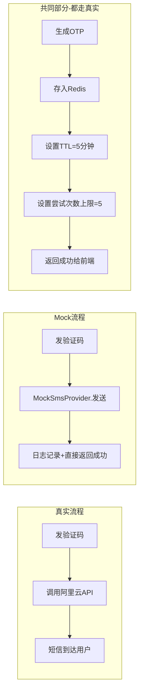

# 注册、一键登录、忘记密码分析与优化方案

> 项目：live-streaming-saas-v2-main  
> 更新时间：2026-05-23  
> 分析范围：`backend/users` 用户服务、`D:\saas_app-main` 前端认证 API 封装  
> 结论：原分析方向基本正确，但需要调整接口边界、实施顺序和若干与当前代码不一致的点。本文档已按当前实现重新整理为可落地方案。

---

## 1. 当前实现结论

### 1.1 注册

当前注册入口是：

- `POST /api/v1/users/register`
- 前端封装：`src/api/auth.ts -> registerUser()`

当前注册方式是邮箱注册，要求字段：

```json
{
  "username": "testuser",
  "email": "user@example.com",
  "password": "Test@123",
  "nickname": "用户昵称",
  "captcha_id": "captcha-id",
  "captcha_solution": "abcd1"
}
```

当前特征：

- `UserRegisterRequest` 定义在 `backend/users/app/api/v1/endpoints/users.py`。
- `UserService.register_user()` 会校验图形验证码、用户名、邮箱、密码强度。
- 创建用户时 `phone_number=None`，`is_phone_verified=False`。
- `users` 表已经有 `phone_number` 和 `is_phone_verified` 字段。
- `crud_user.get_by_phone_number()` 已存在，不需要新增，只需要复用。

问题：

- 只支持邮箱注册，不符合 App 端以手机号为主的注册习惯。
- 图形验证码是每次必填，移动端体验较差。
- 密码哈希当前是 `hashlib.sha256`，生产不可接受，应改为 Argon2id 或 bcrypt。

### 1.2 忘记密码

当前正式流程是邮箱重置 token：

1. `POST /api/v1/auth/password-reset-request`
   请求体：`email + captcha_id + captcha_solution`
2. 后端校验图形验证码。
3. 按邮箱查用户。
4. 用户不存在仍返回成功，避免邮箱枚举。
5. 用户存在则生成 `reset_token`，写入 Redis：`password_reset:{token} -> user.id`，TTL 15 分钟。
6. 当前仅日志模拟发送邮件，没有真实邮件发送。
7. `POST /api/v1/auth/password-reset`
   请求体：`reset_token + new_password`
8. 后端查 Redis token，删除 token，校验新密码强度，更新密码。

已做对的地方：

- 用户不存在时统一成功响应，避免账号枚举。
- reset token 有 TTL，且单次使用。
- 新密码有强度校验。

主要问题：

- 这是 Web 邮箱链接模型，不适合 App 主流找回密码体验。
- `verification-codes` 已经支持 `RESET_PASSWORD` 场景，但没有“校验验证码并换取重置凭证”的接口，验证码流程没有闭环。
- `perform_password_reset()` 先删除 token 再校验密码强度，弱密码会导致 token 被浪费。
- 重置成功后没有吊销旧 refresh token 或旧会话。
- 没有检查账号状态，例如 `BANNED`、`DELETED`、`PENDING_REVIEW` 是否允许重置。
- OTP 和 reset token 当前存在明文日志风险。
- 邮件/短信都还只是模拟发送。

### 1.3 验证码能力

当前已有：

- `POST /api/v1/auth/verification-codes`
- 请求体：`channel + recipient + scenario + captcha_id + captcha_solution`
- 支持 `REGISTER / RESET_PASSWORD / LOGIN` 等场景。
- Redis key：`otp:{scenario}:{recipient}`，TTL 5 分钟。

不足：

- 只能发，缺少统一验证接口。
- 没有验证码尝试次数限制。
- 没有按手机号、账号、设备指纹等维度限流。
- 绑定手机号使用 `otp:BIND_PHONE:{phone}`，但通用验证码接口当前未清晰声明并支持 `BIND_PHONE` 场景，需要统一。

### 1.4 一键登录

当前已有的是 Authing SSO：

- `POST /api/v1/auth/sso-login`
- 请求体：`id_token`

这不是手机号一键登录。手机号一键登录应由 App 端通过运营商/号码认证 SDK 获取临时 token，后端用该 token 调用号码认证服务换取手机号，再查找或创建用户。

当前缺少：

- `POST /api/v1/auth/one-tap-login`
- 运营商号码认证服务封装，例如 `CarrierAuthService`
- 手机号自动注册/登录逻辑
- App 端 uni-verify 或号码认证插件集成

### 1.5 设备指纹/账号关联基础设施

当前后端 **完全没有** 设备追踪或账号关联检测能力。

User 模型现有可用于"关联判断"的字段：

| 字段 | 能用于关联判断吗？ |
|------|-------------------|
| `last_login_ip` | ⚠️ 勉强可以，但 IP 会变（WiFi/4G 切换、VPN、NAT），不可靠 |
| `email` / `phone_number` | 这是"同一凭证"判断，不是"同一设备"判断 |
| `social_id` | 只和 Authing SSO 有关 |

**缺失的基础设施：**

- ❌ 设备指纹（device fingerprint）字段
- ❌ 设备 ID 记录表
- ❌ 登录历史表（记录哪些设备登录过哪个账号）
- ❌ Session/设备管理表

**这意味着什么：**

> "一键登录时检测手机号未注册、但同设备关联已有邮箱账号"这个功能，在当前阶段**无法实现**，因为根本没有设备追踪数据。

**务实处理方案：**

```
一键登录时：
├── 手机号已注册 → 直接登录 ✅
├── 手机号未注册 → 自动创建新账号 ✅
└── "设备关联已有邮箱账号"分支 → 暂不处理 ⏸️

为什么可以暂不处理？
├── 这个场景的发生概率：用户先用邮箱注册 → 从没用过一键登录
│   → 换手机（或清除 App 数据）→ 打开 App → 点一键登录
│   → 此时手机号未注册 → 自动创建了新账号
│   → 用户发现会员/数据不见了 → 联系客服
│
├── 但这种情况：
│   1. 只在"有邮箱老用户 + 第一次用一键登录"这个窗口期发生
│   2. 可以后续通过"账号绑定"功能让用户自己合并
│   3. 比做自动检测+提示选择要简单得多
│
└── 建议：Phase 4 一键登录上线后，观察客服反馈数据，
    如果投诉多再补设备关联逻辑，如果少就维持现状
```

实现设备关联检测需要的前置条件（Phase 5+ 再考虑）：

```
前端：引入 fingerprint.js 或 uni-app 设备指纹插件
后端：创建设备表、记录每次登录的 device_id
数据库迁移：ALTER TABLE 新增设备相关字段
业务逻辑：一键登录时查 device_id 关联的账号
```

---

## 2. 产品策略决策与分析

以下三个产品策略问题已在讨论中逐一分析并给出建议。

### 2.1 是否允许手机号一键登录时自动注册？

**结论：✅ 允许自动注册，这是当前 App 主流设计。**

当前 App 主流设计的两种形态并存：

```
形态 A：传统设计（微信、早期淘宝）
┌─────────────────────────┐
│     登录页面              │
│  [手机号]  [密码]         │
│  [       登录       ]    │
│                         │
│  没有账号？立即注册 →      │  ← 注册和登录是分开的两个页面
└─────────────────────────┘

形态 B：一键登录设计（抖音、拼多多、京东、美团）
┌─────────────────────────┐
│                         │
│    📱 检测到本机号码      │
│    138****8000          │
│                         │
│  ┌───────────────────┐  │
│  │   本机号码一键登录   │  │  ← 新用户点这个 = 自动注册+登录
│  └───────────────────┘  │
│  [其他手机号登录]        │
│  [账号密码登录]          │
│                         │
│  点击即同意《用户协议》    │
│  和《隐私政策》          │
└─────────────────────────┘
```

一键登录的核心价值就是"无感"——用户不需要区分自己是登录还是注册，点一下就进去了。

**两个关键细节：**

1. **按钮文案和 UI 要清晰**：按钮写"本机号码一键登录/注册"，或在按钮下方用小字说明"未注册将自动创建账号"。
2. **协议同意**：必须展示《用户协议》和《隐私政策》，并明确告知"点击即同意"（既是法规要求，也让用户心理有预期）。

**建议策略：**

| 策略 | 说明 |
|------|------|
| ✅ 自动注册 | 一键登录时手机号未注册 → 自动创建账号 → 直接进入 App |
| ✅ 降级保留传统入口 | 同时保留"其他方式登录/注册"入口 |
| ✅ 补充资料引导 | 自动注册后，首次进入 App 可弹窗引导设置昵称、头像（可选） |

### 2.2 邮箱账号和手机号账号冲突时是否允许自动合并？

**结论：❌ 不要自动合并，提示用户选择。**

**场景说明：**

```
用户张三之前用邮箱 zhangsan@qq.com 注册了 App（没有绑定手机号）
            ↓
    过了一段时间，张三换了新手机
            ↓
    打开 App，点击"一键登录"
            ↓
    后端用运营商 token 换到手机号 13800138000
            ↓
    查数据库：
    - phone_number = 13800138000 → 没有记录（未注册）
    - email = zhangsan@qq.com → 有记录
            ↓
    ⚠️ 问题：系统该怎么办？
```

**三种方案对比：**

```
方案一：静默自动合并（❌ 不推荐）
├── 风险：如果手机号是张三刚换的二手号码，前任主人也可能是你的用户
└── 结果：绑错人，安全风险高

方案二：创建全新账号（⚠️ 有隐患）
├── 张三现在有两个账号：邮箱账号 + 手机号账号
└── 问题：张三之前的会员、数据全在新账号里看不到

方案三：提示用户选择（✅ 推荐，Phase 5+ 实现）
├── 检测到手机号 13800138000 未注册
├── 弹出提示："检测到您可能已有账号（zhang***@qq.com），
│              是否绑定此手机号到已有账号？"
├── [绑定到已有账号]  [创建新账号]
└── 用户自己选择
```

**当前阶段处理：**

| 场景 | 处理方式 |
|------|---------|
| 手机号完全未注册，也找不到关联账号 | 自动注册新账号 ✅ |
| 手机号已绑定到某账号 | 直接登录该账号 ✅ |
| 手机号未注册，同设备关联已有邮箱账号 | ⏸️ Phase 5+ 再处理，当前自动注册 |
| 用户主动在设置里绑定手机号 | 允许，需验证码二次确认 |

### 2.3 忘记密码是否必须支持邮箱 fallback？

**结论：✅ 短期保留现有接口不动，App 端默认短信找回，邮箱折叠为次级入口。**

**分析：**

| 因素 | 分析 |
|------|------|
| 现有用户 | 全是邮箱注册的，如果去掉邮箱找回，他们的密码忘了怎么办？ |
| App 新用户 | 未来用手机号注册/一键登录，找回密码走短信验证码即可 |
| 海外用户 | 可能收不到国内短信，邮箱 fallback 对他们有用 |
| 开发成本 | 需要接入邮件服务、设计邮件模板、处理邮件到达率问题 |

**建议策略：**

```
Phase 1-2（当前）：保留邮箱找回作为旧用户的保底方案
├── 不删除现有的 POST /auth/password-reset-request
├── 不用投资完善它（真实邮件发送先不做）
└── 精力集中在短信验证码找回路径

Phase 3+（短信验证码上线后）：
├── 忘记密码页默认展示"手机号找回"
├── 底部放小字链接"邮箱找回" → 跳转到邮箱找回流程
└── 观察数据：超过 90% 用户用短信找回 → 邮箱 fallback 优先级降低
```

---

## 3. 原文档评估

原文档判断基本正确，尤其是这些点：

- 忘记密码当前偏 Web，不适合 App。
- OTP 发码能力未闭环。
- SHA-256 密码哈希需要替换。
- OTP/reset token 不应进入日志。
- 重置后应吊销旧会话。
- 一键登录和忘记密码可以共用“身份验证票据”模型。

需要修正或优化的点：

- `crud_user.get_by_phone_number()` 当前已经存在，不能列为新增，只能列为复用。
- 一键登录接口不建议承担 `RESET_PASSWORD` 场景。登录接口只做登录/自动注册；忘记密码应使用“本机号码校验”或短信验证码换取 `reset_ticket`。
- 手机号注册不建议直接改旧 `/users/register` 为可选 phone/email 混合大接口。更稳妥是新增 `POST /users/register/phone`，保留旧邮箱注册，降低回归风险。
- Phase 顺序需要调整：真实短信服务和验证码闭环应早于手机号注册，否则手机号注册无法安全落地。
- 文档应明确兼容现有前端 `authUrl()` 路径规则：`AUTH_API_URL` 已包含 `/api/v1/users` 时，注册/用户资料走 `/register`、`/me`，认证相关走 `/auth/...`。
- 需要增加“账号合并/绑定策略”：一键登录手机号命中已有邮箱账号时，是否自动绑定、要求二次验证、还是提示登录后绑定。

---

## 4. 推荐目标架构

核心思想：把“身份验证”和“最终业务动作”拆开。

统一验证方式包括：

- 短信 OTP
- 邮箱 OTP 或邮箱链接
- 运营商一键登录 token
- 运营商本机号码校验 token

验证成功后，不同场景执行不同动作：

| 场景 | 验证后动作 |
|---|---|
| 手机号注册 | 创建用户，设置 `phone_number`，`is_phone_verified=True` |
| 一键登录 | 查找或创建用户，签发 JWT |
| 忘记密码 | 签发短期 `reset_ticket`，再设置新密码 |
| 绑定手机号 | 把手机号绑定到当前登录用户 |

建议新增统一票据：

```text
ticket:{purpose}:{ticket_id} -> JSON
TTL: 5-10 分钟
单次使用
```

示例 value：

```json
{
  "purpose": "RESET_PASSWORD",
  "user_id": 123,
  "phone_number": "+8613800138000",
  "verified_by": "SMS_OTP",
  "created_at": "2026-05-23T10:00:00Z"
}
```

---

## 5. 推荐 API 设计

### 5.1 发送验证码

复用并规范当前接口：

```http
POST /api/v1/auth/verification-codes
```

请求体：

```json
{
  "channel": "SMS",
  "recipient": "+8613800138000",
  "scenario": "RESET_PASSWORD",
  "captcha_id": "captcha-id",
  "captcha_solution": "abcd1",
  "device_id": "optional-device-id"
}
```

允许场景建议统一为：

- `REGISTER`
- `LOGIN`
- `RESET_PASSWORD`
- `BIND_PHONE`

落地要求：

- `recipient` 必须规范化为 E.164 格式。
- `REGISTER` 场景：手机号已存在应返回 409，或按产品策略提示“请直接登录”。
- `RESET_PASSWORD` 场景：账号不存在仍返回统一成功，避免枚举。
- `BIND_PHONE` 场景：手机号已被其他账号绑定应返回 409。
- 生产环境必须接入真实短信服务；开发环境可使用 mock provider，但不能把验证码打到普通日志。

### 5.2 验证码换票据

新增：

```http
POST /api/v1/auth/verification-codes/verify
```

请求体：

```json
{
  "channel": "SMS",
  "recipient": "+8613800138000",
  "scenario": "RESET_PASSWORD",
  "code": "123456"
}
```

返回：

```json
{
  "ticket": "reset-ticket",
  "expires_in": 600
}
```

规则：

- 校验 OTP 正确后立刻删除 OTP。
- 同一 OTP 最多尝试 5 次。
- `RESET_PASSWORD` 场景返回 `reset_ticket`。
- `REGISTER` 场景可返回 `register_ticket`，供手机号注册使用。
- `BIND_PHONE` 场景可返回 `bind_phone_ticket`，供绑定手机号使用。短期也可以继续沿用当前直接传 `verification_code` 的实现，但中长期建议统一。

### 5.3 忘记密码

保留旧接口兼容：

```http
POST /api/v1/auth/password-reset-request
POST /api/v1/auth/password-reset
```

新增 App 推荐流程：

```http
POST /api/v1/auth/verification-codes
POST /api/v1/auth/verification-codes/verify
POST /api/v1/auth/password-reset
```

新的 `password-reset` 请求体建议兼容两种凭证：

```json
{
  "reset_ticket": "ticket-from-verify",
  "new_password": "NewPass@123"
}
```

旧邮箱链接继续支持：

```json
{
  "reset_token": "email-link-token",
  "new_password": "NewPass@123"
}
```

后端规则：

- `reset_ticket` 和 `reset_token` 二选一。
- 先校验新密码强度，再原子消费凭证。
- 重置成功后吊销该用户已有 refresh token/session。
- 发送安全通知。
- 禁止 `BANNED`、`DELETED` 用户重置；`PENDING_REVIEW` 是否允许由产品策略决定。

### 5.4 手机号注册

新增：

```http
POST /api/v1/users/register/phone
```

请求体建议：

```json
{
  "register_ticket": "ticket-from-otp-verify",
  "password": "NewPass@123",
  "nickname": "用户昵称",
  "username": "optional"
}
```

不要直接让前端提交手机号和验证码完成注册。更稳妥做法是：先发码，再验证 OTP 换 `register_ticket`，注册接口只信任后端签发的 ticket。

创建规则：

- 从 ticket 中读取手机号。
- 校验手机号未被占用。
- `phone_number` 写入规范化号码。
- `is_phone_verified=True`。
- 邮箱可为空。
- username 为空时自动生成，例如 `u_` + 短随机串；需处理唯一冲突。

### 5.5 一键登录

新增：

```http
POST /api/v1/auth/one-tap-login
```

请求体：

```json
{
  "carrier_token": "token-from-app-sdk",
  "provider": "aliyun",
  "device_id": "optional-device-id"
}
```

后端流程：

1. 后端调用号码认证服务，用 `carrier_token` 换取真实手机号。
2. 规范化手机号。
3. 按手机号查用户。
4. 用户存在且状态正常：签发 JWT。
5. 用户不存在：按产品策略自动创建用户，签发 JWT，并返回 `is_new_user=true`。
6. 用户存在但未绑定手机号或是邮箱账号冲突：不要静默合并，建议提示用户登录原账号后绑定手机号，或走二次验证合并流程。

响应：

```json
{
  "access_token": "...",
  "refresh_token": "...",
  "token_type": "bearer",
  "is_new_user": false,
  "phone_masked": "138****8000"
}
```

注意：

- 客户端永远不能直接传手机号给后端作为一键登录依据。
- `one-tap-login` 只负责登录/自动注册，不负责忘记密码。
- 如果要用本机号码校验辅助忘记密码，应新增 `POST /api/v1/auth/recovery/carrier-verify`，成功后签发 `reset_ticket`。

---

## 6. 安全与工程改造要求

### 6.1 P0 必做

1. 密码哈希改为 Argon2id 或 bcrypt。
2. 清理日志：OTP、reset token、ticket、carrier token 禁止明文输出。
3. 接入真实短信服务，至少抽象 `SmsProvider`，开发环境使用 mock，生产环境使用 Aliyun/Tencent。
4. 完成 OTP 校验闭环：新增 `verification-codes/verify`。
5. 修复 reset token 消费顺序：先校验密码，再原子消费凭证。
6. 重置密码后吊销旧 refresh token/session。
7. 增加账号状态检查。

### 6.2 P1 建议

1. 增加手机号注册。
2. 增加多维限流：IP、手机号、账号、设备、场景。
3. 图形验证码改为风险触发，而不是移动端默认必填。
4. 增加安全通知：密码修改、手机号绑定、新设备登录。
5. 增加审计事件表或 Redis/日志事件流。

### 6.3 P2 建议

1. 接入一键登录。
2. 增加本机号码校验，用于忘记密码和绑定手机号的强验证。
3. 抽象 `IdentityVerificationService`，统一 OTP、carrier token、ticket、风控。

---

## 7. 代码改动清单

### 后端

| 文件 | 操作 |
|---|---|
| `backend/users/app/schemas/auth.py` | 新增 `VerifyCodeRequest`、`VerifyCodeResponse`、扩展 `PasswordResetConfirmRequest` 支持 `reset_ticket` |
| `backend/users/app/api/v1/endpoints/auth.py` | 新增 `POST /verification-codes/verify`、后续新增 `POST /one-tap-login` |
| `backend/users/app/services/auth_service.py` | 新增 `verify_otp_and_issue_ticket()`、`consume_ticket()`、`one_tap_login()`；修复密码重置顺序 |
| `backend/users/app/services/user_service.py` | 新增 `register_by_phone_ticket()`；复用 `get_by_phone_number()` |
| `backend/users/app/api/v1/endpoints/users.py` | 新增 `POST /register/phone` |
| `backend/users/app/core/config.py` | 新增短信、号码认证配置 |
| `backend/users/app/services/sms_service.py` | 新增短信服务抽象与 provider |
| `backend/users/app/services/carrier_auth_service.py` | 新增号码认证服务封装 |
| `backend/users/tests` | 增加 OTP verify、手机号注册、密码 reset_ticket、一键登录 mock 测试 |

### 前端

| 文件 | 操作 |
|---|---|
| `D:\saas_app-main\src/api/auth.ts` | 新增 `verifyCode()`、`registerByPhone()`、`oneTapLogin()`；保留旧邮箱注册和重置接口 |
| `D:\saas_app-main\src/types/auth.ts` | 增加手机号注册、一键登录、ticket 类型 |
| 登录页 | 增加一键登录按钮，失败降级到密码/验证码登录 |
| 注册页 | 增加手机号注册入口 |
| 忘记密码页 | App 默认手机号验证码找回；邮箱找回作为 fallback |

---

## 8. 实施路线

### Phase 1：安全底座修复（建议立即开始，1-2 天）

目标：先修现有风险，不改太多产品流程。**这是所有后续工作的基础，也是你现在最应该做的事情。**

#### 8.1.1 密码哈希 SHA-256 → bcrypt（兼容老用户滚动迁移）

**文件：** `auth_service.py` 和 `user_service.py` 的 `_hash_password()`、`_verify_password()`

当前项目有两套密码入口：

- `AuthService`：登录、忘记密码重置会用到。
- `UserService`：邮箱注册、已登录用户修改密码会用到。

因此不能只改 `auth_service.py`，否则会出现“登录验证支持 bcrypt，但新注册/修改密码仍写入 SHA-256”的不一致。建议抽一个公共密码工具，例如 `backend/users/app/core/password.py`，两个 service 都调用同一套方法。

```python
# backend/users/app/core/password.py

import bcrypt
import hashlib

def hash_password(password: str) -> str:
    """使用 bcrypt 哈希密码"""
    return bcrypt.hashpw(password.encode(), bcrypt.gensalt()).decode()

def verify_password(password: str, password_hash: str) -> bool:
    """验证密码，兼容旧 SHA-256 哈希"""
    if password_hash.startswith("$2b$") or password_hash.startswith("$2a$"):
        return bcrypt.checkpw(password.encode(), password_hash.encode())

    if len(password_hash) == 64 and all(c in "0123456789abcdef" for c in password_hash.lower()):
        return hashlib.sha256(password.encode()).hexdigest() == password_hash

    return False

def is_legacy_sha256_hash(password_hash: str) -> bool:
    return len(password_hash) == 64 and all(c in "0123456789abcdef" for c in password_hash.lower())
```

```python
# auth_service.py / user_service.py 都改为调用公共工具

class AuthService:
    
    def _hash_password(self, password: str) -> str:
        return hash_password(password)

    def _verify_password(self, password: str, password_hash: str) -> bool:
        return verify_password(password, password_hash)

    # 登录成功后在 login_user() 中调用
    async def _upgrade_password_hash_if_needed(self, user, password: str):
        """如果用户密码还是旧 SHA-256 格式，升级为 bcrypt"""
        if is_legacy_sha256_hash(user.password_hash):
            new_hash = self._hash_password(password)
            user.password_hash = new_hash
            await self.db.commit()
```

⚠️ 注意：

- `requirements.txt` 需添加 `bcrypt` 依赖。
- 测试 fixture 当前也有 SHA-256 假数据，改造后要补“旧 SHA-256 用户可登录并升级为 bcrypt”的测试。
- 已登录修改密码、邮箱注册、忘记密码重置都必须最终写入 bcrypt。

#### 8.1.2 修复 reset token 消费时序

**文件：** `auth_service.py` 的 `perform_password_reset()`

```python
# 当前错误顺序（auth_service.py 约 793-806 行）：
# await self.redis_client.delete(reset_key)    # ← 先删
# if not self._validate_password_strength(...): # ← 后校验
#     raise WeakPasswordException(...)           # ← token 已丢失！

# 修复后：
async def perform_password_reset(self, confirm_request):
    reset_key = f"password_reset:{confirm_request.reset_token}"
    user_id_str = await self.redis_client.get(reset_key)

    if not user_id_str:
        raise InvalidResetTokenException("密码重置链接无效或已过期")

    # ✅ 先校验密码强度
    if not self._validate_password_strength(confirm_request.new_password):
        raise WeakPasswordException("新密码不符合强度要求")

    # ✅ 密码通过后，再原子删除 token
    deleted = await self.redis_client.delete(reset_key)
    if not deleted:
        raise InvalidResetTokenException("密码重置链接已被使用")

    # 查用户、检查状态
    user_id = int(user_id_str)
    user = await crud_user.get(self.db, user_id)
    if not user:
        raise InvalidResetTokenException("无效的令牌")
    user_public_id = str(user.public_id)

    # 检查账号状态（新增）
    if user.status in (EntityStatus.BANNED, EntityStatus.DELETED):
        raise InvalidCredentialsException("账户状态异常，无法重置密码")

    # 更新密码
    new_hash = self._hash_password(confirm_request.new_password)
    user.password_hash = new_hash
    user.updated_at = datetime.utcnow()
    await self.db.commit()

    # 吊销旧 refresh token（新增）
    await self._revoke_user_sessions(user_public_id)
```

#### 8.1.3 日志脱敏

**文件：** `auth_service.py`

```python
# ❌ 当前（约 410 行）：
logger.info(f"模拟发送验证码: code={otp_code}, recipient={otp_request.recipient}")

# ✅ 修复后：
logger.info(f"验证码已生成: recipient={self._mask_recipient(otp_request.recipient)}, "
            f"code_length={len(otp_code)}, scenario={otp_request.scenario}")

# ❌ 当前（约 768 行）：
logger.info(f"模拟发送密码重置邮件: email={reset_request.email}, reset_token={reset_token}")

# ✅ 修复后：
logger.info(f"密码重置 token 已生成: email={self._mask_recipient(reset_request.email)}")
```

说明：不要记录 `reset_token` 的任何片段。即使只记录前缀，也会降低 token 搜索空间，线上日志泄露时风险不必要。

#### 8.1.4 重置后吊销旧会话

**文件：** `auth_service.py` 新增方法

```python
async def _revoke_user_sessions(self, user_public_id: str):
    """密码重置后吊销该用户所有 refresh token"""
    # JWT payload 里的 user_id 是 public_id，不是 users.id 自增主键
    revocation_key = f"user_sessions_revoked:{user_public_id}"
    await self.redis_client.set(
        revocation_key, 
        datetime.utcnow().isoformat(), 
        ex=86400 * 7  # 7 天过期
    )
    logger.info(f"已吊销用户所有会话: public_id={user_public_id}")
```

然后在 `refresh_access_token()` 中增加吊销检查：验证 refresh token 时对比 token `iat` 和 `user_sessions_revoked:{public_id}` 的时间戳，若 token 签发时间早于吊销时间则拒绝。

注意：当前项目没有持久化 refresh token 表，所以“吊销所有旧 refresh token”的可行落地方式是 Redis 时间戳截止线；如果以后要支持设备管理、单设备登出、登录列表，再补 `user_sessions` 表。

#### 8.1.5 账号状态检查

**文件：** `auth_service.py` 的 `request_password_reset()` 和 `perform_password_reset()`

```python
# request_password_reset() 中，查到用户后：
if user and user.status in (EntityStatus.BANNED, EntityStatus.DELETED):
    # 仍返回成功（防枚举），但不生成 token
    logger.info(f"禁止重置密码的用户尝试重置: user_id={user.id}, status={user.status}")
    return

# perform_password_reset() 中，重置前：
if user.status in (EntityStatus.BANNED, EntityStatus.DELETED):
    raise InvalidCredentialsException("账户状态异常，无法重置密码")
```

#### 8.1.6 Phase 1 总结

Phase 1 主要改动集中在 `auth_service.py`、`user_service.py` 和一个公共密码工具文件，约 80-120 行改动，**不需要**任何外部服务、不需要改前端、不需要数据库迁移（只需增加 `bcrypt` 依赖）。

### Phase 2：验证码闭环

目标：让现有 `verification-codes` 从“能发”变为“能验证、能签发 ticket”。

- 新增 `POST /auth/verification-codes/verify`。
- 增加 OTP 尝试次数限制。
- 支持 `RESET_PASSWORD` 换 `reset_ticket`。
- `POST /auth/password-reset` 支持 `reset_ticket`。

### Phase 3：短信服务与手机号注册

目标：让 App 可用手机号注册和找回密码。

- 接入真实短信服务。
- 新增 `POST /users/register/phone`。
- 前端注册页接手机号注册流程。
- 忘记密码页默认手机号找回。

### Phase 4：一键登录

目标：提升 App 登录转化。

- 开通号码认证服务。
- 实现 `CarrierAuthService`。
- 新增 `POST /auth/one-tap-login`。
- 前端接 `uni.login({ provider: 'univerify' })` 或等价插件。
- 失败降级到短信验证码或账号密码登录。

### Phase 5：统一抽象

目标：降低后续维护成本。

- 抽象 `IdentityVerificationService`。
- 统一验证码、ticket、风控、审计日志。
- 统一注册、绑定手机号、忘记密码、一键登录的验证层。

---

## 9. 下一步建议（可执行清单）

### 现在立即开始：Phase 1 安全底座修复

| 步骤 | 具体操作 | 依赖 |
|------|---------|------|
| 1 | `pip install bcrypt`，更新 `requirements.txt` | 无 |
| 2 | 新增公共密码工具，`AuthService` 和 `UserService` 都调用 bcrypt | 步骤1 |
| 3 | 修改 `_verify_password()` → 兼容 SHA-256 + bcrypt | 步骤2 |
| 4 | 在 `login_user()` 中调用 `_upgrade_password_hash_if_needed()`，旧用户登录后滚动升级 | 步骤3 |
| 5 | 修复 `perform_password_reset()` token 消费顺序 | 无 |
| 6 | 清理日志中的 OTP/reset token 明文 | 无 |
| 7 | 新增 `_revoke_user_sessions(public_id)`，重置后调用，并在 refresh 时检查 | 无 |
| 8 | `request_password_reset()` 和 `perform_password_reset()` 增加状态检查 | 无 |
| 9 | 本地 Docker 重启验证：登录、注册、密码重置流程全跑一遍 | Docker |

### 同步申请外部服务（审核需要 1-2 周，别等代码写完再申请）

| 服务 | 操作 |
|------|------|
| 阿里云短信服务 | 企业认证 → 申请签名 → 申请验证码模板 |
| 阿里云号码认证 | 开通服务 → 创建一键登录方案 → 创建本机号码校验方案 |
| App 打包信息 | 确定 Android 包名、iOS Bundle ID、签名证书 SHA1/SHA256 |

### Phase 1 完成后：Phase 2 验证码闭环（Mock 模式）

Mock 的核心价值：**除了不真发短信，其余所有业务逻辑、Redis 流转、安全机制完全真实跑通。**

```
Mock 验证了什么：
✅ OTP 生成和 Redis 存储（完全真实）
✅ OTP TTL 过期（完全真实）
✅ OTP 校验和单次消费（完全真实）
✅ OTP 尝试次数限制 5 次锁定（完全真实）
✅ ticket 签发和消费（完全真实）
✅ 密码重置完整流程（完全真实）
✅ 风控限流（IP/手机号/设备维度）（完全真实）
✅ API 接口的请求/响应格式（完全真实）
❌ 唯一 mock 的：短信网关那一次 HTTP 调用

→ 后期切换真实短信，只需实现 AliyunSmsProvider 替换 MockSmsProvider，一行配置切换
```

### 完整推进时间线

```
第 1 周：Phase 1 安全修复（现在就做）
        同时去阿里云申请短信签名和模板

第 2-3 周：Phase 2 验证码闭环（Mock 模式）
          ├── 新增 POST /auth/verification-codes/verify
          ├── 实现 ticket 签发/消费
          └── 补充单元测试

第 3-4 周：短信审核通过 → Phase 3
          ├── 实现 AliyunSmsProvider
          ├── 新增 POST /users/register/phone
          └── 前端注册页/忘记密码页适配

第 5-6 周：Phase 4 一键登录
          ├── 号码认证服务对接
          ├── 新增 POST /auth/one-tap-login
          └── App 打包配置 + 真机测试

第 7 周+：Phase 5 统一抽象（可选，按需）
```

---

## 10. 验收清单

### 忘记密码

- 不存在的手机号/邮箱不会暴露账号存在性。
- OTP 错误次数超过限制后锁定一段时间。
- OTP 只能使用一次。
- `reset_ticket` 只能使用一次。
- 弱密码不会消耗 ticket。
- 重置成功后旧 refresh token 失效。
- 日志中无 OTP、reset token、ticket 明文。

### 手机号注册

- 手机号格式统一。
- 已注册手机号不能重复注册。
- 注册成功后 `is_phone_verified=True`。
- 未验证手机号不能直接写入用户表。

### 一键登录

- 后端只信任运营商 token 换回的手机号。
- 已有手机号用户直接登录。
- 新手机号按策略自动注册或进入补充资料页。
- token 无效、取号失败时前端能降级到短信验证码登录。

---

## 11. 本轮复核新增修正项

这一章是基于当前源码和前端类型定义再次核对后新增的落地修正，建议作为开发前的检查清单。

### 11.1 前后端验证码场景名不一致

当前后端使用：

```text
REGISTER / RESET_PASSWORD / LOGIN / BIND_PHONE
```

当前前端 `D:\saas_app-main\src\types\auth.ts` 的 `SendOtpRequest.scenario` 使用：

```text
REGISTER / PASSWORD_RESET / BIND_PHONE
```

这里的 `PASSWORD_RESET` 和后端 `RESET_PASSWORD` 不一致。若前端直接调用，会导致后端走不到重置密码分支。

**建议：统一使用 `RESET_PASSWORD`。**

前端需要修改：

```ts
scenario: 'REGISTER' | 'RESET_PASSWORD' | 'BIND_PHONE' | 'LOGIN';
```

后端也建议在 `schemas/auth.py` 用枚举限制，避免继续接受任意字符串。

### 11.2 captcha image_url 当前不可直接依赖

`AuthService.generate_captcha()` 返回了：

```json
{
  "image_url": "api/v1/auth/captcha/image/{captcha_id}",
  "image_base64": "data:image/png;base64,..."
}
```

但当前路由里没有发现 `/auth/captcha/image/{captcha_id}` 对应 endpoint。前端目前类型只声明并使用 `image_base64`，所以现阶段可用。

**建议：**

- 短期：前端继续使用 `image_base64`。
- 如果后续要用 `image_url`：后端必须补图片读取 endpoint，或删除该字段避免误用。

### 11.3 一键登录自动建号必须满足数据库约束

`users` 表有约束：

```sql
(password_hash IS NOT NULL) OR (social_provider IS NOT NULL AND social_id IS NOT NULL)
```

这意味着一键登录自动注册用户时，如果不设置密码，不能只写 `phone_number`，否则会违反 `users_login_method_check`。

**可行做法：**

```python
UserCreate(
    username=generated_username,
    email=None,
    nickname=generated_nickname,
    phone_number=normalized_phone,
    social_provider="carrier",
    social_id=f"carrier:{hash_phone(normalized_phone)}",
)
```

并以 `password_hash=None` 创建用户。

不要给一键登录用户生成一个“随机不可用密码”来绕过约束，这会让后续账号安全、密码设置、审计语义变得混乱。手机号一键登录本质是第三方/外部身份凭证登录，使用 `social_provider/social_id` 更符合当前模型。

### 11.4 reset ticket 不应给不存在的账号签发可用票据

为了防枚举，`RESET_PASSWORD` 发码接口可以对不存在账号返回统一成功。但验证码验证阶段不能给不存在账号签发一个后续可用于重置密码的 `reset_ticket`。

推荐策略：

- `RESET_PASSWORD` 发码前先查账号。
- 账号不存在：返回统一成功，但不真实发送 OTP、不写 Redis OTP。
- 账号存在且状态允许：写 Redis OTP 并发送。
- `/verification-codes/verify` 只对真实存在的 OTP 签发 `reset_ticket`，ticket 中必须带 `user_id` 或 `user_public_id`。
- `/password-reset` 消费 `reset_ticket` 时，如果 ticket 没有关联用户，直接按无效凭证处理。

这样不会在“发码接口”暴露账号存在性，也不会产生没有业务归属的 reset ticket。

### 11.5 Redis 更新 OTP 尝试次数要注意客户端兼容

文档示例里使用了：

```python
await self.redis_client.set(otp_key, json.dumps(otp_data), keepttl=True)
```

这取决于当前异步 Redis 客户端是否支持 `keepttl` 参数。为了减少兼容风险，建议实现时使用更稳妥的方式：

```python
ttl = await self.redis_client.ttl(otp_key)
if ttl <= 0:
    await self.redis_client.delete(otp_key)
    raise InvalidTokenException("验证码不存在或已过期")
await self.redis_client.set(otp_key, json.dumps(otp_data), ex=ttl)
```

更严谨的实现可以用 Lua 脚本原子完成“读取、校验、增加 attempts、保留 TTL”。

### 11.6 邮箱 fallback 目前不是完整可用能力

文档里建议短期保留邮箱找回，这个方向正确，因为当前老用户是邮箱注册。但当前后端只是“日志模拟发送邮件”，没有真实邮件服务。

因此要把邮箱 fallback 的状态定义清楚：

- 开发环境：可作为 mock 流程验证。
- 生产环境：在接入真实邮件服务前，不能认为邮箱找回已经可用。
- 如果短期 App 仍要服务邮箱老用户，至少需要接入一个真实邮件 provider，或在 App 内明确引导用户走客服/人工验证。

### 11.7 限流提示与实际窗口需要统一

当前 `send_otp_code()` 逻辑是“同 IP 每小时最多 5 次”，但错误文案是“请在 60 秒后重试”，同时响应里也返回 `cooldown_seconds=60`。

建议拆成两个概念：

- 冷却时间：同一 recipient/scenario 60 秒内不能重复发送。
- 配额限制：同一 IP/recipient/device 每小时或每天最多 N 次。

响应中分别返回：

```json
{
  "cooldown_seconds": 60,
  "quota_reset_seconds": 3600
}
```

前端倒计时使用 `cooldown_seconds`，不要把小时级封禁显示成 60 秒。

### 11.8 手机号绑定短期可保留，但中期应迁移到 ticket

当前 `POST /users/me/phone` 直接接收 `phone_number + verification_code`，并从 Redis 读取 `otp:BIND_PHONE:{phone}`。这条路径短期可用，因为通用发码接口使用 `scenario=BIND_PHONE` 时 key 格式正好一致。

中期建议迁移为：

```http
POST /auth/verification-codes
POST /auth/verification-codes/verify
POST /users/me/phone
```

其中绑定接口接收：

```json
{
  "bind_phone_ticket": "ticket-from-verify"
}
```

这样注册、忘记密码、绑定手机号都走同一套 ticket 模型，安全边界更清晰。

### 11.9 测试需要同步调整

实现 Phase 1 和 Phase 2 后，至少补以下测试：

- 旧 SHA-256 密码用户可以登录，登录成功后密码哈希升级为 bcrypt。
- 新注册用户密码写入 bcrypt。
- 已登录修改密码写入 bcrypt。
- 弱密码不会消费 reset token/reset ticket。
- 重置密码后旧 refresh token 无法刷新。
- `RESET_PASSWORD` 场景名从前端到后端一致。
- `BIND_PHONE` 发码后可以被现有绑定手机号接口消费。
- 一键登录自动建号时满足 `users_login_method_check`。

---

## 附录 A：Mock Provider + Redis 闭环实现详解

Mock Provider 的核心思路：把所有外部依赖（短信、邮件）替换成假的实现，但内部的业务逻辑、Redis 存储、接口流程全部走真实的。

### A.1 架构示意



### A.2 抽象接口定义

```python
# backend/users/app/services/sms_provider.py
from abc import ABC, abstractmethod

class SmsProvider(ABC):
    """短信服务抽象接口"""
    
    @abstractmethod
    async def send(self, phone: str, code: str, template_params: dict = None) -> bool:
        """发送短信，返回是否成功"""
        ...
    
    @abstractmethod
    async def health_check(self) -> bool:
        """检查服务是否可用"""
        ...


class MockSmsProvider(SmsProvider):
    """开发环境 Mock —— 不真发短信，只记录和模拟"""
    
    async def send(self, phone: str, code: str, template_params: dict = None) -> bool:
        import logging, asyncio
        logger = logging.getLogger("sms.mock")
        # ⚠️ 只打掩码信息，不打 code 明文
        logger.debug(f"[MOCK SMS] to={phone[:3]}****{phone[-4:]} "
                     f"code_length={len(code)}")
        await asyncio.sleep(0.05)  # 模拟网络延迟
        return True  # 永远成功
    
    async def health_check(self) -> bool:
        return True


class AliyunSmsProvider(SmsProvider):
    """生产环境阿里云短信实现"""
    
    def __init__(self, access_key_id, access_key_secret, sign_name, template_code):
        from alibabacloud_dysmsapi20170525.client import Client
        from alibabacloud_tea_openapi import models
        config = models.Config(
            access_key_id=access_key_id,
            access_key_secret=access_key_secret,
        )
        config.endpoint = "dysmsapi.aliyuncs.com"
        self.client = Client(config)
        self.sign_name = sign_name
        self.template_code = template_code
    
    async def send(self, phone: str, code: str, template_params: dict = None) -> bool:
        import json
        from alibabacloud_dysmsapi20170525 import models as sms_models
        params = template_params or {}
        params["code"] = code
        request = sms_models.SendSmsRequest(
            phone_numbers=phone,
            sign_name=self.sign_name,
            template_code=self.template_code,
            template_param=json.dumps(params),
        )
        response = self.client.send_sms(request)
        return response.body.code == "OK"
    
    async def health_check(self) -> bool:
        try:
            return True
        except Exception:
            return False
```

### A.3 环境变量切换

```python
# backend/users/app/core/config.py
import os

SMS_PROVIDER = os.getenv("SMS_PROVIDER", "mock")  # 默认 mock

if SMS_PROVIDER == "aliyun":
    ALIBABA_ACCESS_KEY_ID = os.getenv("ALIBABA_ACCESS_KEY_ID")
    ALIBABA_ACCESS_KEY_SECRET = os.getenv("ALIBABA_ACCESS_KEY_SECRET")
    SMS_SIGN_NAME = os.getenv("SMS_SIGN_NAME")
    SMS_TEMPLATE_CODE = os.getenv("SMS_TEMPLATE_CODE")
```

### A.4 AuthService 注入

```python
# auth_service.py 中
from app.services.sms_provider import MockSmsProvider, AliyunSmsProvider
from app.core.config import settings

class AuthService:
    def __init__(self, db: AsyncSession, redis_client=None):
        self.db = db
        self.redis_client = redis_client or get_redis_client()
        
        if settings.SMS_PROVIDER == "aliyun":
            self.sms_provider = AliyunSmsProvider(
                access_key_id=settings.ALIBABA_ACCESS_KEY_ID,
                access_key_secret=settings.ALIBABA_ACCESS_KEY_SECRET,
                sign_name=settings.SMS_SIGN_NAME,
                template_code=settings.SMS_TEMPLATE_CODE,
            )
        else:
            self.sms_provider = MockSmsProvider()
```

### A.5 验证码闭环 —— send_otp_code 完整实现

```python
async def send_otp_code(self, otp_request, client_ip: str = None):
    # 1. 校验图形验证码（可改为风险触发）
    if not await self._verify_captcha(otp_request.captcha_id, otp_request.captcha_solution):
        raise CaptchaErrorException("图形验证码错误或已过期")

    # 2. 多维度限流检查
    await self._check_rate_limit(client_ip, otp_request.recipient, otp_request.scenario)

    # 3. 生成 OTP
    otp_code = self._generate_otp()
    otp_key = f"otp:{otp_request.scenario}:{otp_request.recipient}"

    # 4. 存入 Redis（包含 OTP 和尝试次数）
    import json
    otp_data = {
        "code": otp_code,
        "attempts": 0,
        "max_attempts": 5,
        "created_at": datetime.utcnow().isoformat(),
    }
    await self.redis_client.set(otp_key, json.dumps(otp_data), ex=300)

    # 5. 调用 provider 发送（mock 或真实）
    success = await self.sms_provider.send(
        phone=otp_request.recipient,
        code=otp_code,
        template_params={"minutes": "5"},
    )

    if not success:
        await self.redis_client.delete(otp_key)
        raise Exception("短信发送失败，请稍后重试")

    # 6. 更新频率限制
    await self._update_rate_limit(client_ip, otp_request.recipient, otp_request.scenario)

    # 7. 返回掩码后的信息
    return {
        "message": "验证码已发送",
        "recipient_masked": self._mask_recipient(otp_request.recipient),
        "cooldown_seconds": 60,
    }
```

### A.6 验证码闭环 —— verify_otp_and_issue_ticket

```python
async def verify_otp_and_issue_ticket(self, verify_request) -> dict:
    """校验 OTP 并签发短期 ticket"""
    
    otp_key = f"otp:{verify_request.scenario}:{verify_request.recipient}"
    otp_data_str = await self.redis_client.get(otp_key)
    
    if not otp_data_str:
        raise InvalidTokenException("验证码不存在或已过期")
    
    import json
    otp_data = json.loads(otp_data_str)
    
    # 检查尝试次数
    if otp_data["attempts"] >= otp_data["max_attempts"]:
        await self.redis_client.delete(otp_key)
        raise RateLimitException("验证码尝试次数过多，请重新获取")
    
    # 比对验证码
    if otp_data["code"] != verify_request.code:
        otp_data["attempts"] += 1
        ttl = await self.redis_client.ttl(otp_key)
        if ttl <= 0:
            await self.redis_client.delete(otp_key)
            raise InvalidTokenException("验证码不存在或已过期")
        await self.redis_client.set(otp_key, json.dumps(otp_data), ex=ttl)
        remaining = otp_data["max_attempts"] - otp_data["attempts"]
        raise InvalidCredentialsException(f"验证码错误，还剩 {remaining} 次机会")
    
    # ✅ 验证成功，立即删除 OTP
    await self.redis_client.delete(otp_key)
    
    # 签发 ticket
    ticket_id = secrets.token_urlsafe(32)
    ticket_data = {
        "purpose": verify_request.scenario,
        "recipient": verify_request.recipient,
        "channel": verify_request.channel,
        "created_at": datetime.utcnow().isoformat(),
    }
    
    if verify_request.scenario == "RESET_PASSWORD":
        user = await crud_user.get_by_phone_number(
            self.db,
            phone_number=verify_request.recipient,
        )
        if not user:
            raise InvalidTokenException("验证码不存在或已过期")
        ticket_data["user_id"] = user.id
        ticket_data["user_public_id"] = str(user.public_id)
    
    ticket_key = f"ticket:{verify_request.scenario}:{ticket_id}"
    await self.redis_client.set(ticket_key, json.dumps(ticket_data), ex=600)
    
    return {"ticket": ticket_id, "expires_in": 600}
```

### A.7 Mock 的开发价值

| 验证内容 | Mock 能测吗？ |
|---------|-------------|
| OTP 生成和 Redis 存储 | ✅ 完全真实 |
| OTP TTL 过期 | ✅ 完全真实 |
| OTP 校验和单次消费 | ✅ 完全真实 |
| OTP 尝试次数限制（5 次锁定） | ✅ 完全真实 |
| ticket 签发和消费 | ✅ 完全真实 |
| 密码重置完整流程 | ✅ 完全真实 |
| 风控限流（IP/手机号/设备维度） | ✅ 完全真实 |
| API 接口请求/响应格式 | ✅ 完全真实 |
| 短信是否真的到达用户手机 | ❌ 唯一 mock 掉的部分 |

**切换真实短信只需两件事：**

```bash
# 1. 改环境变量
SMS_PROVIDER=aliyun

# 2. 提供真实凭证
ALIBABA_ACCESS_KEY_ID=xxx
ALIBABA_ACCESS_KEY_SECRET=xxx
SMS_SIGN_NAME=你的签名
SMS_TEMPLATE_CODE=SMS_xxx
```

之前的所有测试照样全部通过，因为业务逻辑没变，只是 provider 实现换了。

---

> **文档维护说明：** 本文档基于 2026-05-23 的源码分析和多轮讨论生成。当代码实现发生变更后，请同步更新本文档对应的进度状态。产品策略决策（第 2 章）已确认并记录，可作为后续开发的依据。
