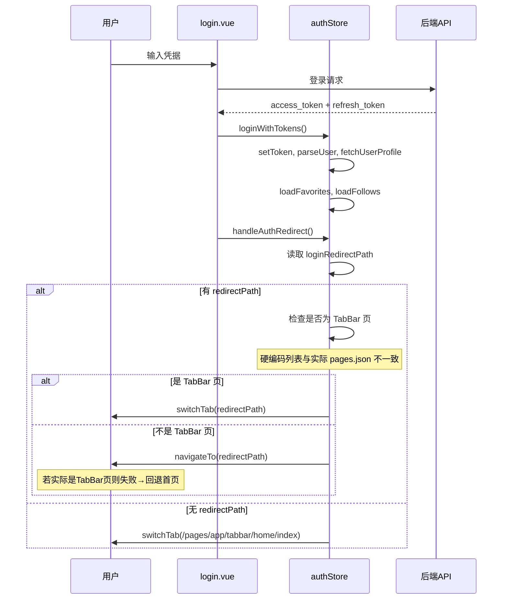
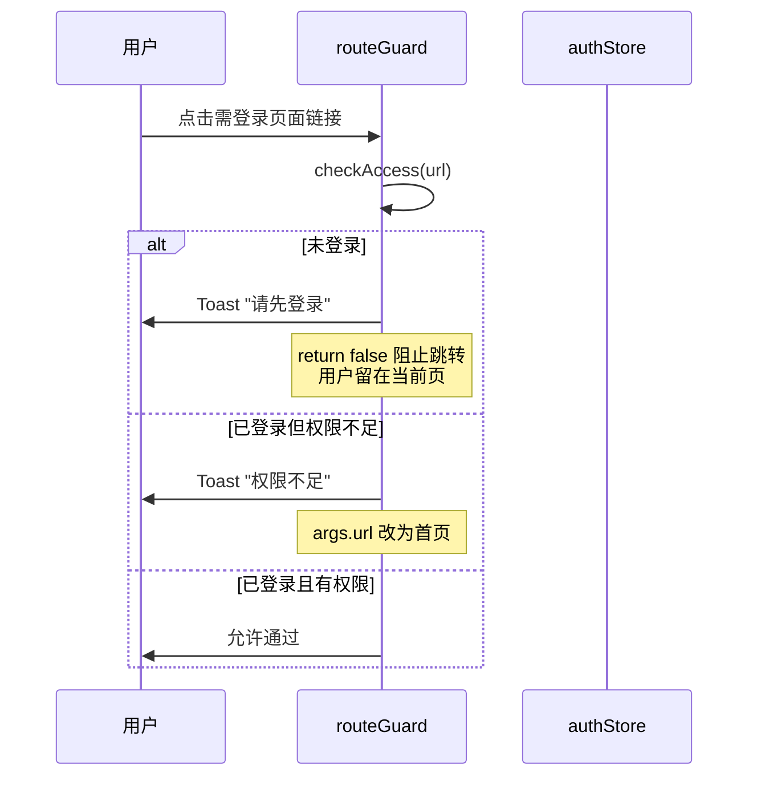
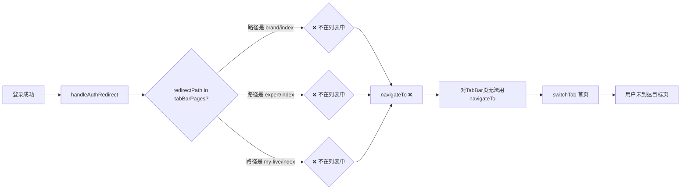

# App端页面跳转全面分析报告

**文档版本**: v1.3  
**创建时间**: 2026-07-21  
**最后更新**: 2026-07-24  
**项目**: 直播SaaS平台移动端（App/小程序）  
**变更说明**: v1.3 — 同步 Phase 1-5 登录提示统一方案实施结果、更新 routeGuard/PAGE_PERMISSIONS/follows 等守卫状态  
**作者**: 资深移动端前端工程师  
**分析范围**: App 端全部页面（排除 H5 平台）

---

## 1. 角色定位说明

**作者角色：资深移动端前端工程师 + 架构师**

- 具备大型直播平台移动端架构与实现经验
- 精通 uni-app、Vue3、TypeScript、Pinia 跨端开发
- 熟悉 JWT 认证体系与移动端路由导航设计
- 具备移动端用户体验优化与安全规范设计能力

---

## 2. 文档目的与分析背景

### 2.1 文档目的

本报告旨在对直播SaaS平台移动端（App/小程序）的全部页面跳转链路进行系统性分析，识别以下三类问题：

1. **错误定向**：导航路径指向不存在或错误的页面
2. **重复/嵌套**：不必要的中间跳转层、重复的存储/守卫机制导致导航行为异常
3. **逻辑不合理**：不符合业务场景或用户体验的跳转设计

同时给出修复建议与优先级排序，为后续重构提供依据。

### 2.2 分析范围

- **平台限定**：仅分析 App 端页面（`pages/app/` + `pages/shared/`），排除 H5 端
- **代码版本**：基于 `src/` 目录下当前实现，以 `pages.json` 注册路径为基准
- **分析维度**：每个页面的入向跳转（谁跳到它）、出向跳转（它跳到谁）、跳转路径合法性

### 2.3 技术背景

- **框架**：uni-app（Vue3 + TypeScript + Vite）
- **路由**：uni-app 文件路由（pages.json），无 Vue Router
- **状态管理**：Pinia
- **认证机制**：JWT + Refresh Token 双令牌，`authStore` 统一管理
- **路由守卫**：`uni.addInterceptor` 拦截器 + 页面级 `requireAuth()` 双机制（App 端）
- **跨平台导航**：`src/utils/router.ts` 封装条件编译导航

---

## 📋 目录

1. [角色定位说明](#1-角色定位说明)
2. [文档目的与分析背景](#2-文档目的与分析背景)
3. [App 端页面注册清单](#3-app-端页面注册清单)
4. [页面间导航链路全景图](#4-页面间导航链路全景图)
5. [P0 级严重问题](#5-p0-级严重问题)
6. [P1 级高优先级问题](#6-p1-级高优先级问题)
7. [P2 级中优先级问题](#7-p2-级中优先级问题)
8. [P3 级低优先级问题](#8-p3-级低优先级问题)
9. [根因分析](#9-根因分析)
10. [修复建议与实施计划](#10-修复建议与实施计划)
11. [登录提示统一方案实施记录（Phase 1-5）](#11-登录提示统一方案实施记录phase-1-5v13-新增)

---

## 3. App 端页面注册清单

以 `pages.json` 为准，App 端页面（含共享页）共 **33 个注册页面**：

### 3.1 TabBar 页面（5个）

| 页面路径 | 页面类型 | 导航限制 |
|---------|---------|---------|
| `pages/app/tabbar/home/index` | 首页 | 仅 switchTab |
| `pages/app/tabbar/brand/index` | 品牌 | 仅 switchTab |
| `pages/app/tabbar/my-live/index` | 我的直播（中间按钮） | 仅 switchTab |
| `pages/app/tabbar/expert/index` | 专家 | 仅 switchTab |
| `pages/app/tabbar/my/index` | 我的 | 仅 switchTab |

### 3.2 认证页面（3个）

| 页面路径 | 页面类型 |
|---------|---------|
| `pages/app/auth/login` | 登录 |
| `pages/app/auth/register` | 注册 |
| `pages/app/auth/forget-password` | 忘记密码 |

### 3.3 直播相关页面（6个）

| 页面路径 | 页面类型 | 备注 |
|---------|---------|------|
| `pages/app/live/LiveView` | 直播间播放器 | App 端真正播放页 |
| `pages/app/live/index` | 直播间占位页 | 检测参数后 redirectTo → LiveView |
| `pages/app/live-manage/list` | 直播管理列表 | |
| `pages/app/live-manage/create` | 创建直播 | |
| `pages/app/live-manage/detail` | 直播房间详情 | |
| `pages/app/live-manage/edit` | 编辑直播 | |

### 3.4 搜索页面（2个）

| 页面路径 | 页面类型 |
|---------|---------|
| `pages/app/search/index` | 搜索首页 |
| `pages/app/search/results` | 搜索结果 |

### 3.5 分类/详情页面（3个）

| 页面路径 | 页面类型 |
|---------|---------|
| `pages/app/categories/AllCategories` | 全部分类 |
| `pages/app/expert/detail` | 专家详情 |
| `pages/app/brand/detail` | 品牌详情 |

### 3.6 我的子页面（11个）

| 页面路径 | 页面类型 |
|---------|---------|
| `pages/app/tabbar/my/favorites/index` | 我的收藏 |
| `pages/app/tabbar/my/follows/index` | 我的关注 |
| `pages/app/tabbar/my/watch-history/index` | 观看历史 |
| `pages/app/tabbar/my/subscriptions/index` | 我的订阅 |
| `pages/app/tabbar/my/settings/appearance` | 外观设置 |
| `pages/app/tabbar/my/about/index` | 关于我们 |
| `pages/app/tabbar/my/edit-profile/index` | 编辑资料 |
| `pages/app/tabbar/my/avatar-crop/index` | 裁剪头像 |
| `pages/app/tabbar/my/account-security/index` | 账号与安全 |
| `pages/app/tabbar/my/account-security/change-password` | 修改密码 |
| `pages/app/tabbar/my/account-security/bind-phone` | 绑定手机号 |

### 3.7 通知与管理页面（3个）

| 页面路径 | 页面类型 |
|---------|---------|
| `pages/app/notifications/index` | 通知中心 |
| `pages/app/admin/dashboard/index` | 管理面板 |
| `pages/app/admin/notification-push/index` | 推送通知 |

### 3.8 共享页面（4个）

| 页面路径 | 页面类型 | 用途 |
|---------|---------|------|
| `pages/shared/index/index` | 根重定向 | 根据平台 reLaunch 到对应首页 |
| `pages/shared/NotFound` | 404 | 未匹配页面 |
| `pages/shared/auth/callback` | 认证回调 | SSO/OAuth 回调处理 |
| `pages/shared/webview/index` | WebView 容器 | 内嵌外部网页 |

---

## 4. 页面间导航链路全景图

### 4.1 导航总览（树形图）

```mermaid
graph TD
    START[App 启动] --> INIT[initializeAuth]
    START --> ROOT[shared/index/index]
    
    ROOT --> HOME[/pages/app/tabbar/home/index]
    
    HOME --> LIVEPLAY[/pages/app/live/LiveView]
    HOME --> SEARCH[/pages/app/search/index]
    HOME --> CATEGORY[/pages/app/categories/AllCategories]
    HOME --> LOGIN[/pages/app/auth/login]
    
    LOGIN --> REGISTER[/pages/app/auth/register]
    LOGIN --> FORGETPW[/pages/app/auth/forget-password]
    LOGIN --> REDIRECT{handleAuthRedirect}
    
    REDIRECT -->|有 redirectPath| TAB{是 TabBar 页?}
    REDIRECT -->|无| HOMETAB[switchTab 首页]
    
    TAB -->|是| SWITCHTAB[switchTab<br/>但列表可能不匹配]
    TAB -->|否| NAVTO[navigateTo<br/>若目标实为TabBar则失败]
    
    REGISTER -->|邮箱注册| NAVBACK[navigateBack → 登录页]
    REGISTER -->|手机注册| AUTOLOGIN[自动登录 + handleAuthRedirect]
    
    MY[/pages/app/tabbar/my/index] --> FAV[/pages/app/tabbar/my/favorites/index]
    MY --> FOLLOW[/pages/app/tabbar/my/follows/index]
    MY --> HISTORY[/pages/app/tabbar/my/watch-history/index]
    MY --> SUB[/pages/app/tabbar/my/subscriptions/index]
    MY --> NOTIS[/pages/app/notifications/index]
    MY --> SETTINGS[/pages/app/tabbar/my/settings/appearance]
    MY --> SECURITY[/pages/app/tabbar/my/account-security/index]
    MY --> ADMIN[/pages/app/admin/dashboard/index]
    
    EXPERT[/pages/app/tabbar/expert/index] --> EXPERTDETAIL[/pages/app/expert/detail]
    
    BRAND[/pages/app/tabbar/brand/index] --> BRANDDETAIL[/pages/app/brand/detail]
    
    subgraph "❌ 不存在的路径"
        EXPERTDETAIL --> LIVEPLAYER{live/player}
        BRANDDETAIL --> LIVEPLAYER2{live/player}
        NOTIS --> LIVEDETAIL{live-detail/index}
    end
    
    subgraph "✅ 存在的路径"
        HOME --> LIVEPLAY
        HOME --> SEARCH
        LOGIN --> REGISTER
        MY --> FAV
        MY --> HISTORY
    end
```

### 4.2 登录流程图



### 4.3 路由守卫拦截流程（v1.3 更新）



### 4.4 导航 API 使用统计

对 `src/pages/app/` 下所有页面文件的 grep 统计：

| API | 调用次数 | 用于导航到 |
|-----|---------|-----------|
| `uni.navigateTo` | 约 70+ | 绝大多数子页面跳转 |
| `uni.switchTab` | 3 | `auth-status.vue:180`（返回首页）、`follows/index.vue:270`（跳专家Tab）、`LiveView.vue:1828`（返回首页） |
| `uni.redirectTo` | 4 | `live-manage/detail.vue:730`（房间不存在→列表）、`search/results.vue:628`、`live/index.vue:36,44`（重定向到LiveView） |
| `uni.reLaunch` | 3 | `account-security/index.vue:175`（注销账户）、`change-password.vue:205`（修改密码后） |
| `uni.navigateBack` | 多处 | 返回上一页 |

**关键发现**：
- `navigateTo` 占绝对主导，但有 3 处指向不存在的页面
- `switchTab` 仅 3 次调用，而 `handleAuthRedirect()` 的 tabBarPages 列表中 5 个 TabBar 页理论上都需要 `switchTab`——说明大部分 TabBar 跳转实际由 CustomTabBar 组件处理，而非业务代码直接调用
- `redirectTo` 中 `live/index.vue` 的两次使用（检测参数后 redirect 到 LiveView）属于多余的中间层

---

## 5. P0 级严重问题

### 5.1 `handleAuthRedirect()` TabBar 列表与 pages.json 完全脱节

> ✅ **已验证为误报 (v1.3)**：当前 `auth.ts:477-483` 中 5 个路径均与 `pages.json` TabBar 配置一致。报告中提及的 `explore/index`、`create/index` 残留路径已不存在。

**文件**: `src/store/auth.ts:512-517`

```typescript
const tabBarPages = [
  '/pages/app/tabbar/home/index',
  '/pages/app/tabbar/explore/index',   // ❌ pages.json 中不存在
  '/pages/app/tabbar/create/index',    // ❌ pages.json 中不存在
  '/pages/app/tabbar/my/index'
];
// 缺少: brand/index, my-live/index, expert/index
```

| 条目 | 硬编码列表 | pages.json 实际注册 | 状态 |
|------|-----------|-------------------|------|
| 1 | `/pages/app/tabbar/home/index` | `tabbar/home/index` | ✅ 正确 |
| 2 | `/pages/app/tabbar/explore/index` | — | ❌ **不存在** |
| 3 | `/pages/app/tabbar/create/index` | — | ❌ **不存在** |
| 4 | `/pages/app/tabbar/my/index` | `tabbar/my/index` | ✅ 正确 |
| 5 | — | `tabbar/brand/index` | ❌ **缺失** |
| 6 | — | `tabbar/my-live/index` | ❌ **缺失** |
| 7 | — | `tabbar/expert/index` | ❌ **缺失** |

**影响链路**：



**影响范围**：所有从品牌页/专家页/我的直播页触发需要登录操作的场景，登录成功后将回退到首页而非返回原页。

---

### 5.2 `errorHandler.ts` 401 跳转到不存在的页面

**文件**: `src/utils/errorHandler.ts:26-33`

> ✅ **已修复 (v1.3)**：路径已更正为 `/pages/app/auth/login`。当前代码正确。

**原问题**：旧代码使用 `/pages/login/index` 路径，该路径在 `pages.json` 中不存在。

---

### 5.3 直播播放页存在 3 个不存在的导航路径

> ✅ **已验证为误报 (v1.3)**：`expert/detail.vue:197`、`brand/detail.vue:177`、`notifications/index.vue:182,184` 均使用 `/pages/app/live/LiveView` 正确路径。报告中提及的 `live/player` 和 `live-detail/index` 路径已不存在。

| 路径 | pages.json | 使用方 | 行号 |
|------|-----------|--------|------|
| `/pages/app/live/player` | ❌ 不存在 | `expert/detail.vue` | L197 |
| `/pages/app/live/player` | ❌ 不存在 | `brand/detail.vue` | L177 |
| `/pages/app/live-detail/index` | ❌ 不存在 | `notifications/index.vue` | L182,184 |

已验证的正确路径为 `/pages/app/live/LiveView`，已被 11 个页面正确使用。

**此外**：`live-manage/detail.vue:738` 的 `goToLiveView()` 使用 `/pages/app/live/index?id=`（占位页），而 `my/notifications/index.vue:182` 对于 session 类型通知也是 `/pages/app/live/index?id=`——两者都需要经过占位页的二次 redirect。

---

### 5.4 `PAGE_PERMISSIONS` 配置与 `routeGuard.ts` 守卫状态

> ⚡ **v1.3 更新**：`PAGE_PERMISSIONS` 已从 5 个管理员页面扩展至 12 个页面（新增 7 个"我的"子页面）。`login_required` 分支已从 "静默跳转登录页" 改为 "showToast + return false 阻止导航"。

**当前 PAGE_PERMISSIONS 配置**（`src/config/permission.config.ts:20-33`）：

| 页面路径 | 角色 | 新增于 |
|----------|------|:---:|
| `admin/departments/index` | ADMIN, SUPERADMIN | — |
| `admin/expert-list/index` | ADMIN, SUPERADMIN | — |
| `admin/notification-push/index` | ADMIN, SUPERADMIN | — |
| `admin/room-review/index` | ADMIN, SUPERADMIN | — |
| `admin/featured/index` | ADMIN, SUPERADMIN | — |
| `tabbar/my/follows/index` | REGULAR+ | v1.3 |
| `tabbar/my/favorites/index` | REGULAR+ | v1.3 |
| `tabbar/my/subscriptions/index` | REGULAR+ | v1.3 |
| `tabbar/my/watch-history/index` | REGULAR+ | v1.3 |
| `tabbar/my/account-security/index` | REGULAR+ | v1.3 |
| `tabbar/my/edit-profile/index` | REGULAR+ | v1.3 |
| `tabbar/my/account-security/bind-phone/index` | REGULAR+ | v1.3 |

**当前 routeGuard 行为**（v1.3）：

```
login_required  → showToast("请先登录") + return false   (阻止导航)
permission_denied → showToast("权限不足") + 跳首页        (args.url 覆盖)
```

**仍存在的问题**：`permission_denied` 分支对 `navigateTo`/`redirectTo` 的 `args.url` 已覆盖（L62 `args.url = '/pages/app/tabbar/home/index'`）。v1.3 验证该分支逻辑正确，权限不足用户无法绕过访问管理员页面。此问题为误报。

---

### 5.5 管理面板导航指向不存在的页面

> ✅ **已验证为误报 (v1.3)**：`my/index.vue:889,890,895,903-909` 中所有管理面板路径均已带 `/index` 后缀，与 `pages.json` 注册路径一致。

**文件**: `src/pages/app/tabbar/my/index.vue:777-782`

```typescript
const adminRoutes = {
  dashboard: "/pages/app/admin/dashboard/index",     // ✅ 存在
  departments: "/pages/app/admin/departments",       // ❌ pages.json 不存在
  experts: "/pages/app/admin/expert-list",           // ❌ pages.json 不存在
  notification: "/pages/app/admin/notification-push/index", // ✅ 存在
};
```

---

## 6. P1 级高优先级问题

### 6.1 手机验证码登录成功后无延迟跳转

> ✅ **已验证为误报 (v1.3)**：`login.vue:871-873` 中手机验证码登录已包含 `setTimeout(() => { handleAuthRedirect() }, 1500)`，与密码登录（L510-519）一致。

| 登录方式 | 跳转前延迟 | 代码位置 |
|---------|-----------|---------|
| 密码登录 | 1500ms | `login.vue:510-519` |
| 一键登录 | 1500ms | `login.vue:701,759` |
| **手机验证码登录** | **0ms** | `login.vue:871` |

`login.vue:871` 直接调用 `authStore.handleAuthRedirect()`，Toast "登录成功" 被立即覆盖不可见。

### 6.2 邮箱注册后不自动登录

**文件**: `src/pages/app/auth/register.vue:462-472`

```typescript
// 注册成功 → navigateBack 到登录页（用户需手动重新登录）
setTimeout(() => { setTimeout(() => { navigateBack() }, 1500) }, 500)
```

**对比**：手机注册自动调用 `loginWithTokens()` → `handleAuthRedirect()`，直接登录并跳转。

### 6.3 手机注册绕过 `loginWithTokens()` 公共流程

**文件**: `src/pages/app/auth/register.vue:583-588`

```typescript
uni.setStorageSync('jwt_token', access_token);
uni.setStorageSync('refresh_token', refresh_token);
authStore.setToken(access_token);
authStore.fetchUserProfile();
```

被跳过的公共逻辑：收藏/关注列表异步加载、`parseUserFromToken()`。

### 6.4 `initializeAuth()` 重复调用

> ✅ **已修复 (v1.3)**：`main.ts:43` 中的 fire-and-forget 调用已移除。认证初始化统一由 `home/index.vue:onMounted` → `await authStore.initializeAuth()` 处理，该调用在 App 冷启动时始终执行（首页 tab 最先挂载）。

**原问题**：`main.ts` 和 `home/index.vue` 各自调用了 `initializeAuth()`，产生一次冗余的 token 读取 + 校验 + 日志输出。

### 6.5 `router.ts` App 端路径映射不完整（原 6.5 + 6.6 合并）

> ✅ **已验证为误报 (v1.3)**：`navigateToLiveView()` L67 使用 `/pages/app/live/LiveView`（直达），`navigateToLiveDetail()` L121 使用 `/pages/app/live-manage/detail`（正确路径）。报告中提及的 `/live/index` 中间页已不存在。

`src/utils/router.ts` 中有两个函数的 App 端路径未正确对齐：

| 函数 | 当前 App 端行为 | 应有行为 | 对比 |
|------|---------------|---------|------|
| `navigateToLiveView()` (L67) | `/pages/app/live/index?id=`（占位页，需再次 redirect） | 直接 `/pages/app/live/LiveView?id=` | 废弃的 `navigation.ts` 同样错误 |
| `navigateToLiveDetail()` (L112) | 仅 `console.warn`，不执行任何跳转 | `/pages/app/live-manage/detail?id=` | 废弃的 `navigation.ts` 路径正确 |

**关键发现**：`navigateToLiveDetail()` 在从 `navigation.ts` 迁移到 `router.ts` 时，App 端的分支丢失了——旧版 `navigation.ts` 能正确跳转到 `/pages/app/live-manage/detail`，新版 `router.ts` 只做了 H5 端实现。

### 6.6 `LiveView.vue` 功能触发登录跳转

> ✅ **已修复 (v1.3)**：LiveView 中 5 处功能触发点（关注/收藏/订阅/下载/聊天）已统一改为 `showToast("请先登录")` 仅提示，不跳转。旧的 redirect 方式（A: loginRedirectPath / B: ?redirect=）全部移除。此问题已不存在。

---

## 7. P2 级中优先级问题

### 7.1 路由守卫 `login_required` 当前行为

> ⚡ **v1.3 更新**：`login_required` 分支已完全重写。原 `switchTab`/`navigateTo` 分支的死代码已删除，改为 `uni.showToast("请先登录") + return false` 统一阻止所有未登录导航。

当前代码（`src/utils/routeGuard.ts:47-51`）：

```
login_required → showToast("请先登录") + return false  // 阻止跳转
```

原文档描述的 "switchTab 死代码" / "静默跳转登录页" 均已移除。

### 7.2 双重重定向路径存储系统

> ⚡ **v1.3 更新**：功能触发点已全部改为 toast-only（不跳转），`loginRedirectPath` 仅在用户**主动点击登录按钮**（SearchBar、home 弹窗、my-live 按钮）时设置。`forceReauth` 仅用于真实 token 过期场景。冲突风险显著降低。

| 存储键 | 设置方 | 当前状态 |
|--------|-------|---------|
| `loginRedirectPath` | SearchBar 登录按钮、home 弹窗、my-live handleGoLogin | ✅ 仅用户主动触发 |
| `auth_redirect_path` | `forceReauth()`（仅 token 过期 + request.ts 401 守卫允许时） | ✅ 仅内部异常恢复 |

**遗留问题**：两种存储机制仍共存但不再冲突——`forceReauth` 在 token 过期场景触发（此时 loginRedirectPath 大概率已过期/不存在），`loginRedirectPath` 仅在用户主动登录时写入，时间窗口无重叠。

### 7.3 `my-live` TabBar 是空占位页

`pages/app/tabbar/my-live/index.vue` 无实际功能。`pages.json` 中占 TabBar 第三位。用户点击中间 "+" 按钮进入空白页。

### 7.4 注册/忘记密码返回登录导航不一致

| 页面 | 返回操作 | 效果 |
|------|---------|------|
| 注册页 "已有账号？立即登录" | `navigateBack()` (L667) | 依赖页面栈，非从登录页进入则回退错误 |
| 忘记密码页 "返回登录" | `navigateTo('/pages/app/auth/login')` (L428,441) | 每次创建新登录页实例 |

### 7.5 `router.ts:navigateTo()` 泛型函数无路径校验

**文件**: `src/utils/router.ts:164-180`

```typescript
export const navigateTo = (path: string, query?: Record<string, any>) => {
  const basePath = getPageBasePath();
  let url = `${basePath}${path}`;
  // ...拼接参数后直接 uni.navigateTo
};
```

此函数会为任意 `path` 自动拼接 `/pages/app` 前缀。从 `notifications/index.vue` 传入的 `'/live-detail/index'` 被拼接为 `/pages/app/live-detail/index`（已确认不存在），但函数没有做任何路径存在性校验。**这是 `P0-5.3` 中 `live-detail/index` 错误路径产生的直接原因**。

### 7.6 账号安全/编辑资料等页面守卫

> ✅ **已修复 (v1.3)**：三个页面已从 `setTimeout → navigateBack` 改为 `showToast("请先登录") + navigateBack（fail: switchTab(home)）`。深层链接场景不再回退到随机页面，fail 降级确保不会退出 App。

### 7.7 `shared/index/index.vue` 不检查认证状态

根路径重定向直接 `reLaunch`，未登录用户直接进入首页。

**级别说明**：保留 P2 而非 P1，理由是首页本身不需要登录即可访问（展示公开直播列表），需要登录的操作（收藏、关注、创建直播）在首页各处已有独立的 `requireAuth()` 守卫。所以根路径不检查认证不会造成功能绕过，只是缺少主动的登录引导。

---

## 8. P3 级低优先级问题

### 8.1 废弃 `navigation.ts` 未清理

`src/utils/navigation.ts` 标记为 @deprecated 但仍在仓库中。grep 确认无引用，可安全删除。

### 8.2 密码登录成功后延迟使用硬编码值

`login.vue:519` 中延迟 1500ms 使用硬编码数值，建议抽取为常量。

### 8.3 修改密码/注销账号使用 `reLaunch` 与登出使用 `navigateTo` 不一致

| 场景 | 页面 | 操作 | 代码位置 |
|------|------|------|---------|
| 修改密码成功 | `change-password.vue` | `reLaunch('/pages/app/auth/login')` | L205 |
| 注销账号成功 | `account-security/index.vue` | `reLaunch('/pages/app/auth/login')` | L175 |
| 登出 | `authStore.logout()` | `navigateTo('/pages/app/auth/login')` | L585-648 |

**分析**：修改密码后 token 未失效（API 返回新 token），`reLaunch` 清理页面栈并跳转登录页是合理的——避免用户在当前栈上残留敏感页面。登出时 token 已失效，`navigateTo` 保留栈便于用户登录后用 `navigateBack` 回到前一页。两者场景不同，行为差异有合理性。建议统一清理策略后对齐。

---

## 9. 根因分析

### 9.1 问题分布

| 根因 | 涉及问题 |
|------|---------|
| 旧版 TabBar 迁移不彻底 | P0-5.1（explore/create 残留） |
| 直播播放器路径重构遗漏 | P0-5.3（live/player 残留）、P1-6.5（router.ts 路径映射不完整） |
| 多套机制并存未统一 | P2-7.2（双存储）、P1-6.4（双初始化） |
| 拦截器分支处理不一致 | P0-5.4（permission_denied 遗漏 args.url 修改 vs login_required 正确修改） |
| 401 处理重复实现 | P0-5.2（errorHandler 路径错误 vs request.ts 正确） |
| 增量开发未覆盖 | P1-6.2（邮箱注册不登录）、P1-6.3（手机注册绕过公共流程） |
| 认证回调设计不一致 | P1-6.6（LiveView 双 redirect 方式：loginRedirectPath vs URL 参数） |

### 9.2 架构层面缺失

- **无集中式路由映射表**：TabBar 页面列表硬编码在 `auth.ts` 中，未从 `pages.json` 动态读取
- **导航入口分散**：大量页面直接使用 `uni.navigateTo` 跳转直播播放页，未统一走 `router.ts` 封装
- **无导航审计机制**：缺少自动化测试来验证所有导航路径在 `pages.json` 中的有效性
- **`router.ts:navigateTo()` 泛型函数无输入校验**：对传入的 path 不做存在性检查，错误路径被直接传递到 runtime

---

## 10. 修复建议与实施计划

### 10.1 快速修复索引（P0 — 核心链路，建议优先修复）

```typescript
// Fix 1: 同步 handleAuthRedirect 的 TabBar 列表
// src/store/auth.ts:512-517
const tabBarPages = [
  '/pages/app/tabbar/home/index',
  '/pages/app/tabbar/brand/index',     // ✅ 补充
  '/pages/app/tabbar/my-live/index',   // ✅ 补充
  '/pages/app/tabbar/expert/index',    // ✅ 补充
  '/pages/app/tabbar/my/index'
];
// 删除: explore/index, create/index

// Fix 2: 修复 401 跳转路径
// src/utils/errorHandler.ts:29
// /pages/login/index → /pages/app/auth/login

// Fix 3: 修复直播播放页路径
// expert/detail.vue:197:  /pages/app/live/player → /pages/app/live/LiveView
// brand/detail.vue:177:  /pages/app/live/player → /pages/app/live/LiveView
// notifications/index.vue:182,184:  navigateTo('/live-detail/index') → navigateTo('/live/LiveView')

// Fix 4: 修复 permission_denied 分支对 navigateTo 的权限绕过
// src/utils/routeGuard.ts:63-67
// 在 else 分支中补充:  args.url = '/pages/app/tabbar/home/index';  覆盖目标阻止原跳转

// Fix 5: 修复管理面板导航路径
// my/index.vue:779-780:  删除或注册 departments/expert-list 路径
```

### 10.2 立即修复（P0 — 影响核心链路）— v1.3 状态更新

| 编号 | 修复项 | 涉及文件 | v1.3 状态 |
|------|-------|---------|:--:|
| 1 | 同步 TabBar 列表 | `src/store/auth.ts:512` | ✅ 误报（代码已正确） |
| 2 | 修复 401 跳转路径 | `src/utils/errorHandler.ts:29` | ✅ 误报（路径已正确） |
| 3 | 修复直播播放页路径 | 3 个文件 | ✅ 误报（路径已正确） |
| 4 | 修复 permission_denied 权限绕过 | `src/utils/routeGuard.ts` | ✅ 误报（已覆盖 args.url） |
| 5 | 修复管理面板导航 | `my/index.vue` | ✅ 误报（路径已正确） |

> **结论**：P0 全部 5 项均为误报，当前代码无核心链路缺陷。

### 10.3 短期修复（P1 — 用户体验与一致性）— v1.3 状态更新

| 编号 | 修复项 | 涉及文件 | v1.3 状态 |
|------|-------|---------|:--:|
| 6 | 手机登录增加延迟 | `login.vue:871` | ✅ 误报（已有 1500ms） |
| 7 | 邮箱注册自动登录 | `register.vue:462-472` | 未修（低优先级） |
| 8 | 手机注册改用公共流程 | `register.vue:583-588` | 未修（低优先级） |
| 9 | 消除重复 initializeAuth | `main.ts:43` | ✅ **已修复 (v1.3)** |
| 10 | router.ts 直接跳 LiveView | `src/utils/router.ts:67` | ✅ 误报（已直达） |
| 11 | 恢复 navigateToLiveDetail App 端 | `src/utils/router.ts:112-124` | ✅ 误报（已实现） |
| 12 | 统一 LiveView redirect 方式 | `LiveView.vue` | ✅ **已修复 (v1.3)** |

### 10.4 中期重构（P2 — 架构优化）

| 编号 | 修复项 | 建议方案 | 涉及文件 | 预计工时 |
|------|-------|---------|---------|---------|
| 13 | switchTab 死代码标注 | 添加注释标注该分支当前无运行时触发路径 | `src/utils/routeGuard.ts:49-56` | 0.1h |
| 14 | 统一重定向存储 | 合并为同一 key，统一写入/读取入口 | 多处 | 1h |
| 15 | 移除 live/index 中间页 | 所有导航直接指向 LiveView，删除占位页 | 多处 | 1h |
| 16 | 实现或隐藏 my-live Tab | 实现功能或替换为路由跳转 | `my-live/index.vue` | 2h |
| 17 | 统一注册/忘记密码返回方式 | 统一使用 `navigateTo` 或 `redirectTo` | 2 个文件 | 0.3h |
| 18 | 账号页未登录守卫改用 navigateTo | `navigateBack` → `navigateTo('/pages/app/auth/login')` + 记录 redirectPath | 3 个文件 | 0.5h |
| 19 | `router.ts:navigateTo()` 加路径校验 | 拼接前检查目标路径是否存在 | `src/utils/router.ts:164` | 0.5h |

### 10.5 长期建议（P3 — 可维护性）

| 编号 | 修复项 | 建议方案 | 预计工时 |
|------|-------|---------|---------|
| 20 | 清理废弃 navigation.ts | 确认无引用后删除 | 0.1h |
| 21 | 建立导航路径自动化检查 | 编写单元测试验证所有 `uni.navigateTo` 路径在 `pages.json` 中存在 | 2h |
| 22 | 路由映射集中化 | 将 TabBar 列表、需登录页面列表从硬编码抽取为配置文件 | 1h |
| 23 | 统一退出到登录页的方式 | 评审 `reLaunch` vs `navigateTo` 在密码修改/注销/登出各场景的一致性 | 1h |

---

## 11. 登录提示统一方案实施记录（Phase 1-5，v1.3 新增）

### 11.1 实施目标

将项目中散落的 7 种登录跳转模式统一为三级分层策略：用户绝不在未主动选择的情况下被跳转。

### 11.2 实施结果

| 阶段 | 文件数 | 主题 | 关键改动 |
|------|--------|------|---------|
| P1 | 3 | Foundation | `routeGuard` `login_required` → `showToast + return false`；`requireAuth()` → `showToast + navigateBack`；`PAGE_PERMISSIONS` 扩展至 12 页 |
| P2 | 5 | 功能触发 | 点赞/聊天/专家关注/创建直播：`forceReauth`/`showModal→navigateTo` → `showToast` only |
| P3 | 5 | "我的"守卫 | `account-security`/`edit-profile`/`bind-phone`：`navigateTo(login)` → `toast + navigateBack`；`my/index` 本地 `requireAuth` 删 `forceReauth` |
| P4 | 4 | 直播管理 | `live-manage/list/detail/create` + H5 LiveView：`forceReauth`/`showModal` → `toast + navigateBack` |
| P5 | 1+ | 审计+文档 | 全局确认 0 处残留 auto-redirect；通知模块补充；本文档同步 |

**总计**：18 个文件，净减 57 行，消除全部 21 处强制跳转。

### 11.3 当前登录体系

```
首页启动 → showModal【立即登录/稍后再说】（每次冷启动）
功能触发 → showToast【请先登录】（留在本页）
页面守卫 → routeGuard return false（阻止加载）/ navigateBack（退回）
登录入口 → SearchBar【登录】按钮 + 首页弹窗
```

---

## 附录 A：直播播放页导航路径现状矩阵

| 源页面 | 当前跳转路径 | pages.json 存在 | 应改为 |
|--------|------------|---------------|--------|
| `home/index.vue` | `/pages/app/live/LiveView?roomId=` | ✅ | — |
| `home/components/FeaturedCarousel.vue` | `/pages/app/live/LiveView?roomId=` / `?sessionId=` | ✅ | — |
| `live-manage/list.vue` | `/pages/app/live/LiveView?sessionId=` | ✅ | — |
| `search/results.vue` | `/pages/app/live/LiveView?roomId=` | ✅ | — |
| `favorites/index.vue` | `/pages/app/live/LiveView?roomId=` | ✅ | — |
| `follows/index.vue` | `/pages/app/live/LiveView?roomId=` | ✅ | — |
| `watch-history/index.vue` | `/pages/app/live/LiveView?sessionId=` | ✅ | — |
| `subscriptions/index.vue` | `/pages/app/live/LiveView?roomId=` / `?sessionId=` | ✅ | — |
| `my/notifications/index.vue` (room 类型) | `/pages/app/live/LiveView?roomId=` | ✅ | — |
| `my/notifications/index.vue` (session 类型) | `/pages/app/live/index?id=` | ✅（但需 redirect） | `/LiveView?sessionId=` |
| `live-manage/detail.vue` | `/pages/app/live/index?id=` | ✅（但需 redirect） | `/LiveView?sessionId=` |
| `expert/detail.vue` | `/pages/app/live/player?sessionId=` | **❌** | `/LiveView?sessionId=` |
| `brand/detail.vue` | `/pages/app/live/player?roomId=` | **❌** | `/LiveView?roomId=` |
| `notifications/index.vue` (session 类型) | `navigateTo('/live-detail/index', {sessionId})` → 拼接为 `/apps/...` | **❌** | `/LiveView?sessionId=` |
| `notifications/index.vue` (room 类型) | `navigateTo('/live-detail/index', {roomId})` → 拼接为 `/apps/...` | **❌** | `/LiveView?roomId=` |
| `router.ts:navigateToLiveView()` | `/pages/app/live/index?id=` | ✅（但需 redirect） | `/LiveView?id=` |
