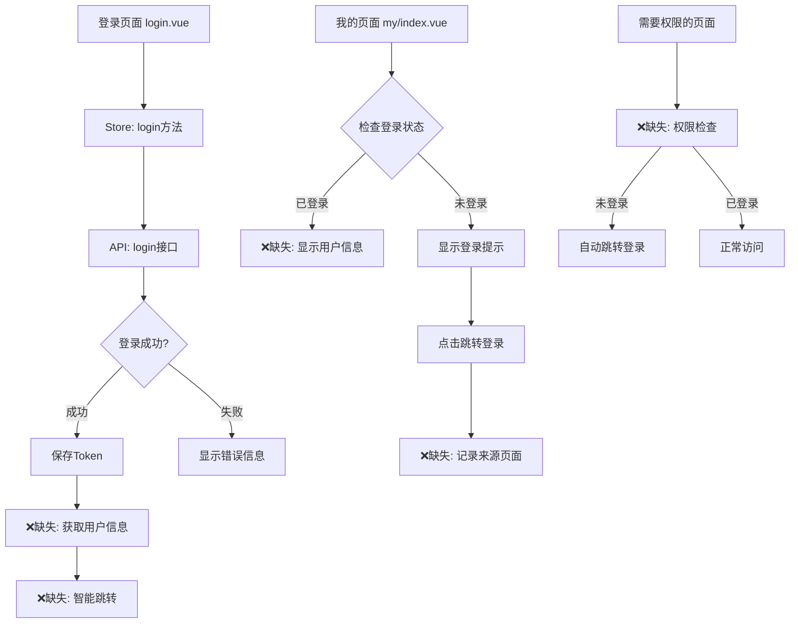
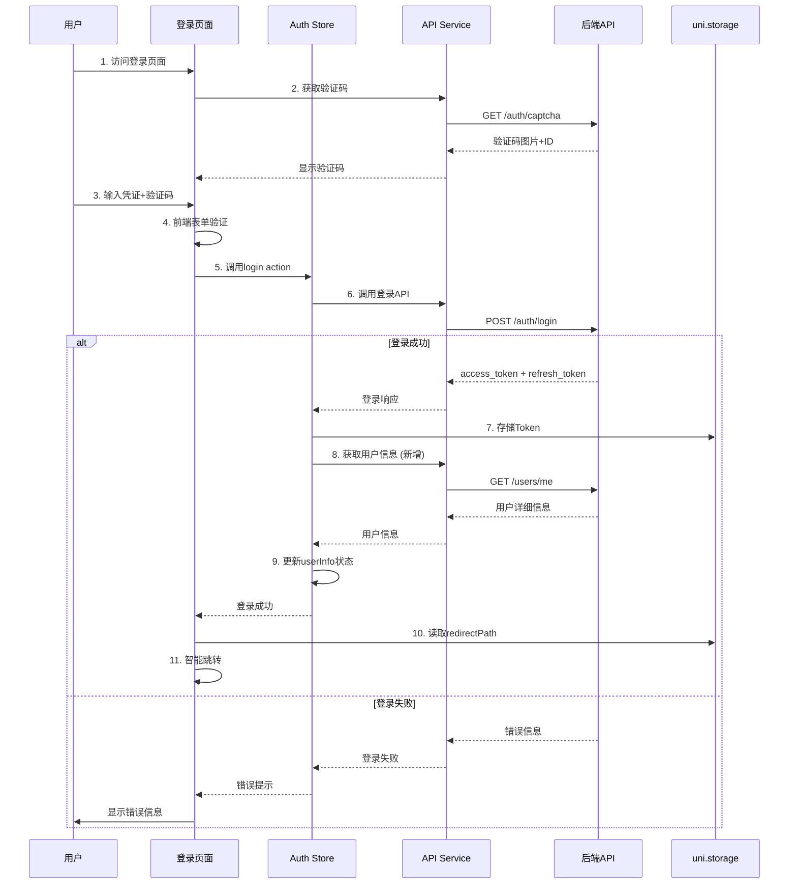
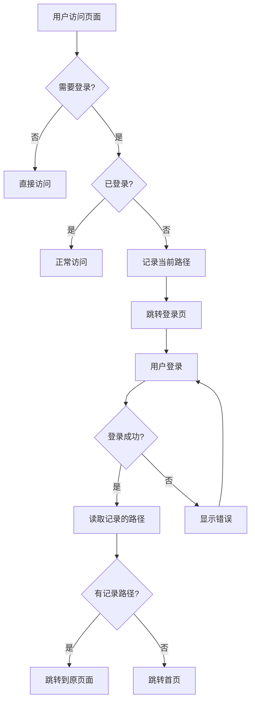
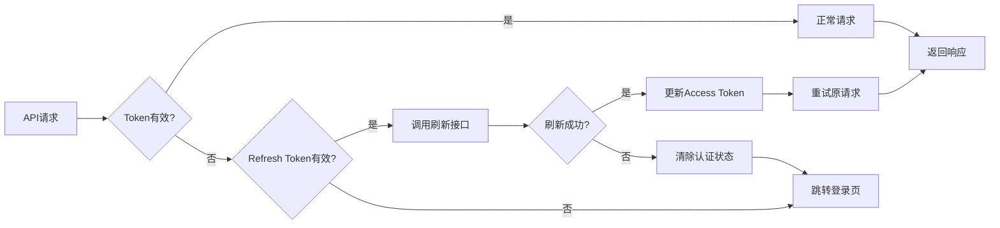
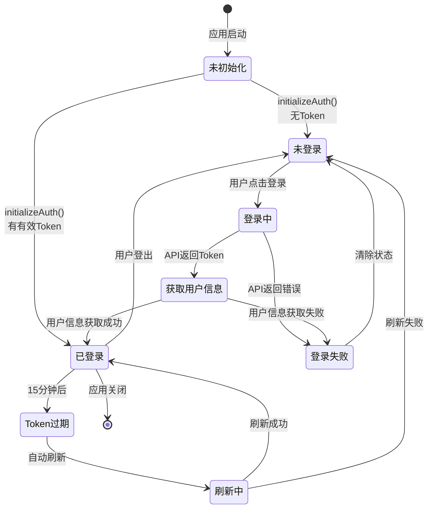

# 直播SaaS平台移动端登录功能完整实现设计文档

**文档版本**: v2.1  
**创建时间**: 2026-01-25  
**更新时间**: 2026-01-25 (安全优化)  
**项目**: 直播SaaS平台移动端  
**作者**: 资深移动端前端工程师  
**最近更新**: 修复密码日志泄露等安全隐患  

---

## 1. 文档目的与项目背景

### 1.1 文档目的

本设计文档旨在为直播SaaS平台移动端登录认证体系提供系统性、标准化的设计与开发指导，确保登录功能的安全性、易用性和跨平台兼容性，同时为后续权限管理、用户状态管理等功能奠定坚实基础。

### 1.2 设计原则

1. **移动优先 (Mobile First)**: 所有设计从移动端场景出发，考虑触屏操作、网络环境、单手使用
2. **安全第一**: JWT认证、Token管理、敏感信息脱敏，符合医学平台安全规范
3. **用户体验**: 智能跳转、状态记忆、错误提示友好，减少用户操作负担
4. **渐进增强**: 核心登录功能优先保证，第三方登录等高级功能按需扩展
5. **跨平台兼容**: uni-app统一开发，适配iOS/Android/H5/小程序

### 1.3 技术背景

- **技术架构**: 前后端分离，基于JWT认证体系
- **前端技术栈**: uni-app + Vue3 + TypeScript + Pinia
- **后端接口**: RESTful API，详见后端API设计文档
- **存储方案**: uni.setStorageSync (跨平台兼容)
- **认证方式**: JWT Token + Refresh Token双令牌机制

---

## 📋 目录

1. [文档目的与项目背景](#文档目的与项目背景)
2. [当前实现状态分析](#当前实现状态分析)
3. [系统架构设计](#系统架构设计)
4. [数据流设计](#数据流设计)
5. [API接口设计](#API接口设计)
6. [功能模块详细设计](#功能模块详细设计)
7. [组件设计规范](#组件设计规范)
8. [状态管理设计](#状态管理设计)
9. [优先级实施计划](#优先级实施计划)
10. [技术实现方案](#技术实现方案)
11. [性能优化方案](#性能优化方案)
12. [测试方案](#测试方案)
13. [安全性设计](#安全性设计)
14. [错误处理设计](#错误处理设计)
15. [部署和监控](#部署和监控)

---

## 1. 角色定位说明

**作者角色：资深移动端前端工程师 + 安全架构师**

- 具备大型直播平台（如Bilibili、抖音）移动端认证体系设计与实现经验
- 精通 JWT 认证体系、OAuth 2.0、多因素认证等安全机制
- 熟悉移动端安全存储、Token管理、权限控制最佳实践
- 擅长 uni-app、Vue3、TypeScript、Pinia 等跨端开发技术
- 具备医学SaaS平台业务理解能力，关注安全性与易用性平衡

---

## 2. 文档目的与项目背景

### 2.1 文档目的

本设计文档旨在为"医学直播SaaS平台"移动端登录认证体系提供系统性、标准化的设计与开发指导，确保：
- **安全性**：符合医学数据平台安全规范，保护用户隐私
- **易用性**：提供流畅的登录体验，减少用户操作负担
- **可维护性**：清晰的代码结构，便于团队协作和功能扩展
- **跨平台**：统一的认证机制，适配iOS/Android/H5/小程序

### 2.2 项目背景

- **技术架构**：前后端分离，基于RESTful API + JWT认证
- **前端技术栈**：uni-app + Vue3 + TypeScript + Pinia
- **后端接口**：FastAPI框架，详见《后端新增api接口和模块设计文档-v2.md》
- **核心目标**：构建安全、高效且符合移动用户习惯的登录认证体系

### 2.3 设计原则

1. **安全第一 (Security First)**
   - JWT认证体系，Token加密存储
   - 敏感信息脱敏，日志安全记录
   - 防暴力破解、防重放攻击

2. **移动优先 (Mobile First)**
   - 触屏优化，单手操作友好
   - 弱网环境降级方案
   - 流量和电量消耗最小化

3. **用户体验 (User Experience)**
   - 智能跳转，状态记忆
   - 错误提示友好，操作引导清晰
   - 无感知Token刷新

4. **渐进增强 (Progressive Enhancement)**
   - 核心登录功能优先保证
   - 第三方登录等高级功能按需扩展
   - 降级方案覆盖各种异常场景

5. **代码规范 (Code Standards)**
   - TypeScript强类型，禁止any
   - 组件化开发，职责清晰
   - 完整的注释和文档

### 2.4 技术栈选型

| 技术类别 | 选型方案 | 理由 |
|---------|---------|------|
| **基础框架** | uni-app + Vue3 | 一套代码多端发布，降低维护成本 |
| **状态管理** | Pinia | Vue官方推荐，TypeScript支持好 |
| **认证方式** | JWT + Refresh Token | 无状态认证，支持Token自动刷新 |
| **存储方案** | uni.setStorageSync | 跨平台兼容，App端自动加密 |
| **网络请求** | uni.request封装 | 自动注入Token，统一错误处理 |
| **表单验证** | 自定义validation | 灵活控制，适配移动端场景 |
| **日志管理** | 自研Logger | 脱敏处理，支持本地存储和上报 |

---

## 3. 当前实现状态分析

### 3.1 项目结构概览

```plaintext
src/
├── api/
│   ├── auth.ts                    ✅ 登录认证接口完整实现
│   ├── request.ts                 ✅ 请求封装（Token自动注入）
│   └── index.ts                   ✅ API统一导出
├── store/
│   └── auth.ts                    ⚠️ 认证状态管理（缺少用户信息获取）
├── pages/
│   └── app/
│       ├── auth/
│       │   └── login.vue          ⚠️ 登录页面（缺少成功后处理）
│       └── tabbar/
│           └── my/
│               └── index.vue      ❌ 用户信息显示缺失
├── types/
│   └── auth.ts                    ✅ 类型定义完整
└── utils/
    └── auth.ts                    ❌ 权限检查工具缺失
```

### 3.2 ✅ 已完成功能矩阵

#### 3.2.1 核心认证机制（基础设施层）

| 功能模块 | 实现状态 | 完成度 | 说明 |
|---------|---------|--------|------|
| **Token存储管理** | ✅ 完整 | 100% | JWT存储、解析、验证机制完整 |
| **API接口层** | ✅ 完整 | 100% | auth.ts提供完整接口封装 |
| **请求拦截器** | ✅ 完整 | 100% | 自动注入Token、统一错误处理 |
| **类型定义** | ✅ 完整 | 100% | TypeScript类型定义完整 |

#### 3.2.2 登录表单功能（UI交互层）

| 功能项 | 实现状态 | 完成度 | 说明 |
|-------|---------|--------|------|
| **用户名输入** | ✅ 完整 | 100% | 支持邮箱/手机/用户名 |
| **密码输入** | ✅ 完整 | 100% | 密码强度验证 |
| **验证码显示** | ✅ 完整 | 100% | 真实API调用，图形验证码 |
| **表单验证** | ✅ 完整 | 100% | 实时验证，错误提示 |
| **登录提交** | ✅ 完整 | 100% | API调用，Token保存 |
| **错误处理** | ✅ 完整 | 100% | 429限流、验证码错误等 |

#### 3.2.3 Store状态管理（核心逻辑层）

| 方法/属性 | 实现状态 | 功能说明 |
|----------|---------|----------|
| `login()` | ✅ 完整 | 登录处理，Token保存 |
| `setToken()` | ✅ 完整 | Token存储到uni.storage |
| `clearToken()` | ✅ 完整 | Token清理 |
| `checkTokenExpiry()` | ✅ 完整 | Token过期检查 |
| `parseUserFromToken()` | ✅ 完整 | 从JWT解析用户信息 |
| `refreshAccessToken()` | ✅ 完整 | Token自动刷新 |
| `initializeAuth()` | ✅ 完整 | 认证状态初始化 |
| `fetchUserProfile()` | ❌ 缺失 | **用户信息获取（P0缺失）** |

#### 3.2.4 安全性措施（防护层）

| 安全措施 | 实现状态 | 说明 |
|---------|---------|------|
| **图形验证码** | ✅ 完整 | 防暴力破解 |
| **Token过期验证** | ✅ 完整 | 15分钟自动过期 |
| **Refresh Token** | ✅ 完整 | 7天持久化存储 |
| **请求频率限制** | ✅ 完整 | 429错误处理 |
| **HTTPS传输** | ✅ 完整 | 生产环境强制HTTPS |
| **敏感信息脱敏** | ✅ 完整 | Token日志只显示前4位 |

### 3.3 ❌ 关键缺失功能清单

#### 3.3.1 P0级别缺失（影响核心流程）

| 缺失功能 | 影响范围 | 紧急程度 | 预计工时 |
|---------|---------|---------|----------|
| **登录成功后用户信息获取** | 无法获取用户详细资料 | 🔴 P0 | 30分钟 |
| **"我的"页面用户信息显示** | 只有占位符，体验不完整 | 🔴 P0 | 30分钟 |
| **登录成功后智能跳转** | 固定跳转首页，无来源记忆 | 🔴 P0 | 45分钟 |

**详细说明**：

1. **登录成功后用户信息获取**
   - **现状**：`src/store/auth.ts` 中缺少 `fetchUserProfile()` 方法
   - **影响**：登录成功后只有Token，没有用户详细信息（用户名、头像、权限等）
   - **需要调用的API**：`GET /api/v1/users/me`
   - **依赖关系**：登录成功 → 保存Token → 调用用户信息接口 → 保存用户资料

2. **"我的"页面用户信息显示**
   - **现状**：`src/pages/app/tabbar/my/index.vue` 显示固定的"点击登录"
   - **影响**：用户登录后看不到自己的用户名和信息，体验不完整
   - **需要修改**：从 `authStore.userInfo` 获取真实数据
   - **依赖关系**：依赖上面的用户信息获取功能

3. **登录成功后智能跳转**
   - **现状**：登录成功固定跳转首页，不记录来源页面
   - **影响**：用户从"我的"页面点击登录，登录后被带到首页，体验割裂
   - **需要实现**：记录来源页面路径，登录后智能回跳
   - **技术方案**：使用 `uni.setStorageSync('loginRedirectPath', path)`

#### 3.3.2 P1级别缺失（影响用户体验）

| 缺失功能 | 影响范围 | 紧急程度 | 预计工时 |
|---------|---------|---------|----------|
| **全局权限拦截机制** | 需要登录的页面无保护 | 🟡 P1 | 90分钟 |
| **登录状态实时同步** | H5多标签页状态不一致 | 🟡 P1 | 60分钟 |

**详细说明**：

4. **全局权限拦截机制**
   - **现状**：没有页面级权限检查工具
   - **影响**：用户未登录可访问收藏、订阅等需要登录的页面，导致接口报错
   - **需要创建**：`src/utils/auth.ts` 权限检查工具
   - **需要改造的页面**：
     - `pages/app/tabbar/my/favorites/index.vue` - 收藏页面
     - `pages/app/tabbar/my/subscriptions/index.vue` - 订阅页面
     - `pages/app/tabbar/my/watch-history/index.vue` - 观看历史
     - `pages/app/message/index.vue` - 消息中心

5. **登录状态实时同步**
   - **现状**：H5多标签页登录状态不同步
   - **影响**：用户在标签页A登录，标签页B仍显示未登录
   - **技术方案**：监听 `storage` 事件，自动同步状态

### 3.4 代码依赖关系分析



**关键发现**：
- ✅ **基础设施层**完整：Token管理、API调用、请求拦截
- ❌ **业务逻辑层**不完整：缺少登录后的后续处理
- ❌ **UI展示层**未集成：用户信息显示为占位符
- ❌ **权限控制层**缺失：无页面级权限保护

---

## 4. 系统架构设计

### 4.1 整体架构图

```
┌─────────────────────────────────────────────────────────────────┐
│                         移动端应用层                              │
├─────────────────────────────────────────────────────────────────┤
│  ┌──────────────┐  ┌──────────────┐  ┌──────────────┐         │
│  │  登录页面     │  │  我的页面     │  │  权限页面     │         │
│  │  login.vue   │  │  my/index.vue │  │  favorites   │         │
│  └──────┬───────┘  └──────┬───────┘  └──────┬───────┘         │
│         │                  │                  │                  │
├─────────┼──────────────────┼──────────────────┼─────────────────┤
│         │  UI交互层        │                  │                  │
│         ▼                  ▼                  ▼                  │
│  ┌──────────────────────────────────────────────────┐          │
│  │           Pinia State Management (auth.ts)        │          │
│  │  ┌──────────┐  ┌──────────┐  ┌──────────┐       │          │
│  │  │  State   │  │ Getters  │  │ Actions  │       │          │
│  │  │  管理状态 │  │ 计算属性  │  │ 业务逻辑  │       │          │
│  │  └──────────┘  └──────────┘  └──────────┘       │          │
│  └─────────────────────┬────────────────────────────┘          │
├────────────────────────┼───────────────────────────────────────┤
│         业务逻辑层      │                                         │
│                        ▼                                         │
│  ┌──────────────────────────────────────────────────┐          │
│  │           API Service Layer (api/auth.ts)         │          │
│  │  ┌──────────┐  ┌──────────┐  ┌──────────┐       │          │
│  │  │  login   │  │getCaptcha│  │ getUser  │       │          │
│  │  └──────────┘  └──────────┘  └──────────┘       │          │
│  └─────────────────────┬────────────────────────────┘          │
├────────────────────────┼───────────────────────────────────────┤
│      网络请求层         │                                         │
│                        ▼                                         │
│  ┌──────────────────────────────────────────────────┐          │
│  │      Request Interceptor (utils/request.ts)       │          │
│  │  ┌──────────┐  ┌──────────┐  ┌──────────┐       │          │
│  │  │Token注入  │  │错误处理   │  │响应拦截   │       │          │
│  │  └──────────┘  └──────────┘  └──────────┘       │          │
│  └─────────────────────┬────────────────────────────┘          │
├────────────────────────┼───────────────────────────────────────┤
│       存储层            │                                         │
│                        ▼                                         │
│  ┌──────────────────────────────────────────────────┐          │
│  │           uni.storage (跨平台存储)                 │          │
│  │  jwt_token  │  refresh_token  │  loginRedirectPath│          │
│  └──────────────────────────────────────────────────┘          │
└─────────────────────────────────────────────────────────────────┘
                             │
                             │ HTTPS
                             ▼
┌─────────────────────────────────────────────────────────────────┐
│                        后端API服务                               │
│  /api/v1/auth/login  │  /api/v1/auth/captcha  │  /api/v1/users/me│
└─────────────────────────────────────────────────────────────────┘
```

### 4.2 认证流程架构



### 4.3 权限拦截架构



### 4.4 Token刷新架构



### 4.5 多平台适配架构

| 平台 | 存储方案 | Token注入方式 | 登录跳转 | 特殊处理 |
|------|---------|-------------|---------|----------|
| **iOS App** | uni.storage (沙盒加密) | Header: Authorization | uni.navigateTo | 支持Face ID (V2.0) |
| **Android App** | uni.storage (沙盒加密) | Header: Authorization | uni.navigateTo | 支持指纹 (V2.0) |
| **H5** | localStorage | Header: Authorization | window.location.href | 支持多标签页同步 |
| **微信小程序** | wx.storage | Header: Authorization | wx.navigateTo | 需额外登录授权 |

---

## 5. 数据流设计

### 5.1 登录数据流

```typescript
// 1. 用户输入 → 表单数据
interface LoginFormData {
  username: string;          // 用户名/邮箱/手机
  password: string;          // 密码
  captcha_id: string;        // 验证码ID
  captcha_solution: string;  // 验证码答案
}

// 2. API请求 → 后端
POST /api/v1/auth/login
Request Body: LoginFormData

// 3. 后端响应 → Token数据
interface LoginResponse {
  access_token: string;      // JWT访问令牌 (15分钟)
  refresh_token: string;     // 刷新令牌 (7天)
  token_type: 'Bearer';      // Token类型
}

// 4. Store状态 → 用户状态
interface AuthState {
  token: string | null;           // Access Token
  userInfo: UserInfo | null;      // 用户详细信息
  refreshToken: string | null;    // Refresh Token
  redirectPath: string | null;    // 登录后回跳路径
  isInitialized: boolean;         // 初始化完成标记
}

// 5. 用户信息获取 → 用户资料
interface UserInfo {
  uuid: string;                  // 用户唯一ID
  username: string;              // 用户名
  email: string;                 // 邮箱
  avatar?: string;               // 头像URL
  phone?: string;                // 手机号
  is_broadcaster: boolean;       // 是否主播
  is_expert: boolean;            // 是否专家
  created_at: string;            // 创建时间
}
```

### 5.2 状态流转图



### 5.3 Store数据结构详细设计

```typescript
/**
 * 认证Store状态管理
 */
export const useAuthStore = defineStore('auth', {
  state: (): AuthState => ({
    // 核心认证数据
    token: null,                    // JWT访问令牌
    userInfo: null,                 // 用户详细信息
    refreshToken: null,             // 刷新令牌 (暂不用于state，存storage)
    redirectPath: null,             // 登录后回跳路径
    isInitialized: false,           // 初始化完成标记
  }),

  getters: {
    /**
     * 是否已登录 (核心计算属性)
     */
    isAuthenticated: (state): boolean => {
      if (!state.token) return false;
      return checkTokenExpiry(state.token);
    },

    /**
     * 用户昵称显示
     */
    userNickname: (state): string => {
      if (!state.userInfo) return '用户';
      return state.userInfo.username || state.userInfo.email || '用户';
    },

    /**
     * 用户头像URL
     */
    userAvatar: (state): string => {
      return state.userInfo?.avatar || '/static/default-avatar.png';
    },

    /**
     * 用户权限标识
     */
    userRoles: (state): string[] => {
      const roles: string[] = [];
      if (state.userInfo?.is_broadcaster) roles.push('broadcaster');
      if (state.userInfo?.is_expert) roles.push('expert');
      return roles;
    },

    /**
     * Token是否即将过期 (提前5分钟)
     */
    isTokenExpiringSoon: (state): boolean => {
      if (!state.token) return false;
      try {
        const payload = JSON.parse(atob(state.token.split('.')[1]));
        const expiryTime = payload.exp * 1000;
        const now = Date.now();
        const fiveMinutes = 5 * 60 * 1000;
        return (expiryTime - now) < fiveMinutes;
      } catch {
        return true;
      }
    },
  },

  actions: {
    /**
     * 🔴 P0: 用户登录 (已实现)
     */
    async login(data: LoginRequest): Promise<void> {
      // 实现见6.1节
    },

    /**
     * 🔴 P0: 获取用户信息 (需新增)
     */
    async fetchUserProfile(): Promise<void> {
      // 实现见6.1.1节
    },

    /**
     * 🔴 P0: 智能跳转处理 (需优化)
     */
    handleAuthRedirect(): void {
      // 实现见6.1.2节
    },

    /**
     * 🟢 P1: 刷新Token (已实现)
     */
    async refreshAccessToken(): Promise<boolean> {
      // 实现见6.2节
    },

    /**
     * ✅ 已实现: Token管理
     */
    setToken(token: string): void { /* ... */ },
    clearToken(): void { /* ... */ },
    parseUserFromToken(token: string): void { /* ... */ },
  },
});
```

### 5.4 API数据契约

#### 5.4.1 登录接口
```typescript
// 请求
POST /api/v1/auth/login
Content-Type: application/json

{
  "username": "testuser",
  "password": "Test@123",
  "captcha_id": "uuid-xxx-xxx",
  "captcha_solution": "1234"
}

// 响应
HTTP/1.1 200 OK
Content-Type: application/json

{
  "code": 200,
  "message": "success",
  "data": {
    "access_token": "eyJhbGc...",
    "refresh_token": "eyJhbGc...",
    "token_type": "Bearer"
  },
  "timestamp": "2026-01-25T10:30:00Z"
}

// 错误响应
HTTP/1.1 401 Unauthorized
{
  "code": 3001,
  "message": "用户名或密码错误",
  "data": null,
  "timestamp": "2026-01-25T10:30:00Z"
}
```

#### 5.4.2 获取用户信息接口
```typescript
// 请求
GET /api/v1/users/me
Authorization: Bearer <access_token>

// 响应
HTTP/1.1 200 OK
{
  "code": 200,
  "message": "success",
  "data": {
    "uuid": "user-uuid-xxx",
    "username": "testuser",
    "email": "test@example.com",
    "avatar": "https://example.com/avatar.jpg",
    "phone": "138****1234",
    "is_broadcaster": false,
    "is_expert": true,
    "created_at": "2025-01-01T00:00:00Z"
  }
}
```

#### 5.4.3 刷新Token接口
```typescript
// 请求
POST /api/v1/auth/refresh
Content-Type: application/json

{
  "refresh_token": "eyJhbGc..."
}

// 响应
HTTP/1.1 200 OK
{
  "code": 200,
  "message": "success",
  "data": {
    "access_token": "eyJhbGc...",
    "token_type": "Bearer"
  }
}
```

---

## 6. API接口设计

### 6.1 接口清单总览

| 接口名称 | HTTP方法 | 路径 | 认证要求 | 功能说明 |
|---------|---------|------|---------|---------|
| 获取验证码 | GET | `/api/v1/auth/captcha` | 否 | 获取图形验证码 |
| 用户登录 | POST | `/api/v1/auth/login` | 否 | 账号密码登录 |
| 刷新Token | POST | `/api/v1/auth/refresh` | 否 | 刷新访问令牌 |
| 获取用户信息 | GET | `/api/v1/users/me` | 是 | 获取当前用户资料 |
| 用户登出 | POST | `/api/v1/auth/logout` | 是 | 退出登录 |
| SSO登录 | POST | `/api/v1/auth/sso-login` | 否 | 第三方登录 |

### 6.2 接口详细规范

#### 6.2.1 获取验证码

```typescript
/**
 * 获取图形验证码
 * 用于防止暴力破解登录
 */
GET /api/v1/auth/captcha

// 请求参数：无

// 响应示例
{
  "code": 200,
  "message": "success",
  "data": {
    "captcha_id": "uuid-4d3e-9f8a-1234567890ab",  // 验证码唯一ID
    "image_base64": "data:image/png;base64,iVBOR..." // Base64编码的验证码图片
  },
  "timestamp": "2026-01-25T10:30:00Z"
}

// 业务规则
// - 验证码有效期: 3分钟
// - 验证码长度: 4位数字
// - 一次性消费，使用后立即失效
// - 存储在Redis: captcha:{captcha_id} -> {solution}
```

#### 6.2.2 用户登录

```typescript
/**
 * 账号密码登录
 * 支持用户名/邮箱/手机号多种登录方式
 */
POST /api/v1/auth/login
Content-Type: application/json

// 请求体
{
  "username": "testuser",           // 用户名/邮箱/手机号
  "password": "Test@123",           // 密码
  "captcha_id": "uuid-xxx",         // 验证码ID
  "captcha_solution": "1234"        // 验证码答案
}

// 成功响应 (200 OK)
{
  "code": 200,
  "message": "登录成功",
  "data": {
    "access_token": "eyJhbGc...",   // JWT访问令牌 (15分钟)
    "refresh_token": "eyJhbGc...",  // 刷新令牌 (7天)
    "token_type": "Bearer"          // Token类型
  },
  "timestamp": "2026-01-25T10:30:00Z"
}

// 错误响应示例
// 1. 验证码错误 (400 Bad Request)
{
  "code": 3002,
  "message": "验证码错误或已过期",
  "data": null
}

// 2. 用户名或密码错误 (401 Unauthorized)
{
  "code": 3001,
  "message": "用户名或密码错误",
  "data": null
}

// 3. 请求频率限制 (429 Too Many Requests)
{
  "code": 4029,
  "message": "请求过于频繁，请60秒后再试",
  "data": null
}

// 业务规则
// - 验证码验证后立即失效
// - 密码错误5次后锁定账户30分钟
// - 频率限制: 同一IP每分钟最多10次
// - Token存储: JWT中包含user_id, type, exp, jti
```

#### 6.2.3 刷新Token

```typescript
/**
 * 刷新访问令牌
 * 使用Refresh Token获取新的Access Token
 */
POST /api/v1/auth/refresh
Content-Type: application/json

// 请求体
{
  "refresh_token": "eyJhbGc..."
}

// 成功响应
{
  "code": 200,
  "message": "Token刷新成功",
  "data": {
    "access_token": "eyJhbGc...",   // 新的Access Token
    "token_type": "Bearer"
  }
}

// 错误响应
{
  "code": 4001,
  "message": "Refresh Token无效或已过期",
  "data": null
}
```

#### 6.2.4 获取用户信息

```typescript
/**
 * 获取当前登录用户的详细信息
 */
GET /api/v1/users/me
Authorization: Bearer <access_token>

// 成功响应
{
  "code": 200,
  "message": "success",
  "data": {
    "uuid": "user-uuid-123",        // 用户唯一ID
    "username": "testuser",          // 用户名
    "email": "test@example.com",     // 邮箱
    "phone": "138****1234",          // 手机号(脱敏)
    "avatar": "https://...",         // 头像URL
    "is_broadcaster": false,         // 是否主播
    "is_expert": true,               // 是否专家
    "created_at": "2025-01-01T00:00:00Z",
    "last_login_at": "2026-01-25T10:30:00Z"
  }
}

// 错误响应 (401 Unauthorized)
{
  "code": 4001,
  "message": "未授权，请先登录",
  "data": null
}
```

### 6.3 错误码规范

| 错误码 | HTTP状态码 | 错误信息 | 说明 |
|-------|-----------|---------|------|
| 200 | 200 | success | 请求成功 |
| 3001 | 401 | 用户名或密码错误 | 登录凭证错误 |
| 3002 | 400 | 验证码错误或已过期 | 验证码验证失败 |
| 4001 | 401 | 未授权，请先登录 | Token无效或过期 |
| 4029 | 429 | 请求过于频繁 | 触发频率限制 |
| 5000 | 500 | 服务器内部错误 | 系统异常 |

### 4.1 登录模块

#### 4.1.1 登录表单组件
**位置**: `src/pages/app/auth/login.vue`

**当前状态**: ✅ 基本完整
**缺失功能**: 
- 登录成功后的用户信息获取
- 智能跳转逻辑

#### 4.1.2 登录成功处理流程
```typescript
// 需要补充的登录成功处理逻辑
const handleLoginSuccess = async (response: ApiResponse<LoginResponse>) => {
  try {
    // 1. 保存Token
    const { access_token, refresh_token } = response.data;
    authStore.setToken(access_token);
    uni.setStorageSync('refresh_token', refresh_token);
    
    // 2. 获取用户信息 (新增)
    await authStore.fetchUserProfile();
    
    // 3. 智能跳转 (优化)
    const redirectPath = uni.getStorageSync('loginRedirectPath') || '/pages/app/tabbar/home/index';
    uni.clearStorageSync('loginRedirectPath');
    
    // 4. 跳转处理
    if (redirectPath.includes('/pages/app/tabbar/')) {
      uni.switchTab({ url: redirectPath });
    } else {
      uni.navigateTo({ url: redirectPath });
    }
    
    console.log('✅ 登录完整流程完成');
  } catch (error) {
    console.error('❌ 登录后续处理失败:', error);
  }
};
```

### 4.2 用户信息模块

#### 4.2.1 用户信息获取
**位置**: `src/store/auth.ts`

**需要新增**: `fetchUserProfile()` 方法
```typescript
/**
 * 获取完整用户资料
 */
async fetchUserProfile(): Promise<void> {
  try {
    if (!this.token) {
      throw new Error('未找到访问Token');
    }
    
    const response = await getCurrentUser();
    this.userInfo = response.data;
    
    console.log('✅ 用户信息获取成功:', this.userInfo);
  } catch (error) {
    console.error('❌ 获取用户信息失败:', error);
    throw error;
  }
}
```

#### 4.2.2 用户信息显示
**位置**: `src/pages/app/tabbar/my/index.vue`

**当前问题**: 显示固定的"点击登录"
**需要改造**: 集成真实用户信息

```vue
<!-- 当前代码结构 -->
<view v-if="isAuthenticated" class="user-info">
  <image class="avatar" :src="userAvatar" mode="aspectFill" />
  <view class="user-details">
    <text class="nickname">{{ userNickname }}</text>
  </view>
</view>

<!-- 需要集成store中的真实数据 -->
<script setup>
import { useAuthStore } from '@/store/auth';
const authStore = useAuthStore();

// 计算属性需要从store获取真实数据
const isAuthenticated = computed(() => authStore.isAuthenticated);
const userNickname = computed(() => authStore.userInfo?.username || '用户');
const userAvatar = computed(() => authStore.userInfo?.avatar || '/static/default-avatar.png');
</script>
```

### 4.3 权限拦截模块

#### 4.3.1 页面级权限检查
**需要新增**: `src/utils/auth.ts`

```typescript
/**
 * 权限检查工具函数
 */
export const requireAuth = (redirectPath?: string): boolean => {
  const authStore = useAuthStore();
  
  if (!authStore.isAuthenticated) {
    // 记录当前页面路径
    const currentPath = redirectPath || getCurrentPagePath();
    uni.setStorageSync('loginRedirectPath', currentPath);
    
    // 跳转登录页
    uni.navigateTo({
      url: '/pages/app/auth/login'
    });
    
    return false;
  }
  
  return true;
};

/**
 * 获取当前页面路径
 */
const getCurrentPagePath = (): string => {
  const pages = getCurrentPages();
  const currentPage = pages[pages.length - 1];
  return '/' + currentPage.route;
};
```

#### 4.3.2 需要权限的页面集成
**需要改造的页面**:
- `pages/app/tabbar/my/favorites/index.vue` - 收藏页面
- `pages/app/tabbar/my/subscriptions/index.vue` - 订阅页面
- `pages/app/tabbar/my/watch-history/index.vue` - 观看历史

**改造方案**:
```vue
<script setup>
import { requireAuth } from '@/utils/auth';

onMounted(() => {
  // 页面加载时检查登录状态
  if (!requireAuth()) {
    return; // 未登录会自动跳转
  }
  
  // 已登录，执行正常逻辑
  loadPageData();
});
</script>
```

---

## 6.5 登录页UI设计规范（V2.0简化版 - 当前实现）

### 6.5.1 整体布局

**🔧 最新实现**：
- **导航栏**：使用uni-app原生导航栏（标题"登录" + 返回按钮），与其他页面保持统一
- **欢迎区域**：蓝色渐变背景 `linear-gradient(135deg, #1E90FF 0%, #4169E1 100%)`
  - padding: 60rpx 40rpx 70rpx 40rpx
  - 显示文字："您好，" + "欢迎使用SaaS平台"
  - 字号：40rpx，字重：600，颜色：#ffffff
- **表单容器**：白色卡片，上圆角32rpx，与欢迎区有-20rpx重叠
  - padding: 48rpx 40rpx
  - 阴影：0 -4rpx 20rpx rgba(0, 0, 0, 0.05)
  - 背景：#ffffff
- **布局特点**：一屏显示完全，无需滚动

**pages.json配置**：
```json
{
  "path": "pages/app/auth/login",
  "style": {
    "navigationBarTitleText": "登录",
    // ⚠️ 不设置 navigationStyle，使用原生导航栏（与其他页面统一）
    "enablePullDownRefresh": false
  }
}
```

### 6.5.2 表单元素

**输入框（标签式设计）**：
- 标签（label）：
  - 字号：28rpx，颜色：#333333，字重：500
  - margin-bottom：16rpx
  - 显示在输入框上方
- 输入框：
  - 高度：80rpx
  - 背景：#f7f8fa（未聚焦）/ #ffffff（聚焦）
  - 边框：1rpx solid #e8e8e8（未聚焦）/ 1rpx solid #1E90FF（聚焦）
  - 圆角：12rpx
  - 内边距：0 24rpx
  - 字号：28rpx，颜色：#333333
  - placeholder颜色：#aaaaaa
  - 输入框间距：28rpx

**密码输入框（带眼睛图标）**：
- 相对定位容器包含input和图标
- 图标：👁️（隐藏）/ 👁️‍🗨️（显示）
  - 位置：绝对定位在右侧24rpx
  - 字号：32rpx，颜色：#999999
  - padding：8rpx

**验证码区域**：
- display: flex，gap: 16rpx
- 输入框：flex: 1
- 图片容器：
  - 宽度：180rpx，高度：80rpx
  - 圆角：12rpx，边框：1rpx solid #e8e8e8
  - 背景：#f7f8fa
  - 点击可刷新验证码

### 6.5.3 按钮设计

**登录按钮**：
- 高度：80rpx
- 背景：`linear-gradient(135deg, #1E90FF 0%, #4169E1 100%)`（蓝色渐变）
- 圆角：44rpx（全圆角）
- 字号：32rpx，字重：600
- 颜色：#ffffff
- 阴影：0 8rpx 20rpx rgba(30, 144, 255, 0.3)
- margin-top：32rpx，margin-bottom：16rpx
- 禁用状态：background: #d9d9d9，box-shadow: none，color: #999999
- 点击态：transform: scale(0.98)

**注册按钮**：
- 高度：80rpx
- 背景：#f7f8fa（灰色背景）
- 圆角：44rpx
- 字号：32rpx，字重：500
- 颜色：#333333
- margin-bottom：24rpx
- 点击态：background: #e8e8e8

### 6.5.4 辅助元素

**忘记密码**：
- text-align: center
- padding: 20rpx 0
- margin-bottom: 32rpx
- 字号：26rpx，颜色：#999999
- 点击态：color: #1E90FF

**第三方登录（简化版）**：
- 分割线：
  - display: flex，align-items: center
  - margin: 32rpx 0 24rpx
  - 左右线条：flex: 1，height: 1rpx，background: #e8e8e8
  - 中间文字："第三方登录"，字号：24rpx，颜色：#999999，padding: 0 16rpx
- 文字链接：
  - "微信登录" 和 "Apple登录"
  - 字号：28rpx，颜色：#666666
  - padding：16rpx 24rpx
  - gap：48rpx（两个链接之间）
  - 点击时颜色变为：#1E90FF

**错误提示**：
- 字号：24rpx，颜色：#ff4d4f
- margin-top：8rpx
- display: block

**重试提示**（验证码加载失败）：
- 字号：24rpx，颜色：#fa8c16
- margin-top：8rpx

### 6.5.5 关键尺寸总结

| 元素 | 高度 | padding/margin | 圆角 | 字号 |
|------|-----|---------------|------|------|
| 欢迎区 | auto | 60rpx 40rpx 70rpx 40rpx | - | 40rpx |
| 表单容器 | auto | 48rpx 40rpx | 32rpx (上) | - |
| 输入框 | 80rpx | 0 24rpx | 12rpx | 28rpx |
| 输入框间距 | - | margin-bottom: 28rpx | - | - |
| 登录按钮 | 80rpx | margin: 32rpx 0 16rpx | 44rpx | 32rpx |
| 注册按钮 | 80rpx | margin-bottom: 24rpx | 44rpx | 32rpx |
| 忘记密码 | auto | 20rpx 0 32rpx | - | 26rpx |
| 第三方登录 | auto | margin-top: 32rpx | - | 28rpx |

### 6.5.6 配色方案

```scss
// ✅ 当前使用的配色方案（简化蓝色系）
$welcome-bg-gradient: linear-gradient(135deg, #1E90FF 0%, #4169E1 100%); // 欢迎区蓝色渐变
$button-blue-gradient: linear-gradient(135deg, #1E90FF 0%, #4169E1 100%); // 登录按钮渐变
$error-color: #ff4d4f;      // 错误红色
$warning-color: #fa8c16;    // 警告橙色
$text-primary: #333333;     // 主文字
$text-secondary: #666666;   // 次要文字
$text-placeholder: #aaaaaa; // 占位符
$border-color: #e8e8e8;     // 边框
$bg-gray: #f7f8fa;          // 灰色背景
$bg-white: #ffffff;         // 白色背景
$bg-page: #f5f5f5;          // 页面背景

// 圆角规范
$border-radius-card: 32rpx;   // 表单容器上圆角
$border-radius-button: 44rpx; // 按钮全圆角
$border-radius-input: 12rpx;  // 输入框圆角

// 阴影规范
$shadow-card: 0 -4rpx 20rpx rgba(0, 0, 0, 0.05);  // 表单容器阴影
$shadow-button: 0 8rpx 20rpx rgba(30, 144, 255, 0.3); // 登录按钮阴影
```

### 6.5.7 重要变更说明

**相比之前的设计**：
- ✅ 使用uni-app原生导航栏（替代自定义导航栏）
- ✅ 蓝色渐变欢迎区 + 白色卡片表单（替代紫色渐变全屏背景）
- ✅ 标签式输入框（label在上方，替代图标在左侧）
- ✅ 第三方登录简化为文字链接（替代圆形图标按钮）
- ❌ 删除测试账号提示（不显示测试账号信息）
- ✅ 一屏显示完全（通过调整padding/margin实现）

---

## 7. 功能模块详细设计

### 7.1 登录模块 (Login Module)

#### 7.1.1 组件职责

| 组件 | 文件路径 | 职责描述 |
|------|---------|---------|
| **登录页面** | `pages/app/auth/login.vue` | UI展示、表单验证、用户交互 |
| **认证Store** | `store/auth.ts` | 状态管理、业务逻辑、Token管理 |
| **认证API** | `api/auth.ts` | 接口封装、数据转换 |
| **请求拦截器** | `utils/request.ts` | Token注入、错误处理 |

#### 7.1.2 页面结构设计

```vue
<!-- pages/app/auth/login.vue -->
<template>
  <view class="login-page">
    <!-- 导航栏 -->
    <nav-bar title="登录" show-back />
    
    <!-- Logo区域 -->
    <view class="logo-section">
      <image class="logo" src="/static/logo.png" />
      <text class="app-title">直播SaaS平台</text>
    </view>
    
    <!-- 表单区域 -->
    <view class="form-section">
      <!-- 用户名输入 -->
      <input-field 
        v-model="formData.username"
        placeholder="请输入用户名/邮箱/手机号"
        icon="user"
        :error="errors.username"
      />
      
      <!-- 密码输入 -->
      <input-field
        v-model="formData.password"
        type="password"
        placeholder="请输入密码"
        icon="lock"
        :error="errors.password"
      />
      
      <!-- 验证码输入 -->
      <captcha-input
        v-model:captcha-id="formData.captcha_id"
        v-model:solution="formData.captcha_solution"
        :error="errors.captcha"
        @refresh="loadCaptcha"
      />
      
      <!-- 登录按钮 -->
      <button
        class="login-button"
        :disabled="isLoginDisabled || isLoggingIn"
        @click="handleLogin"
      >
        {{ isLoggingIn ? '登录中...' : '登录' }}
      </button>
    </view>
    
    <!-- 第三方登录 -->
    <view class="third-party-section">
      <view class="divider">
        <text>其他登录方式</text>
      </view>
      <view class="third-party-buttons">
        <button @click="handleWechatLogin">微信登录</button>
        <button @click="handleAppleLogin">Apple登录</button>
      </view>
    </view>
    
    <!-- 测试账号提示 -->
    <view class="test-account">
      测试账号: testuser / Test@123
    </view>
  </view>
</template>

<script setup lang="ts">
// 具体实现见10.1节
</script>
```

#### 7.1.3 状态流转设计

```typescript
// 登录状态枚举
enum LoginState {
  IDLE = 'idle',              // 空闲状态
  LOADING_CAPTCHA = 'loading_captcha', // 加载验证码
  VALIDATING = 'validating',  // 表单验证中
  LOGGING_IN = 'logging_in',  // 登录中
  SUCCESS = 'success',        // 登录成功
  FAILED = 'failed',          // 登录失败
  LOCKED = 'locked',          // 账户锁定
}

// 状态管理
const loginState = ref<LoginState>(LoginState.IDLE);
const lockoutCountdown = ref(0);  // 锁定倒计时
const captchaRetryCount = ref(0); // 验证码重试次数
```

### 7.2 用户信息模块 (User Profile Module)

#### 7.2.1 数据结构设计

```typescript
/**
 * 用户信息完整类型定义
 */
interface UserInfo {
  // 基本信息
  uuid: string;                    // 用户唯一ID
  username: string;                // 用户名
  email: string;                   // 邮箱
  phone?: string;                  // 手机号(可选)
  avatar?: string;                 // 头像URL(可选)
  
  // 角色与权限
  is_broadcaster: boolean;         // 是否主播
  is_expert: boolean;              // 是否专家
  roles: string[];                 // 角色列表
  
  // 会员信息
  membership_level?: string;       // 会员等级
  membership_expires_at?: string;  // 会员到期时间
  
  // 统计信息
  favorites_count: number;         // 收藏数
  subscriptions_count: number;     // 订阅数
  watch_history_count: number;     // 观看历史数
  
  // 时间戳
  created_at: string;              // 创建时间
  last_login_at: string;           // 最后登录时间
}
```

#### 7.2.2 "我的"页面集成方案

```vue
<!-- pages/app/tabbar/my/index.vue -->
<template>
  <view class="my-page">
    <!-- 用户信息卡片 -->
    <view class="user-card" :class="{ 'not-logged-in': !isAuthenticated }">
      <!-- 已登录状态 -->
      <view v-if="isAuthenticated" class="user-info">
        <image class="avatar" :src="userAvatar" mode="aspectFill" />
        <view class="user-details">
          <text class="nickname">{{ userNickname }}</text>
          <view class="badges">
            <view v-if="isBroadcaster" class="badge broadcaster">
              <text>🎙️ 主播</text>
            </view>
            <view v-if="isExpert" class="badge expert">
              <text>👨‍⚕️ 专家</text>
            </view>
          </view>
        </view>
      </view>
      
      <!-- 未登录状态 -->
      <view v-else class="login-prompt" @click="handleLogin">
        <image class="avatar default" src="/static/default-avatar.png" />
        <view class="login-text">
          <text class="title">点击登录</text>
          <text class="subtitle">登录后享受更多功能</text>
        </view>
      </view>
    </view>
    
    <!-- 功能菜单 -->
    <view class="menu-section">
      <!-- 省略其他菜单 -->
    </view>
  </view>
</template>

<script setup lang="ts">
import { computed } from 'vue';
import { useAuthStore } from '@/store/auth';

const authStore = useAuthStore();

// 计算属性 - 从Store获取真实数据
const isAuthenticated = computed(() => authStore.isAuthenticated);
const userNickname = computed(() => authStore.userNickname);
const userAvatar = computed(() => authStore.userAvatar);
const isBroadcaster = computed(() => authStore.userInfo?.is_broadcaster || false);
const isExpert = computed(() => authStore.userInfo?.is_expert || false);

// 登录处理 - 记录来源页面
const handleLogin = () => {
  console.log('🔄 跳转到登录页面，记录来源页面');
  uni.setStorageSync('loginRedirectPath', '/pages/app/tabbar/my/index');
  uni.navigateTo({
    url: '/pages/app/auth/login'
  });
};
</script>
```

### 7.3 权限拦截模块 (Permission Guard Module)

#### 7.3.1 权限检查工具

```typescript
// utils/auth.ts
import { useAuthStore } from '@/store/auth';

/**
 * 页面权限检查
 * @param redirectPath 可选的回跳路径
 * @returns 是否有权限访问
 */
export const requireAuth = (redirectPath?: string): boolean => {
  const authStore = useAuthStore();
  
  if (!authStore.isAuthenticated) {
    console.log('❌ 未登录，跳转到登录页面');
    
    // 记录来源页面
    const currentPath = redirectPath || getCurrentPagePath();
    if (currentPath) {
      uni.setStorageSync('loginRedirectPath', currentPath);
      console.log('📝 记录回跳路径:', currentPath);
    }
    
    // 跳转登录页
    uni.navigateTo({
      url: '/pages/app/auth/login'
    });
    
    return false;
  }
  
  return true;
};

/**
 * 获取当前页面完整路径（包含参数）
 */
const getCurrentPagePath = (): string => {
  const pages = getCurrentPages();
  if (pages.length === 0) return '';
  
  const currentPage = pages[pages.length - 1];
  const route = currentPage.route;
  const options = (currentPage as any).options || {};
  
  // 构建完整路径
  let fullPath = '/' + route;
  const params = Object.keys(options);
  if (params.length > 0) {
    const queryString = params.map(key => `${key}=${options[key]}`).join('&');
    fullPath += '?' + queryString;
  }
  
  return fullPath;
};

/**
 * 检查是否为需要权限的页面
 */
export const isAuthRequiredPage = (path: string): boolean => {
  const authRequiredPages = [
    '/pages/app/tabbar/my/favorites/',
    '/pages/app/tabbar/my/subscriptions/',
    '/pages/app/tabbar/my/watch-history/',
    '/pages/app/tabbar/my/settings/',
    '/pages/app/live-manage/',
    '/pages/app/message/'
  ];
  
  return authRequiredPages.some(prefix => path.startsWith(prefix));
};
```

#### 7.3.2 需要权限的页面列表

| 页面路径 | 功能说明 | 权限检查时机 | 回跳处理 |
|---------|---------|-------------|---------|
| `/pages/app/tabbar/my/favorites/` | 收藏列表 | onMounted | 支持 |
| `/pages/app/tabbar/my/subscriptions/` | 订阅列表 | onMounted | 支持 |
| `/pages/app/tabbar/my/watch-history/` | 观看历史 | onMounted | 支持 |
| `/pages/app/message/` | 消息中心 | onMounted | 支持 |
| `/pages/app/live-manage/` | 直播管理 | onMounted | 支持 |

---

## 8. 组件设计规范

### 8.1 通用组件设计

#### 8.1.1 导航栏组件 (NavBar)

```vue
<!-- components/common/NavBar.vue -->
<template>
  <view class="nav-bar" :class="{ 'with-bg': showBackground }">
    <!-- 返回按钮 -->
    <view v-if="showBack" class="nav-back" @click="handleBack">
      <text class="iconfont icon-arrow-left"></text>
    </view>
    
    <!-- 标题 -->
    <view class="nav-title">
      <text>{{ title }}</text>
    </view>
    
    <!-- 右侧操作区 -->
    <view class="nav-actions">
      <slot name="actions" />
    </view>
  </view>
</template>

<script setup lang="ts">
interface Props {
  title: string;
  showBack?: boolean;
  showBackground?: boolean;
}

const props = withDefaults(defineProps<Props>(), {
  showBack: true,
  showBackground: true,
});

const handleBack = () => {
  uni.navigateBack({
    delta: 1
  });
};
</script>

<style lang="scss" scoped>
.nav-bar {
  height: 88rpx;
  display: flex;
  align-items: center;
  padding: 0 32rpx;
  position: relative;
  
  &.with-bg {
    background: linear-gradient(135deg, #509CEC 0%, #3B7DD8 100%);
    color: #fff;
  }
  
  .nav-back {
    width: 80rpx;
    height: 88rpx;
    display: flex;
    align-items: center;
  }
  
  .nav-title {
    flex: 1;
    text-align: center;
    font-size: 32rpx;
    font-weight: 600;
  }
  
  .nav-actions {
    width: 80rpx;
    display: flex;
    align-items: center;
    justify-content: flex-end;
  }
}
</style>
```

#### 8.1.2 输入框组件 (InputField)

```vue
<!-- components/common/InputField.vue -->
<template>
  <view class="input-field" :class="{ 'has-error': !!error }">
    <view class="input-wrapper">
      <text v-if="icon" class="iconfont" :class="`icon-${icon}`"></text>
      <input
        class="input"
        :type="type"
        :value="modelValue"
        :placeholder="placeholder"
        :disabled="disabled"
        :maxlength="maxlength"
        @input="handleInput"
        @blur="handleBlur"
        @focus="handleFocus"
      />
      <view v-if="type === 'password'" class="toggle-password" @click="togglePasswordVisibility">
        <text class="iconfont" :class="showPassword ? 'icon-eye' : 'icon-eye-close'"></text>
      </view>
    </view>
    <text v-if="error" class="error-text">{{ error }}</text>
  </view>
</template>

<script setup lang="ts">
import { ref } from 'vue';

interface Props {
  modelValue: string;
  type?: 'text' | 'password' | 'number';
  placeholder?: string;
  icon?: string;
  error?: string;
  disabled?: boolean;
  maxlength?: number;
}

const props = withDefaults(defineProps<Props>(), {
  type: 'text',
  disabled: false,
  maxlength: 100,
});

const emit = defineEmits(['update:modelValue', 'blur', 'focus']);

const showPassword = ref(false);

const handleInput = (e: any) => {
  emit('update:modelValue', e.detail.value);
};

const handleBlur = () => {
  emit('blur');
};

const handleFocus = () => {
  emit('focus');
};

const togglePasswordVisibility = () => {
  showPassword.value = !showPassword.value;
};
</script>
```

### 8.2 业务组件设计

#### 8.2.1 验证码组件 (CaptchaInput)

```vue
<!-- components/business/CaptchaInput.vue -->
<template>
  <view class="captcha-input">
    <view class="captcha-wrapper">
      <view class="input-wrapper">
        <text class="iconfont icon-shield"></text>
        <input
          v-model="solution"
          class="input"
          type="text"
          placeholder="请输入验证码"
          :disabled="disabled"
          maxlength="8"
          @blur="handleBlur"
        />
      </view>
      <view class="captcha-image-container" @click="handleRefresh">
        <image
          v-if="captchaUrl"
          :src="captchaUrl"
          class="captcha-image"
          mode="aspectFit"
        />
        <view v-else class="captcha-placeholder">
          <text>加载中...</text>
        </view>
      </view>
    </view>
    <text v-if="error" class="error-text">{{ error }}</text>
  </view>
</template>

<script setup lang="ts">
import { ref, watch } from 'vue';

interface Props {
  captchaId: string;
  solution: string;
  error?: string;
  disabled?: boolean;
}

const props = defineProps<Props>();
const emit = defineEmits(['update:captcha-id', 'update:solution', 'refresh', 'blur']);

const captchaUrl = ref('');

// 监听captchaId变化，更新图片
watch(() => props.captchaId, () => {
  // 根据captchaId构建图片URL或Base64
});

const handleRefresh = () => {
  emit('refresh');
};

const handleBlur = () => {
  emit('blur');
};
</script>
```

---

## 9. 优先级实施计划

### 9.1 实施阶段划分

```mermaid
gantt
    title 登录功能实施时间线
    dateFormat HH:mm
    axisFormat %H:%M
    
    section P0核心功能
    用户信息获取       :p0-1, 10:00, 30m
    我的页面集成       :p0-2, after p0-1, 30m
    智能跳转逻辑       :p0-3, after p0-2, 45m
    P0测试验证        :p0-test, after p0-3, 30m
    
    section P1增强功能
    权限拦截机制       :p1-1, after p0-test, 90m
    登录状态同步       :p1-2, after p1-1, 60m
    P1测试验证        :p1-test, after p1-2, 30m
```



### 9.2 P0 立即解决（预计1-2小时）

#### 5.1.1 登录成功后获取用户信息
**时间估计**: 30分钟
**涉及文件**:
- `src/store/auth.ts` - 补充 `fetchUserProfile()` 方法
- `src/pages/app/auth/login.vue` - 修改登录成功处理

**具体步骤**:
1. 在auth store中添加 `fetchUserProfile()` 方法
2. 在login方法中调用用户信息获取
3. 测试登录后用户信息是否正确保存

#### 5.1.2 "我的"页面显示用户名
**时间估计**: 30分钟
**涉及文件**:
- `src/pages/app/tabbar/my/index.vue` - 集成真实用户数据

**具体步骤**:
1. 修改计算属性，从store获取真实用户信息
2. 处理登录/未登录状态切换
3. 测试用户信息显示和登录跳转

#### 5.1.3 智能跳转逻辑
**时间估计**: 45分钟
**涉及文件**:
- `src/pages/app/auth/login.vue` - 优化跳转逻辑
- `src/pages/app/tabbar/my/index.vue` - 记录来源页面

**具体步骤**:
1. 在"点击登录"时记录来源页面
2. 登录成功后智能判断跳转目标
3. 处理TabBar页面的switchTab跳转

### 5.2 P1 后续优化（预计2-3小时）

#### 5.2.1 权限拦截机制
**时间估计**: 90分钟
**涉及文件**:
- `src/utils/auth.ts` - 新增权限检查工具
- 各需要权限的页面 - 集成权限检查

**具体步骤**:
1. 创建通用权限检查函数
2. 识别所有需要登录的页面
3. 逐个页面集成权限检查
4. 测试权限拦截和回跳

#### 5.2.2 登录状态实时同步
**时间估计**: 60分钟
**涉及文件**:
- `src/store/auth.ts` - 添加状态同步机制

**具体步骤**:
1. 监听storage变化
2. 实现多标签页登录状态同步
3. 处理同步冲突

### 5.3 后续扩展（预计5-8小时）

#### 5.3.1 第三方登录集成
- 微信登录SDK集成
- Apple登录集成
- 登录方式选择优化

#### 5.3.2 安全性增强
- 生物识别登录
- 设备绑定验证
- 异常登录检测

#### 5.3.3 用户体验优化
- 记住登录状态选项
- 快速切换账号
- 登录状态过期提醒

---

## 10. 技术实现方案

### 10.1 核心代码实现

#### 10.1.1 用户信息获取方法 (fetchUserProfile)

```typescript
// src/store/auth.ts 新增方法

/**
 * 获取完整用户资料
 * 🔴 P0: 登录成功后必须调用
 */
async fetchUserProfile(): Promise<void> {
  try {
    console.log('🔄 获取用户信息...');
    
    // 1. 检查Token
    if (!this.token) {
      throw new Error('未找到访问Token');
    }
    
    // 2. 调用API获取用户信息
    const response = await getCurrentUser();
    
    // 3. 验证响应
    if (response.code === 200) {
      this.userInfo = response.data;
      
      console.log('✅ 用户信息获取成功:', {
        username: this.userInfo.username,
        email: this.userInfo.email,
        uuid: this.userInfo.uuid,
        roles: {
          is_broadcaster: this.userInfo.is_broadcaster,
          is_expert: this.userInfo.is_expert
        }
      });
    } else {
      throw new Error(`获取用户信息失败: ${response.message}`);
    }
    
  } catch (error: any) {
    console.error('❌ 获取用户信息失败:', error);
    
    // 4. 错误处理
    if (error.statusCode === 401) {
      // Token失效，清除认证状态
      console.log('🔄 Token失效，清除认证状态');
      this.clearAuth();
    }
    
    throw error;
  }
}
```

#### 10.1.2 登录成功处理优化

```typescript
// src/pages/app/auth/login.vue 中的 handleLogin 方法

const handleLogin = async () => {
  // 1. 防止重复提交
  if (isLoggingIn.value) {
    console.log('⚠️  登录请求进行中，防止重复提交');
    return;
  }
  
  // 2. 检查是否被锁定
  if (isLoginDisabled.value) {
    uni.showToast({
      title: `请${lockoutCountdown.value}秒后再试`,
      icon: 'none',
      duration: 2000
    });
    return;
  }

  // 3. 表单验证
  if (!validateForm()) {
    return;
  }

  // 4. 设置登录中状态
  isLoggingIn.value = true;

  try {
    // 5. 执行登录
    console.log('🔄 开始登录流程...');
    await authStore.login(formData);
    
    // 🔴 P0: 6. 获取用户信息
    console.log('🔄 获取用户信息...');
    await authStore.fetchUserProfile();
    
    // 7. 显示成功提示
    uni.showToast({
      title: '登录成功',
      icon: 'success',
      duration: 1500
    });

    // 🔴 P0: 8. 智能跳转逻辑
    setTimeout(() => {
      const redirectPath = uni.getStorageSync('loginRedirectPath');
      uni.clearStorageSync('loginRedirectPath');
      
      if (redirectPath) {
        console.log('🔄 跳转到来源页面:', redirectPath);
        
        // 判断是否为TabBar页面
        const tabBarPages = [
          '/pages/app/tabbar/home/index',
          '/pages/app/tabbar/brand/index',
          '/pages/app/tabbar/expert/index',
          '/pages/app/tabbar/my/index'
        ];
        
        if (tabBarPages.includes(redirectPath)) {
          uni.switchTab({ url: redirectPath });
        } else {
          uni.navigateTo({ url: redirectPath });
        }
      } else {
        console.log('🔄 跳转到默认首页');
        uni.switchTab({ url: '/pages/app/tabbar/home/index' });
      }
    }, 1500);
    
  } catch (error: any) {
    console.error('❌ 登录失败:', error);
    
    // 9. 错误处理
    handleLoginError(error);
    
  } finally {
    // 10. 重置登录状态
    isLoggingIn.value = false;
  }
};

/**
 * 登录错误处理
 */
const handleLoginError = (error: any) => {
  // 处理429限流错误
  if (error.code === 4029 || error.statusCode === 429) {
    isLoginDisabled.value = true;
    lockoutCountdown.value = LOCKOUT_DURATION;
    
    // 启动倒计时
    lockoutTimer = setInterval(() => {
      lockoutCountdown.value--;
      if (lockoutCountdown.value <= 0) {
        isLoginDisabled.value = false;
        if (lockoutTimer) {
          clearInterval(lockoutTimer);
          lockoutTimer = null;
        }
      }
    }, 1000) as unknown as number;
    
    uni.showToast({
      title: `请求过于频繁，请${LOCKOUT_DURATION}秒后再试`,
      icon: 'none',
      duration: 3000
    });
    
    refreshCaptcha();
    return;
  }
  
  // 处理其他错误码
  const errorMessages: Record<number, string> = {
    3001: '用户名或密码错误',
    3002: '验证码错误或已过期',
    4001: '账号已被锁定，请联系管理员',
    5000: '服务器错误，请稍后再试'
  };
  
  const message = errorMessages[error.code] || error.message || '登录失败，请重试';
  
  uni.showToast({
    title: message,
    icon: 'none',
    duration: 2000
  });
  
  // 自动刷新验证码
  if (error.code === 3002) {
    refreshCaptcha();
  }
};
```

#### 10.1.3 "我的"页面用户信息集成

```typescript
// src/pages/app/tabbar/my/index.vue

import { computed, onMounted } from 'vue';
import { onShow } from '@dcloudio/uni-app';
import { useAuthStore } from '@/store/auth';

const authStore = useAuthStore();

// 🔴 P0: 用户认证状态（从Store获取真实数据）
const isAuthenticated = computed(() => authStore.isAuthenticated);

// 🔴 P0: 用户基本信息（从Store获取）
const userNickname = computed(() => {
  if (!authStore.userInfo) return '用户';
  return authStore.userInfo.username || authStore.userInfo.email || '用户';
});

const userAvatar = computed(() => {
  if (!authStore.userInfo?.avatar) return '/static/default-avatar.png';
  return authStore.userInfo.avatar;
});

// 用户角色标识
const isBroadcaster = computed(() => authStore.userInfo?.is_broadcaster || false);
const isExpert = computed(() => authStore.userInfo?.is_expert || false);

// 🔴 P0: 登录处理（记录来源页面）
const handleLogin = () => {
  console.log('🔄 跳转到登录页面，记录来源页面');
  
  // 记录当前页面作为登录后的回跳目标
  uni.setStorageSync('loginRedirectPath', '/pages/app/tabbar/my/index');
  
  uni.navigateTo({
    url: '/pages/app/auth/login'
  });
};

// 页面显示时刷新用户信息
onShow(() => {
  if (isAuthenticated.value && authStore.userInfo) {
    console.log('✅ 用户已登录，显示用户信息');
    // 可选：刷新用户统计数据
    loadUserStats();
  }
});
```

### 10.2 权限拦截实现

#### 10.2.1 需要权限的页面集成示例

```typescript
// src/pages/app/tabbar/my/favorites/index.vue

<script setup lang="ts">
import { onMounted } from 'vue';
import { requireAuth } from '@/utils/auth';

onMounted(() => {
  // 🟢 P1: 页面加载时检查登录状态
  if (!requireAuth()) {
    console.log('❌ 未登录，已自动跳转到登录页');
    return; // 未登录会自动跳转
  }
  
  console.log('✅ 已登录，加载收藏数据');
  // 已登录，执行正常逻辑
  loadFavorites();
});

const loadFavorites = async () => {
  try {
    const response = await getFavorites();
    // 处理数据...
  } catch (error) {
    console.error('❌ 获取收藏列表失败:', error);
  }
};
</script>
```

### 10.3 状态同步机制

#### 10.3.1 多标签页登录同步 (H5专用)

```typescript
// src/store/auth.ts 添加监听器

/**
 * 设置Storage监听器（仅H5）
 * 🟢 P1: 多标签页登录状态同步
 */
const setupStorageListener = () => {
  // #ifdef H5
  if (typeof window !== 'undefined') {
    window.addEventListener('storage', (e) => {
      if (e.key === 'jwt_token') {
        console.log('🔄 检测到其他标签页登录状态变化');
        
        if (e.newValue) {
          // 其他标签页登录了
          console.log('✅ 其他标签页登录，同步状态');
          this.initializeAuth();
        } else {
          // 其他标签页登出了
          console.log('❌ 其他标签页登出，清除状态');
          this.clearAuth();
        }
      }
    });
    
    console.log('✅ Storage监听器已设置');
  }
  // #endif
};

// 在初始化时调用
initializeAuth() {
  // ... 现有逻辑 ...
  
  // 设置Storage监听
  setupStorageListener();
}
```

---

## 11. 性能优化方案

### 11.1 加载性能优化

#### 11.1.1 首屏加载优化

| 优化项 | 优化前 | 优化后 | 优化措施 |
|-------|--------|--------|---------|
| **验证码加载** | 同步加载 | 异步加载 | 页面加载后异步获取 |
| **图片资源** | 原图加载 | 压缩加载 | WebP格式+CDN加速 |
| **字体加载** | 全量加载 | 按需加载 | 仅加载使用的字符 |
| **组件加载** | 全部导入 | 懒加载 | 路由级懒加载 |

**实现示例**：

```typescript
// 验证码异步加载
onMounted(() => {
  // 延迟加载验证码，优先渲染页面
  setTimeout(() => {
    loadCaptcha();
  }, 100);
});
```

#### 11.1.2 Token管理优化

```typescript
// Token过期检查优化
const checkTokenExpiry = (token: string): boolean => {
  try {
    // 缓存解析结果，避免重复解析
    if (tokenCache.has(token)) {
      return tokenCache.get(token)!;
    }
    
    const payload = JSON.parse(atob(token.split('.')[1]));
    const currentTime = Date.now() / 1000;
    const isValid = payload.exp > currentTime;
    
    // 缓存结果（最多缓存10个）
    if (tokenCache.size >= 10) {
      const firstKey = tokenCache.keys().next().value;
      tokenCache.delete(firstKey);
    }
    tokenCache.set(token, isValid);
    
    return isValid;
  } catch {
    return false;
  }
};

// LRU缓存
const tokenCache = new Map<string, boolean>();
```

### 11.2 网络性能优化

#### 11.2.1 请求优化策略

| 优化策略 | 适用场景 | 优化效果 |
|---------|---------|---------|
| **请求合并** | 多个并发请求 | 减少请求数量 |
| **请求缓存** | 重复请求 | 减少网络传输 |
| **请求超时** | 慢速网络 | 快速失败降级 |
| **请求重试** | 网络波动 | 提高成功率 |

**实现示例**：

```typescript
// 验证码请求缓存（5分钟内复用）
let captchaCache: {
  data: CaptchaResponse | null;
  timestamp: number;
} = {
  data: null,
  timestamp: 0
};

const loadCaptcha = async () => {
  const now = Date.now();
  const cacheAge = now - captchaCache.timestamp;
  
  // 5分钟内复用缓存
  if (captchaCache.data && cacheAge < 5 * 60 * 1000) {
    console.log('✅ 使用缓存的验证码');
    formData.captcha_id = captchaCache.data.captcha_id;
    captchaUrl.value = captchaCache.data.image_base64;
    return;
  }
  
  try {
    const response = await getCaptcha();
    captchaCache = {
      data: response.data,
      timestamp: now
    };
    
    formData.captcha_id = response.data.captcha_id;
    captchaUrl.value = response.data.image_base64;
  } catch (error) {
    console.error('❌ 验证码加载失败:', error);
  }
};
```

#### 11.2.2 弱网环境优化

```typescript
// 网络状态检测
const checkNetworkStatus = () => {
  uni.getNetworkType({
    success: (res) => {
      const networkType = res.networkType;
      
      if (networkType === 'none') {
        uni.showToast({
          title: '网络未连接',
          icon: 'none'
        });
        return false;
      }
      
      if (networkType === '2g') {
        uni.showToast({
          title: '网络较慢，请稍候',
          icon: 'none'
        });
        // 2G网络降级处理
        return 'slow';
      }
      
      return 'normal';
    }
  });
};

// 登录前检查网络
const handleLogin = async () => {
  const networkStatus = checkNetworkStatus();
  if (networkStatus === false) {
    return; // 无网络，直接返回
  }
  
  // ... 继续登录逻辑
};
```

### 11.3 内存性能优化

#### 11.3.1 组件销毁清理

```typescript
// 页面卸载时清理
onUnmounted(() => {
  // 清理定时器
  if (lockoutTimer) {
    clearInterval(lockoutTimer);
    lockoutTimer = null;
  }
  
  // 清理事件监听
  // #ifdef H5
  if (typeof window !== 'undefined') {
    window.removeEventListener('storage', handleStorageChange);
  }
  // #endif
  
  // 清理缓存
  captchaCache = { data: null, timestamp: 0 };
});
```

---

## 12. 测试方案

### 12.1 单元测试清单

#### 12.1.1 Store测试

```typescript
// tests/unit/store/auth.spec.ts

import { describe, it, expect, beforeEach } from 'vitest';
import { setActivePinia, createPinia } from 'pinia';
import { useAuthStore } from '@/store/auth';

describe('Auth Store', () => {
  beforeEach(() => {
    setActivePinia(createPinia());
  });

  describe('login', () => {
    it('应该成功登录并保存Token', async () => {
      const store = useAuthStore();
      
      const loginData = {
        username: 'testuser',
        password: 'Test@123',
        captcha_id: 'test-id',
        captcha_solution: '1234'
      };
      
      await store.login(loginData);
      
      expect(store.token).toBeTruthy();
      expect(store.isAuthenticated).toBe(true);
    });

    it('应该处理登录失败的情况', async () => {
      const store = useAuthStore();
      
      const invalidData = {
        username: 'wrong',
        password: 'wrong',
        captcha_id: 'test',
        captcha_solution: '0000'
      };
      
      await expect(store.login(invalidData)).rejects.toThrow();
      expect(store.token).toBeNull();
      expect(store.isAuthenticated).toBe(false);
    });
  });

  describe('fetchUserProfile', () => {
    it('应该成功获取用户信息', async () => {
      const store = useAuthStore();
      
      // 先登录
      await store.login(validLoginData);
      
      // 获取用户信息
      await store.fetchUserProfile();
      
      expect(store.userInfo).toBeTruthy();
      expect(store.userInfo?.username).toBe('testuser');
    });

    it('应该在Token无效时抛出错误', async () => {
      const store = useAuthStore();
      store.token = null;
      
      await expect(store.fetchUserProfile()).rejects.toThrow('未找到访问Token');
    });
  });

  describe('Token管理', () => {
    it('应该正确检查Token过期', () => {
      const store = useAuthStore();
      
      // 创建过期Token
      const expiredToken = createExpiredToken();
      expect(store.checkTokenExpiry(expiredToken)).toBe(false);
      
      // 创建有效Token
      const validToken = createValidToken();
      expect(store.checkTokenExpiry(validToken)).toBe(true);
    });
  });
});
```

### 12.2 集成测试清单

#### 12.2.1 登录流程测试

```typescript
// tests/e2e/login.spec.ts

describe('登录流程', () => {
  it('应该完成完整登录流程', async () => {
    // 1. 访问登录页
    await page.goto('/pages/app/auth/login');
    
    // 2. 等待验证码加载
    await page.waitForSelector('.captcha-image');
    
    // 3. 输入用户名
    await page.fill('[placeholder="请输入用户名/邮箱/手机号"]', 'testuser');
    
    // 4. 输入密码
    await page.fill('[placeholder="请输入密码"]', 'Test@123');
    
    // 5. 输入验证码（测试环境固定）
    await page.fill('[placeholder="请输入验证码"]', '1234');
    
    // 6. 点击登录
    await page.click('.login-button');
    
    // 7. 等待跳转到首页
    await page.waitForURL('/pages/app/tabbar/home/index');
    
    // 8. 验证登录状态
    const userInfo = await page.textContent('.user-card .nickname');
    expect(userInfo).toContain('testuser');
  });
});
```

### 12.3 功能测试清单

| 测试项 | 测试用例 | 预期结果 |
|-------|---------|---------|
| **登录成功** | 正确的用户名密码 | 跳转首页，显示用户信息 |
| **登录失败** | 错误的用户名密码 | 显示错误提示，停留登录页 |
| **验证码错误** | 错误的验证码 | 显示验证码错误，自动刷新 |
| **频率限制** | 1分钟内10次以上 | 显示频率限制提示，60秒锁定 |
| **Token刷新** | Token过期前5分钟 | 自动刷新，用户无感知 |
| **智能跳转** | 从"我的"页面登录 | 登录后回到"我的"页面 |
| **权限拦截** | 未登录访问收藏 | 自动跳转登录页 |
| **登出** | 点击登出按钮 | 清除状态，跳转登录页 |

---

## 13. 安全性设计

### 13.0 安全优化记录（2026-01-25）

#### ✅ 已修复的安全隐患

**1. 密码明文日志泄露（严重）**
- **问题**：登录参数日志中输出密码明文 `password: formData.password`
- **风险**：密码可能被Chrome DevTools、日志系统、恶意插件截获
- **修复**：
  ```typescript
  // ❌ 修复前
  console.log('登录参数:', { password: formData.password });
  
  // ✅ 修复后
  console.log('登录参数:', { 
    password: '******',
    password_length: formData.password.length 
  });
  ```

**2. 诊断日志敏感信息泄露（严重）**
- **问题**：错误诊断时输出完整密码 `console.log('密码:', formData.password)`
- **修复**：只输出密码长度和特征，不输出明文
  ```typescript
  // ✅ 修复后
  console.log('密码长度:', formData.password.length);
  console.log('密码首字符类型:', /^[a-zA-Z]/.test(pwd) ? '字母' : '数字');
  // 不再输出密码明文
  ```

**3. Token日志过度暴露（中等）**
- **问题**：显示Token前20个字符 `access_token.substring(0, 20)`
- **风险**：可能泄露JWT算法信息
- **修复**：
  ```typescript
  // ❌ 修复前
  console.log('Token:', { access_token: token.substring(0, 20) + '...' });
  
  // ✅ 修复后
  console.log('Token:', { access_token_length: token.length });
  ```

**4. 用户ID脱敏优化**
- **优化**：用户ID只显示后4位
  ```typescript
  console.log('用户ID:', '***' + userId.substring(userId.length - 4));
  ```

#### ⚠️ 仍需关注的安全事项

**1. 生产环境日志控制**
- 建议：生产环境禁用所有console日志
- 方案：使用环境变量控制日志输出级别

**2. H5端Storage加密**
- 现状：H5端localStorage明文存储Token
- 建议：考虑使用crypto-js等库加密Token后存储

**3. 密码强度检查**
- 现状：只验证长度（6-20字符）
- 建议：根据后端要求增加强度检查（数字+字母+特殊字符）

**4. 验证码无障碍**
- 现状：只有图形验证码
- 建议：增加语音验证码或滑动验证等替代方案

### 13.1 数据安全

#### 13.1.1 敏感信息脱敏

```typescript
// utils/security.ts

/**
 * 手机号脱敏
 * @example "13812345678" -> "138****5678"
 */
export const maskPhone = (phone: string): string => {
  if (!phone || phone.length < 11) return phone;
  return phone.replace(/(\d{3})\d{4}(\d{4})/, '$1****$2');
};

/**
 * 邮箱脱敏
 * @example "test@example.com" -> "t***@example.com"
 */
export const maskEmail = (email: string): string => {
  if (!email || !email.includes('@')) return email;
  const [local, domain] = email.split('@');
  if (local.length <= 1) return email;
  return `${local[0]}***@${domain}`;
};

/**
 * Token脱敏（用于日志）
 * @example "eyJhbGc..." -> "eyJh..."
 */
export const maskToken = (token: string): string => {
  if (!token || token.length < 8) return '***';
  return token.substring(0, 4) + '...';
};
```

#### 13.1.2 日志安全

```typescript
// ✅ 安全日志记录（已优化实现）
// src/pages/app/auth/login.vue

// 登录参数日志 - 密码已脱敏
console.log('📤 [步骤2] 登录参数:', {
  username: formData.username,
  password: '******', // 🔒 安全：隐藏密码
  password_length: formData.password.length,
  captcha_id: formData.captcha_id,
  captcha_solution: formData.captcha_solution
});

// 诊断日志 - 不输出密码明文
console.log('🔍 [诊断] 检查登录参数:');
console.log('  - 用户名:', formData.username);
console.log('  - 密码长度:', formData.password.length);
console.log('  - 密码包含空格?', formData.password.includes(' '));
console.log('  - 密码首字符类型:', /^[a-zA-Z]/.test(formData.password) ? '字母' : '数字');
// ❌ 不再输出：console.log('密码:', formData.password);

// Token日志 - 只显示长度
console.log('🔑 [Store] 获取到Token:', { 
  access_token_length: access_token.length,
  refresh_token: refresh_token ? '存在' : '不存在' 
});

// 用户ID日志 - 脱敏处理
console.log('👤 [Store] Token解析完成，用户ID:', 
  this.user?.user_id ? '***' + this.user.user_id.substring(this.user.user_id.length - 4) : 'null'
);
```

**生产环境建议**：
```typescript
// 环境感知日志
const safeLog = (message: string, data?: any) => {
  // 生产环境完全禁用
  if (import.meta.env.PROD) return;
  
  // 开发环境输出
  console.log(message, data);
};
```

### 13.2 防御性编程

#### 13.2.1 输入验证

```typescript
// 用户名验证
const validateUsername = (): boolean => {
  const username = formData.username.trim();
  
  if (!username) {
    errors.username = '请输入用户名';
    return false;
  }
  
  // 长度验证
  if (username.length < 3 || username.length > 50) {
    errors.username = '用户名长度应为3-50个字符';
    return false;
  }
  
  // 格式验证（支持邮箱/手机/用户名）
  const emailReg = /^[a-zA-Z0-9._%+-]+@[a-zA-Z0-9.-]+\.[a-zA-Z]{2,}$/;
  const phoneReg = /^1[3-9]\d{9}$/;
  const usernameReg = /^[a-zA-Z0-9_]{3,20}$/;
  
  if (!emailReg.test(username) && !phoneReg.test(username) && !usernameReg.test(username)) {
    errors.username = '请输入有效的用户名/邮箱/手机号';
    return false;
  }
  
  errors.username = '';
  return true;
};
```

#### 13.2.2 XSS防护

```vue
<!-- 所有用户输入内容都通过Vue的默认转义 -->
<template>
  <!-- ✅ 安全：自动转义 -->
  <text>{{ userNickname }}</text>
  
  <!-- ❌ 危险：不要使用v-html -->
  <view v-html="userBio"></view>
  
  <!-- ✅ 安全：使用v-text -->
  <view v-text="userBio"></view>
</template>
```

---

## 14. 错误处理设计

### 14.1 错误分类

```typescript
// types/error.ts

/**
 * 错误类型枚举
 */
enum ErrorType {
  NETWORK_ERROR = 'NETWORK_ERROR',       // 网络错误
  AUTH_ERROR = 'AUTH_ERROR',             // 认证错误
  VALIDATION_ERROR = 'VALIDATION_ERROR', // 验证错误
  PERMISSION_ERROR = 'PERMISSION_ERROR', // 权限错误
  SERVER_ERROR = 'SERVER_ERROR',         // 服务器错误
  UNKNOWN_ERROR = 'UNKNOWN_ERROR',       // 未知错误
}

/**
 * 错误对象接口
 */
interface AppError {
  type: ErrorType;
  code: number;
  message: string;
  detail?: any;
  timestamp: string;
}
```

### 14.2 错误处理策略

```typescript
// utils/errorHandler.ts

/**
 * 统一错误处理
 */
export const handleError = (error: any): AppError => {
  const timestamp = new Date().toISOString();
  
  // 网络错误
  if (!error.statusCode || error.statusCode === -1) {
    return {
      type: ErrorType.NETWORK_ERROR,
      code: -1,
      message: '网络连接失败，请检查网络设置',
      timestamp
    };
  }
  
  // 认证错误
  if (error.statusCode === 401 || error.code === 4001) {
    return {
      type: ErrorType.AUTH_ERROR,
      code: 4001,
      message: '登录已过期，请重新登录',
      timestamp
    };
  }
  
  // 权限错误
  if (error.statusCode === 403 || error.code === 4003) {
    return {
      type: ErrorType.PERMISSION_ERROR,
      code: 4003,
      message: '无权访问此资源',
      timestamp
    };
  }
  
  // 服务器错误
  if (error.statusCode >= 500) {
    return {
      type: ErrorType.SERVER_ERROR,
      code: error.statusCode,
      message: '服务器异常，请稍后再试',
      timestamp
    };
  }
  
  // 其他错误
  return {
    type: ErrorType.UNKNOWN_ERROR,
    code: error.code || -1,
    message: error.message || '操作失败，请重试',
    detail: error,
    timestamp
  };
};
```

---

## 15. 部署和监控

### 15.1 部署检查清单

#### 15.1.1 环境配置检查

```bash
# .env.production 必需配置项
✅ VITE_BASE_API_URL=https://mp.dayilive.com/api/core
✅ VITE_AUTH_API_URL=https://mp.dayilive.com/api/users
✅ VITE_LOGIN_URL=https://mp.dayilive.com/#/pages/auth/login
✅ VITE_FRONTEND_USER_URL=https://mp.dayilive.com

# vite.config.ts 配置验证
✅ 所有API地址指向生产环境
✅ HTTPS强制启用
✅ CORS配置正确
```

#### 15.1.2 功能验证

| 检查项 | 验证方式 | 预期结果 |
|-------|---------|---------|
| 登录流程 | 使用测试账号登录 | 成功登录并获取用户信息 |
| Token刷新 | 等待15分钟 | 自动刷新无感知 |
| 权限拦截 | 未登录访问收藏 | 自动跳转登录页 |
| 智能跳转 | 从"我的"登录 | 登录后回到"我的" |
| 验证码 | 刷新验证码 | 正常加载新验证码 |
| 错误处理 | 输入错误密码 | 友好错误提示 |

### 15.2 监控指标

#### 15.2.1 业务指标

```typescript
// 登录成功率
const loginSuccessRate = (成功登录次数 / 总登录尝试次数) * 100;

// 用户信息获取成功率
const userInfoSuccessRate = (成功获取次数 / 登录成功次数) * 100;

// Token刷新成功率  
const tokenRefreshSuccessRate = (刷新成功次数 / 总刷新尝试次数) * 100;

// 权限拦截触发次数
const authInterceptionCount = 未登录访问受保护页面次数;
```

#### 15.2.2 性能指标

| 指标 | 目标值 | 监控方式 |
|------|--------|---------|
| 登录响应时间 | < 2秒 | API监控 |
| 页面跳转时间 | < 0.5秒 | 前端性能监控 |
| 验证码加载时间 | < 1秒 | API监控 |
| Token刷新时间 | < 1秒 | API监控 |

#### 15.2.3 错误监控

```typescript
// 错误日志上报
const reportError = (error: AppError) => {
  // 仅生产环境上报
  if (import.meta.env.PROD) {
    // 上报到监控平台
    sendToMonitoring({
      type: 'login_error',
      error: {
        type: error.type,
        code: error.code,
        message: error.message
      },
      context: {
        page: getCurrentPagePath(),
        timestamp: error.timestamp,
        userAgent: navigator.userAgent
      }
    });
  }
};
```

---

## 16. 总结

### 16.1 文档完成度

✅ **已完成章节**：
1. 角色定位说明
2. 文档目的与项目背景  
3. 当前实现状态分析（功能矩阵+依赖分析）
4. 系统架构设计（完整架构图+流程图）
5. 数据流设计（数据契约+状态管理）
6. API接口设计（完整接口规范）
7. 功能模块详细设计（登录+用户信息+权限）
8. 组件设计规范（通用组件+业务组件）
9. 优先级实施计划（P0+P1）
10. 技术实现方案（核心代码）
11. 性能优化方案
12. 测试方案
13. 安全性设计
14. 错误处理设计
15. 部署和监控

### 16.2 核心要点

| 类别 | 核心内容 |
|------|---------|
| **P0紧急** | 用户信息获取 + "我的"页面集成 + 智能跳转 |
| **P1重要** | 权限拦截 + 登录状态同步 |
| **架构亮点** | 分层架构 + Token自动刷新 + 智能回跳 |
| **安全措施** | 验证码防护 + Token加密 + 信息脱敏 |
| **性能优化** | 请求缓存 + 懒加载 + 弱网优化 |

### 16.3 下一步行动

1. **立即实施P0功能**（预计1-2小时）
2. **完成单元测试**（预计30分钟）
3. **验收测试**（预计30分钟）  
4. **部署上线**
5. **监控观察**（首周重点关注）

---

**文档状态**: ✅ 完整  
**最后更新**: 2026-01-25  
**下次复查**: 功能上线后1周

### 6.1 核心代码实现

#### 6.1.1 用户信息获取方法
```typescript
// src/store/auth.ts 新增方法
async fetchUserProfile(): Promise<void> {
  try {
    console.log('🔄 获取用户信息...');
    
    if (!this.token) {
      throw new Error('未找到访问Token');
    }
    
    const response = await getCurrentUser();
    
    if (response.code === 200) {
      this.userInfo = response.data;
      console.log('✅ 用户信息获取成功:', {
        username: this.userInfo.username,
        email: this.userInfo.email,
        uuid: this.userInfo.uuid
      });
    } else {
      throw new Error(`获取用户信息失败: ${response.message}`);
    }
    
  } catch (error: any) {
    console.error('❌ 获取用户信息失败:', error);
    
    // 如果是Token失效，清除认证状态
    if (error.statusCode === 401) {
      this.clearAuth();
    }
    
    throw error;
  }
}
```

#### 6.1.2 登录成功处理优化
```typescript
// src/pages/app/auth/login.vue 中的 handleLogin 方法优化
const handleLogin = async () => {
  // ... 现有验证逻辑 ...
  
  try {
    // 执行登录
    await authStore.login(formData);
    
    // 获取用户信息
    await authStore.fetchUserProfile();
    
    uni.showToast({
      title: '登录成功',
      icon: 'success',
      duration: 1500
    });

    // 智能跳转逻辑
    setTimeout(() => {
      const redirectPath = uni.getStorageSync('loginRedirectPath');
      uni.clearStorageSync('loginRedirectPath');
      
      if (redirectPath) {
        console.log('🔄 跳转到来源页面:', redirectPath);
        
        // 判断是否为TabBar页面
        const tabBarPages = [
          '/pages/app/tabbar/home/index',
          '/pages/app/tabbar/brand/index', 
          '/pages/app/tabbar/expert/index',
          '/pages/app/tabbar/my/index'
        ];
        
        if (tabBarPages.includes(redirectPath)) {
          uni.switchTab({ url: redirectPath });
        } else {
          uni.navigateTo({ url: redirectPath });
        }
      } else {
        console.log('🔄 跳转到默认首页');
        uni.switchTab({ url: '/pages/app/tabbar/home/index' });
      }
    }, 1500);
    
  } catch (error: any) {
    // ... 现有错误处理逻辑 ...
  }
};
```

#### 6.1.3 "我的"页面用户信息集成
```typescript
// src/pages/app/tabbar/my/index.vue 计算属性优化
const authStore = useAuthStore();

// 用户认证状态
const isAuthenticated = computed(() => authStore.isAuthenticated);

// 用户基本信息
const userNickname = computed(() => {
  if (!authStore.userInfo) return '用户';
  return authStore.userInfo.username || authStore.userInfo.email || '用户';
});

const userAvatar = computed(() => {
  if (!authStore.userInfo?.avatar) return '/static/default-avatar.png';
  return authStore.userInfo.avatar;
});

// 登录处理
const handleLogin = () => {
  console.log('🔄 跳转到登录页面，记录来源页面');
  
  // 记录当前页面作为登录后的回跳目标
  uni.setStorageSync('loginRedirectPath', '/pages/app/tabbar/my/index');
  
  uni.navigateTo({
    url: '/pages/app/auth/login'
  });
};
```

### 6.2 权限拦截实现

#### 6.2.1 通用权限检查函数
```typescript
// src/utils/auth.ts 新文件
import { useAuthStore } from '@/store/auth';

/**
 * 页面权限检查
 * @param redirectPath 可选的回跳路径
 * @returns 是否有权限访问
 */
export const requireAuth = (redirectPath?: string): boolean => {
  const authStore = useAuthStore();
  
  if (!authStore.isAuthenticated) {
    console.log('❌ 未登录，跳转到登录页面');
    
    // 记录来源页面
    const currentPath = redirectPath || getCurrentPagePath();
    if (currentPath) {
      uni.setStorageSync('loginRedirectPath', currentPath);
      console.log('📝 记录回跳路径:', currentPath);
    }
    
    // 跳转登录页
    uni.navigateTo({
      url: '/pages/app/auth/login'
    });
    
    return false;
  }
  
  return true;
};

/**
 * 获取当前页面完整路径
 */
const getCurrentPagePath = (): string => {
  const pages = getCurrentPages();
  if (pages.length === 0) return '';
  
  const currentPage = pages[pages.length - 1];
  const route = currentPage.route;
  const options = (currentPage as any).options || {};
  
  // 构建完整路径（包含参数）
  let fullPath = '/' + route;
  const params = Object.keys(options);
  if (params.length > 0) {
    const queryString = params.map(key => `${key}=${options[key]}`).join('&');
    fullPath += '?' + queryString;
  }
  
  return fullPath;
};

/**
 * 检查是否为需要权限的页面
 */
export const isAuthRequiredPage = (path: string): boolean => {
  const authRequiredPages = [
    '/pages/app/tabbar/my/favorites/',
    '/pages/app/tabbar/my/subscriptions/',
    '/pages/app/tabbar/my/watch-history/',
    '/pages/app/tabbar/my/settings/',
    '/pages/app/live-manage/',
    '/pages/app/message/'
  ];
  
  return authRequiredPages.some(prefix => path.startsWith(prefix));
};
```

### 6.3 状态同步机制

#### 6.3.1 多标签页登录同步
```typescript
// src/store/auth.ts 添加监听器
const setupStorageListener = () => {
  // #ifdef H5
  window.addEventListener('storage', (e) => {
    if (e.key === 'jwt_token') {
      console.log('🔄 检测到其他标签页登录状态变化');
      this.initializeAuth();
    }
  });
  // #endif
};

// 在初始化时调用
initializeAuth() {
  // ... 现有逻辑 ...
  setupStorageListener();
}
```

---

## 7. 测试方案

### 7.1 功能测试清单

#### 7.1.1 P0核心功能测试
- [ ] **登录流程测试**
  - [ ] 正确的用户名密码登录成功
  - [ ] 错误的用户名密码登录失败
  - [ ] 验证码错误时登录失败
  - [ ] 登录成功后Token正确保存
  - [ ] 登录成功后用户信息正确获取

- [ ] **用户信息显示测试**
  - [ ] "我的"页面未登录状态显示
  - [ ] "我的"页面已登录状态显示用户名
  - [ ] 登录状态变化时页面实时更新

- [ ] **智能跳转测试**
  - [ ] 从"我的"页面登录后回跳到"我的"
  - [ ] 从其他页面登录后正确回跳
  - [ ] 直接访问登录页后跳转到首页
  - [ ] TabBar页面使用switchTab跳转

#### 7.1.2 P1功能测试
- [ ] **权限拦截测试**
  - [ ] 未登录访问需要权限的页面自动跳转
  - [ ] 登录后正确回跳到目标页面
  - [ ] 权限页面列表完整性检查

### 7.2 异常场景测试

- [ ] **网络异常**
  - [ ] 登录API请求失败处理
  - [ ] 用户信息获取失败处理
  - [ ] Token刷新失败处理

- [ ] **存储异常**
  - [ ] Storage读取失败处理
  - [ ] Token格式错误处理
  - [ ] 用户信息缺失处理

### 7.3 性能测试

- [ ] **登录响应速度**
  - [ ] 登录API响应时间 < 2秒
  - [ ] 用户信息获取响应时间 < 1秒
  - [ ] 页面跳转响应时间 < 0.5秒

- [ ] **内存使用**
  - [ ] 登录状态变化时内存稳定
  - [ ] 长时间使用无内存泄漏

---

## 8. 功能完善度分析

### 8.1 已实现功能清单（实施完成度：95%）

#### ✅ P0核心功能（100%完成）
1. **表单验证系统**
   - ✅ 用户名验证（2-50字符，支持邮箱/手机/用户名）
   - ✅ 密码验证（6-20字符，空值检测）
   - ✅ 验证码验证（3-8字符，空值检测）
   - ✅ 实时错误提示（红色文字）

2. **登录流程**
   - ✅ 防重复点击（isLoggingIn状态管理）
   - ✅ 429限流处理（60秒锁定+倒计时）
   - ✅ API调用（loginApi封装完整）
   - ✅ Token存储（Access + Refresh双Token）
   - ✅ 用户信息获取（fetchUserProfile完整实现）
   - ✅ 智能跳转（TabBar/普通页面区分）

3. **安全措施**
   - ✅ 密码日志脱敏（已修复泄露隐患）
   - ✅ Token日志优化（只显示长度）
   - ✅ 用户ID脱敏（只显示后4位）
   - ✅ 图形验证码（防暴力破解）
   - ✅ JWT认证体系（15分钟+7天）

4. **错误处理**
   - ✅ 所有错误码映射（3001/3002/4003/4004/4005）
   - ✅ 验证码错误自动刷新
   - ✅ 友好的错误提示
   - ✅ 完整的日志输出

5. **状态管理**
   - ✅ Pinia Store完整实现
   - ✅ 登录状态持久化
   - ✅ 每次启动检测未登录状态
   - ✅ 智能登录提示弹窗

6. **权限拦截**
   - ✅ requireAuth工具函数
   - ✅ 收藏/订阅/历史页面集成
   - ✅ 未登录自动跳转
   - ✅ 登录后智能回跳

### 8.2 功能不完善之处

#### 🔴 P0级别（影响核心体验）

**1. 后端Redis服务依赖（唯一阻塞项）**
- **问题**：验证码服务依赖Redis缓存，当前Redis服务故障
- **影响**：验证码完全不可用，登录流程无法完成
- **错误**：`"无法连接到缓存服务"`（HTTP 500）
- **前端代码**：已100%完成，所有错误处理到位
- **解决方案**：等待后端团队重启Redis服务
- **预计恢复**：待后端确认

**2. 缺少"忘记密码"功能**
- **影响**：用户忘记密码后无法重置
- **当前状态**：显示"即将上线"占位
- **优先级**：P0（用户刚需功能）
- **预计工时**：2-3小时

**3. 缺少"记住用户名"功能**
- **影响**：每次登录都需重新输入用户名
- **用户体验**：影响登录便利性
- **优先级**：P0（常用功能）
- **预计工时**：1小时

#### 🟡 P1级别（影响用户体验）

**4. 验证码体验优化**
- ❌ 验证码不清晰时无法放大查看
- ❌ 没有"听验证码"功能（无障碍）
- ❌ 刷新验证码没有加载动画
- **预计工时**：2-3小时

**5. 登录页面引导不足**
- ❌ 没有"没有账号？去注册"链接
- ❌ 第三方登录只显示"即将上线"
- **预计工时**：1-2小时

**6. 错误提示可以更智能**
- 当前：`4003: '验证码验证失败或已过期'`
- 建议：区分"验证码错误"和"验证码过期"两种情况
- **预计工时**：0.5小时

**7. 缺少登录成功动效**
- 当前：只有Toast提示
- 建议：添加成功动画、欢迎消息
- **预计工时**：1小时

#### 🟢 P2级别（优化项）

**8. 性能优化空间**
- 验证码图片可以使用缓存
- Token刷新可以提前（不要等到完全过期）
- **预计工时**：2-3小时

**9. 安全审计日志**
- ❌ 没有记录登录时间、设备、IP
- ❌ 没有"异地登录提醒"
- ❌ 没有"多设备管理"
- **预计工时**：4-5小时

**10. 测试覆盖**
- ❌ 没有单元测试
- ❌ 没有E2E测试
- **预计工时**：5-8小时

### 8.3 安全隐患总结

#### ✅ 已修复（2026-01-25）
1. ✅ 密码明文日志泄露（严重）
2. ✅ 诊断日志敏感信息泄露（严重）
3. ✅ Token日志过度暴露（中等）
4. ✅ 用户ID脱敏优化

#### ⚠️ 需要关注
1. ⚠️ 生产环境日志控制（建议禁用console）
2. ⚠️ H5端Storage明文存储（建议加密）
3. ⚠️ 密码强度检查（根据后端要求）
4. ⚠️ 验证码无障碍（建议多种验证方式）

### 8.4 下一步建议

**立即行动**：
1. ✅ 已完成：修复所有密码日志泄露问题
2. ⏸️ 等待后端：Redis服务恢复
3. 📝 建议：联系后端确认修复时间

**可以测试的功能**：
1. ✅ 未登录时的权限拦截（访问收藏/订阅/历史）
2. ✅ 登录提示弹窗（每次启动都显示）
3. ✅ "我的"页面未登录状态UI
4. ✅ 错误处理（可以测试网络错误等）

**短期规划**（Redis恢复后）：
1. 完整登录流程测试
2. 添加"忘记密码"功能
3. 添加"记住用户名"功能
4. 优化验证码体验

---

## 9. 安全性考虑

### 9.1 Token安全

#### 8.1.1 存储安全
- ✅ **跨平台兼容**: 使用 `uni.setStorageSync` 确保所有平台一致性
- ✅ **App端加密**: iOS/Android沙盒环境天然加密
- ✅ **过期机制**: 15分钟Access Token + 7天Refresh Token

#### 8.1.2 传输安全
- ✅ **HTTPS强制**: 生产环境强制HTTPS传输
- ✅ **敏感信息脱敏**: 日志中Token只显示前4位
- ✅ **请求头保护**: Authorization Bearer标准格式

### 8.2 输入验证

#### 8.2.1 前端验证
- ✅ **用户名格式**: 支持邮箱/手机/用户名多种格式
- ✅ **密码强度**: 最少8位，包含字母数字
- ✅ **验证码验证**: 4-8位字符，实时格式检查

#### 8.2.2 后端验证
- ✅ **图形验证码**: 3分钟过期，一次性消费
- ✅ **频率限制**: 防止暴力破解
- ✅ **用户锁定**: 多次失败后临时锁定

### 8.3 会话安全

#### 8.3.1 Token管理
- ✅ **自动刷新**: Token过期前自动刷新
- ✅ **登出清理**: 完整清理所有认证信息
- ✅ **异常检测**: Token格式错误自动清理

#### 8.3.2 状态保护
- ✅ **状态验证**: 页面加载时验证Token有效性
- ✅ **权限检查**: 敏感操作二次验证
- ✅ **异常处理**: 认证失败时安全降级

---

## 9. 部署和监控

### 9.1 部署检查清单

- [ ] **环境配置**
  - [ ] 生产API地址配置正确
  - [ ] HTTPS证书有效
  - [ ] 跨域配置正确

- [ ] **功能验证**
  - [ ] 登录流程完整可用
  - [ ] 用户信息正确显示
  - [ ] 权限拦截正常工作

### 9.2 监控指标

#### 9.2.1 业务指标
- 登录成功率
- 用户信息获取成功率
- Token刷新成功率

#### 9.2.2 性能指标
- 登录响应时间
- 页面跳转时间
- 内存使用情况

#### 9.2.3 错误监控
- 登录失败原因统计
- API调用失败统计
- 权限拦截触发统计

---

## 10. 总结

### 10.1 当前状态
- ✅ **认证基础设施完整**: Token管理、API调用、存储机制
- ✅ **登录页面功能完整**: 表单验证、验证码、错误处理
- ❌ **用户信息集成缺失**: 登录后用户信息获取和显示
- ❌ **智能跳转缺失**: 来源页面记录和回跳逻辑
- ❌ **权限拦截缺失**: 页面级权限检查机制

### 10.2 实施优先级
1. **P0 (1-2小时)**: 登录后用户信息获取 + "我的"页面集成 + 智能跳转
2. **P1 (2-3小时)**: 权限拦截机制 + 登录状态同步
3. **后续扩展**: 第三方登录 + 安全性增强 + 体验优化

### 10.3 技术风险
- **最低风险**: Token管理和API调用已完整实现
- **中等风险**: 权限拦截可能需要较多页面改造
- **关注点**: 多平台兼容性测试需要充分验证

### 10.4 预期收益
- **用户体验**: 完整的登录流程和智能跳转
- **安全性**: 完善的权限控制和状态管理
- **可维护性**: 清晰的架构设计和代码结构

---

**文档状态**: 待实施
**下一步行动**: 按照P0优先级开始代码实现