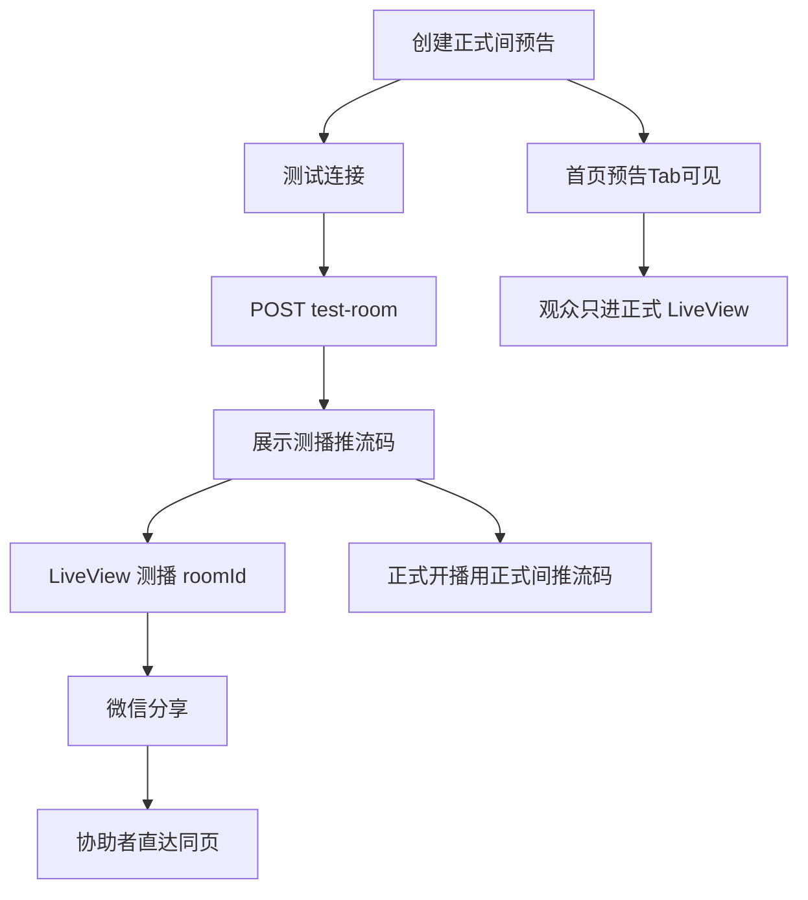

# 分享功能 · 后端设计文档（现有口径归集）

**版本**: V1.0（归集稿）  
**日期**: 2026-08-09  
**状态**: 📚 现有文档归集，非新增设计  
**定位**: 将仓库内已存在、且与「分享」相关的后端/对接口径集中收录，便于查阅

---

## ⚠️ 本文档编写约束

1. **内容来源**：仅来自下文「源文档清单」中已有表述。  
2. **不增加**：不新增源文档未写明的接口、字段、错误码、流程或验收项。  
3. **不改动**：不改写源文档决策含义；若源文档之间存在演进关系，按源文档原文并列收录，并标注出处。  
4. **不减少**：凡源文档中与「分享」直接相关的要求、字段、UI 说明、验收项，均予收录（文案示例中出现的「技术分享」等非功能语义除外）。  
5. **本文不替代**源文档；冲突或细节以各源文档原文为准。

---

## 📚 源文档清单

| 序号 | 源文档路径 | 本文收录范围 |
|------|------------|--------------|
| 1 | `docs/03_系统设计/后端新增api接口和模块设计文档-v2-最终全面检测报告.md` | 分享功能对照行 |
| 2 | `add-docs/18-私密测播不公开通道-增量设计文档.md` | 分享决策、持链观看、协助者流程、禁止分享 stream_key、验收与落地对照 |
| 3 | `add-docs/17-18-管理端与私密测播-前端对接文档.md` | 客服话术、分享 path、读接口行为、联调清单中的分享项 |
| 4 | `add-docs/17-管理端管播MVP-后端设计文档.md` | 持链观看与客服话术（Admin / 客服口径） |
| 5 | `docs/03_系统设计/直播核心功能设计文档_v6_增加权限设计版(非独立版).md` | Public 开放原则（支持 SEO、分享和传播）及身份基线 |
| 6 | `docs/03_系统设计/直播核心功能设计文档_v6_增加专题功能权限管理增量设计版.md` | 专题侧 Public 开放原则（支持 SEO、分享和传播） |
| 7 | `docs/03_系统设计/直播核心功能设计文档_v6_深度融合最终版.md` | `session_statistics.total_share_count` |
| 8 | `docs/03_系统设计/数据库设计文档.md` | `total_share_count`、`share_count`、`access_type` 含 share |
| 9 | `docs/直播推流与播放功能模块设计文档v3.md` | `total_share_count`、`playback_stats.share_count` |
| 10 | `docs/03_系统设计/API设计文档.md` | `GET /streams/{stream_id}/statistics` 响应中的 `share` |
| 11 | `docs/04_前端设计/直播saas平台网站前端效果设计.md` | `[收藏][分享]`、`复制直播链接` |
| 12 | `docs/04_前端设计/直播saas平台网站前端效果设计---移动端版v3.md` | `[🔗 分享]` 弹出分享面板（移动端同系列文档表述一致处一并覆盖） |
| 13 | `docs/02_需求分析/产品需求分析.md` | 营销工具需求：分享裂变 |
| 14 | `docs/直播saas产品核心说明和开发计划文档.md` | 阶段四：生成分享卡片 / 二维码 |
| 15 | `add-docs/FRONTEND_IMPLEMENTATION_GUIDE.md` | 测试连接流程中的「可选分享」 |

---

## 1. 后端 API 口径：分享为前端功能

> 来源：源文档 1《后端新增api接口和模块设计文档-v2-最终全面检测报告》§1.2

### 1.1 直播间页面需求对照（摘录）

| 前端需求模块 | 前端文档位置 | 后端数据支持 | 后端API支持 | 状态 |
|:-----------|:-----------|:-----------|:-----------|:-----|
| └─ 收藏功能 | 行210 | `user_favorites` 表 | ✅ `POST /api/v1/users/me/favorites` | ✅ 完整 |
| └─ 分享功能 | 行210 | 前端功能 | - | ✅ 完整 |

### 1.2 与同表「用户交互」对照说明

同文档 §1.3 列出了收藏、观看历史、订阅提醒的表与 API；**未**将「分享」列入需后端 API 支持的用户交互功能表。

**归集结论（不超出源文档）**：源文档将分享功能标注为「前端功能」，后端 API 支持列为「-」，状态为「✅ 完整」。

---

## 2. 产品与权限原则中与分享相关的表述

### 2.1 公开资源匿名可读（房间侧）

> 来源：源文档 5《直播核心功能设计文档_v6_增加权限设计版(非独立版)》§1

本设计严格遵循以下五条原则，任何代码实现均不得违背：

1. **Public 开放原则**：标记为公开（`is_private=false`）的资源，必须允许**匿名用户**访问，以支持 SEO、分享和传播。
2. **Private 隐私原则**：标记为私有（`is_private=true`）的资源，仅 **创建者（user_id）** 和 **Admin** 可见。
   - *关键约束*：对于无权访问的 Private 资源，必须返回 **404 Not Found**，严禁返回 403，以防止恶意用户通过枚举 ID 探测资源的存在性。
   - *字段说明*：`user_id` 字段存储的是用户的 `public_id`（从JWT的`user_id`字段提取），创建者即为资源的Owner。
3. **写操作严控原则**：所有 CUD（创建、修改、删除）及敏感信息读取（如推流码），必须**强制登录**（Strict Auth）。
4. **管理员上帝视角**：Admin/SuperAdmin 角色拥有全系统的读写权限，不受资源 `is_private` 属性的限制。
5. **职责分层原则（架构红线）**：
   - **API 层 (Controller/Dependency)**：仅负责 **Authentication (认证)** —— 解析"你是谁"（User 还是 Anonymous）。
   - **Service 层 (Domain Logic)**：全权负责 **Authorization (鉴权)** —— 判定"你能看吗/你能改吗"。
   - **CRUD 层 (Repository/Data Access)**：负责在 **SQL 层面应用权限过滤逻辑** —— 禁止内存过滤，业务筛选条件与权限过滤条件使用 AND 关系组合。

身份基线（同文档 §2.1 摘录）：

| 状态 | 判定条件 (API 层行为) | 权限基线 |
| :--- | :--- | :--- |
| **Anonymous (匿名)** | 请求头 **无 Token** 或 Token 为空 | 仅可读 `is_private=false` 的资源 |
| **Regular (普通用户)** | 携带有效 Token，Role=`REGULAR` | 可读 Public + 读写 Own 资源 |
| **Admin (管理员)** | 携带有效 Token，Role=`ADMIN/SUPERADMIN` | 全局读写，无视 Private 限制 |

### 2.2 公开资源匿名可读（专题侧）

> 来源：源文档 6《直播核心功能设计文档_v6_增加专题功能权限管理增量设计版》§1

1. **Public 开放原则**：标记为已发布（`status='published'`）的专题，必须允许**匿名用户**访问，以支持 SEO、分享和传播。

专题功能特殊说明（同文档原文）：

专题功能的可见性判断基于`status`字段而非`is_private`字段：
- `status = 'published'` → 公开资源（相当于`is_private = false`）
- `status = 'draft'` 或 `status = 'archived'` → 私有资源（相当于`is_private = true`）

### 2.3 《18》对 `is_private` / 持链观看的增量修订（与分享落地直接相关）

> 来源：源文档 2《18-私密测播不公开通道-增量设计文档》§1.2、§3  
> 说明：该增量修订了源文档 5 中「Private → 非房主 404」在**持 roomId 读路径**上的语义；以下按《18》原文收录。

#### 2.3.1 决策表中与分享相关的项

| ID | 决策 | 说明 |
|----|------|------|
| D3 | **`is_private` = 不公开（unlisted）** | 不进发现列表；**持有 roomId 即可观看** |
| D4 | **MVP 无观看密码** | 不做输密门禁 |
| D5 | **无独立测播页** | 观看页仍为 `pages/live/LiveView` |
| D6 | **分享复用现网** | LiveView 已有 `onShareAppMessage` |
| D7 | **发现层静默隐藏** | 三个 Tab 永不出现测播间；不是「点链接后出现在直播 Tab」 |

产品语言（对主播）：

| 对内实现 | 对主播文案 |
|----------|------------|
| 微信分享测播 `roomId` | **邀请协助**（可选） |

MVP 明确不做（与分享通道选择相关）：

| 明确不做（MVP） | 说明 |
|-----------------|------|
| 外链 H5 邀请落地 | 微信小程序分享卡片 |

#### 2.3.2 `is_private` 新语义对比

| 维度 | 现网（v6 权限设计） | 本增量（《18》） |
|------|---------------------|------------------|
| 发现（homepage / 公开列表 / 搜索等） | 多数过滤；**Homepage SQL 未过滤** | **一律排除** `is_private=true` |
| 详情 / 拉流 / 留言等「持 roomId 访问」 | 非房主/Admin → **404** | **允许访问**（不公开 = 有链可看） |
| 写操作（改元数据、删房、推流管控等） | 房主 / Admin | **不变** |
| Admin 全站列表（`GET /admin/rooms`） | 含私密，可筛 | **不变**（运营仍可见） |

语义一句话（《18》原文）：

> **`is_private=true`：不进入任何 C 端发现面；知道 `room_id` 的人可以观看。**  
> 安全依赖：链接不公开传播 + UUID 难猜（类 YouTube「不公开」）。

实现要点（后端，《18》§3.3）：

1. **【修改】** `RoomService._check_room_visibility`（及 Session / 留言 / Tab 等继承链）：对读路径，**不再**因 `is_private` 对非房主返回 404。  
2. **【保持】** 写路径 `_check_write_permission` 不变。  
3. **【修改/修复】** 所有 C 端**列表/发现**查询强制 `is_private = false`。  
4. 响应中可继续返回 `is_private`，供小程序展示「连接测试」弱提示。

#### 2.3.3 发现层硬规则（《18》§4.1）

| 规则 | 要求 |
|------|------|
| R1 | `is_private=true` **不得**出现在 `GET /api/v1/homepage/rooms` |
| R2 | 搜索、公开房间列表等 C 端发现接口同等排除 |
| R3 | 点测试邀请**不会**把测播写入「直播」Tab，仅直达 `LiveView` |
| R4 | 正式预告间保持 `is_private=false`，测播不占用正式间 `live_status` |

#### 2.3.4 推流与观看中的分享禁令（《18》§5.4）

- 观看：`GET` 房间/场次/播放地址等对测播间按 §3 **持链可读**。  
- **禁止**把测播间 `stream_key` 当作观众凭证对外分享。

---

## 3. Admin / 客服口径中的分享

> 来源：源文档 4《17-管理端管播MVP-后端设计文档》§1.4；源文档 3《17-18…前端对接文档》§1

| 维度 | 口径 |
|------|------|
| C 端持链观看 | **有 roomId 即可看**，MVP **无观看密码**（《18》；相对旧「仅房主/Admin」） |
| 客服话术 | 「广场看不到，但拿到分享链接的人可以进小程序观看」 |

前端对接文档补充（源文档 3）：

- 持链观看：有 `roomId` 即可进 `LiveView`，**无密码**  
- 客服话术：广场看不到，但拿到分享链接的人可以进小程序观看。

---

## 4. 小程序分享实现与 path 约定

> 来源：源文档 2《18》§6；源文档 3《17-18》§3；源文档 15《FRONTEND_IMPLEMENTATION_GUIDE》§17.4

### 4.1 主播：测试连接流程中的可选分享（《18》§6.1）

```text
正式间（我的直播 / 编辑或推流入口）
  → 点「测试连接」
  → POST /rooms/{正式间id}/test-room
  → 展示测播间推流地址 / 密钥（可复制）
  → 「打开预览」→ navigateTo LiveView?roomId=测播间
  → （可选）在测播 LiveView「分享」邀请协助
  → 「测试完成，正式开播」→ 回到正式间推流信息 / 正式开播流程
```

《FRONTEND_IMPLEMENTATION_GUIDE》对应表述：

```text
正式间 → POST /rooms/{正式间id}/test-room
      → 展示 test_room.stream_key
      → LiveView?roomId=测播间
      → 可选分享；完成后回正式间开播
```

《17-18》页面改动表（与分享相关行）：

| 页面 | 改动 |
|------|------|
| `pages/live/LiveView.vue` | `is_private===true` 顶栏弱提示「连接测试」；分享 path 保持 `roomId` 当前页 |

### 4.2 协助者（《18》§6.3；《17-18》§3.4）

| 步骤 | 行为 |
|------|------|
| 收主播微信分享 | 小程序卡片 |
| 打开 | `LiveView?roomId=测播间`（现网 `sharePath` 已是该形态） |
| 观看 | **直接播放，不输密码** |

分享实现：复用 LiveView `onShareAppMessage`（`path = /pages/live/LiveView?roomId=...`）。  
主播需先进入测播 LiveView 再转发；可选在测试连接面板增加「邀请协助」（`open-type="share"` 或先跳转再分享）。

| 角色 | 行为 |
|------|------|
| 协助者 | 微信分享卡片 → `LiveView?roomId=测播间` → **直接播，无密码** |

### 4.3 读接口行为变化（持链可读，《17-18》§3.5）

| 接口 | 旧（私密） | 新（不公开） |
|------|------------|--------------|
| `GET /rooms/{id}` | 非房主 404 | 持 id **200** |
| 留言列表 / Tab 公开读 | 非房主 404 | 持 id **可读** |
| `GET /homepage/rooms`、公开搜索 | 曾漏滤 | **不含** `is_private=true` |
| `GET /users/me/rooms` | 含自己的不公开房 | **不变**（主播管理视图） |
| `PATCH/DELETE /rooms/{id}` | 非 owner 403 | **不变** |

### 4.4 页面示意中的分享节点（《18》§6.4）



### 4.5 前端落地对照（《18》§7.6）

| 能力 | 建议文件 | 状态 |
|------|----------|------|
| 分享 path 复用 | `LiveView` `onShareAppMessage` | ✅ 现网已有形态 |

---

## 5. 验收 / 联调清单中与分享相关的项

### 5.1 《18》验收清单（摘录）

**可见性语义（§7.3）**

- [ ] 协助者仅凭分享打开测播 `LiveView` 可看，**无需密码** — **前端联调**  
- [x] 非房主持测播 `roomId` 请求详情/观看：**不再 404** — **后端已验**  
- [x] 非房主仍不能 PATCH/DELETE 测播间（写权限不变） — **后端已验**  

**小程序主路径（§7.4）**

- [ ] 主播在正式间可完成：测试连接 → 预览 →（可选）分享 → 回正式开播  
- [ ] 分享 path 为测播 `roomId` 时，协助者进入测播而非正式间  
- [ ] 正式分享 path 仍为正式 `roomId`  

### 5.2 《17-18》联调检查清单（摘录）

**小程序测播**

- [ ] 预览进测播 LiveView；分享协助者可看  

**回归**

- [ ] 正式间分享 path 仍是正式 `roomId`  

---

## 6. 统计数据模型与读统计 API（源文档已有部分）

> 说明：以下为源文档中与「分享数 / share」相关的数据与读接口表述。源文档 **未** 定义「分享上报」类写接口（例如未定义 `POST` 分享计数 API）。本节仅收录已有字段与读示例。

### 6.1 Core：`session_statistics.total_share_count`

> 来源：源文档 7《直播核心功能设计文档_v6_深度融合最终版》

```sql
CREATE TABLE session_statistics (
   -- 核心标识 (在应用层通过 uuid.uuid4() 生成)
    id UUID PRIMARY KEY,

    session_id UUID NOT NULL UNIQUE REFERENCES live_sessions(id) ON DELETE CASCADE,
    peak_viewer_count INT DEFAULT 0,
    total_viewer_count BIGINT DEFAULT 0,
    total_like_count BIGINT DEFAULT 0,
    total_share_count BIGINT DEFAULT 0,
    created_at TIMESTAMPTZ NOT NULL DEFAULT CURRENT_TIMESTAMP,
    updated_at TIMESTAMPTZ NOT NULL DEFAULT CURRENT_TIMESTAMP
);
COMMENT ON TABLE session_statistics IS '单场直播的统计数据表，与 live_sessions 表一一对应。';
```

### 6.2 早期数据库设计：`stream_statistics` / `playback_stats` / `video_access_logs`

> 来源：源文档 8《数据库设计文档》；源文档 9《直播推流与播放功能模块设计文档v3》表述同类字段

**直播统计表（stream_statistics）**（摘录相关列）：

```sql
CREATE TABLE stream_statistics (
    id UUID PRIMARY KEY DEFAULT gen_random_uuid(),
    stream_id INT REFERENCES live_stream(id),
    total_viewer_count INT DEFAULT 0,
    peak_viewer_count INT DEFAULT 0,
    total_like_count INT DEFAULT 0,
    total_share_count INT DEFAULT 0,
    total_comment_count INT DEFAULT 0,
    last_view_time TIMESTAMP,             -- 最近观看时间
    created_at TIMESTAMP DEFAULT CURRENT_TIMESTAMP,
    updated_at TIMESTAMP DEFAULT CURRENT_TIMESTAMP
);
```

**回放统计表（playback_stats）**（摘录相关列）：

```sql
CREATE TABLE playback_stats (
    id UUID PRIMARY KEY DEFAULT gen_random_uuid(),
    playback_id INT REFERENCES playback_record(id),
    view_count INT DEFAULT 0,
    like_count INT DEFAULT 0,
    comment_count INT DEFAULT 0,
    share_count INT DEFAULT 0,
    created_at TIMESTAMP DEFAULT CURRENT_TIMESTAMP,
    updated_at TIMESTAMP DEFAULT CURRENT_TIMESTAMP
);
```

**视频访问记录表（video_access_logs）**（`access_type` 枚举含 share）：

```sql
CREATE TABLE video_access_logs (
    id UUID PRIMARY KEY DEFAULT gen_random_uuid(),
    video_id VARCHAR(50) NOT NULL REFERENCES video_resources(video_id),
    user_id INT NOT NULL,
    access_type VARCHAR(20) NOT NULL,      -- view, download, share
    file_type VARCHAR(20) NOT NULL,        -- raw, hls, mp4, cover, thumbnail
    ip_address VARCHAR(50),
    user_agent TEXT,
    created_at TIMESTAMP DEFAULT CURRENT_TIMESTAMP
);
```

### 6.3 获取直播统计数据（读接口示例）

> 来源：源文档 10《API设计文档》§6.1

- **接口**: `GET /streams/{stream_id}/statistics`
- **描述**: 获取直播统计数据
- **响应示例**:

```json
{
  "code": 200,
  "message": "success",
  "data": {
    "viewer_count": {
      "total": 1000,
      "peak": 100,
      "average": 80
    },
    "interaction_count": {
      "like": 500,
      "comment": 200,
      "share": 100
    },
    "duration": 3600,
    "start_time": "2024-03-20T10:00:00Z",
    "end_time": "2024-03-20T11:00:00Z"
  }
}
```

---

## 7. 前端效果 / 产品规划中与分享相关的表述（无独立后端 API 契约）

### 7.1 Web 直播间页（源文档 11）

- **操作按钮**: (右上角) `[收藏]` `[分享]`。 (我们舍弃B站的点赞、投币)。
- 辅助工具：`复制直播链接` (一键分享)。

### 7.2 移动端直播间操作栏（源文档 12）

- `[🔗 分享]` (点击后弹出分享面板)

（同系列移动端效果设计文档中另有长按菜单 `[收藏]` `[分享]` `[不感兴趣]`、我的直播快捷操作含 `[分享]` 等 UI 表述，语义同为前端分享入口。）

### 7.3 产品需求（源文档 13）

营销工具需求：
- 分享裂变

### 7.4 开发计划阶段四（源文档 14）

分发与推广：
- 生成分享卡片 / 二维码

---

## 8. 归集后的后端相关要求一览（严格对应源文档，不扩展）

| # | 要求（源文档原意） | 出处 |
|---|-------------------|------|
| 1 | 分享功能按「前端功能」对照，后端 API 支持为「-」 | 源文档 1 |
| 2 | 公开（`is_private=false`）资源须允许匿名访问，以支持 SEO、分享和传播 | 源文档 5 |
| 3 | 已发布专题须允许匿名访问，以支持 SEO、分享和传播 | 源文档 6 |
| 4 | 《18》后：`is_private=true` 不进发现面；持有 `roomId` 可观看；MVP 无观看密码 | 源文档 2、3、4 |
| 5 | 分享复用现网 `onShareAppMessage`；path = `/pages/live/LiveView?roomId=...` | 源文档 2、3 |
| 6 | 正式分享 path 为正式 `roomId`；测播分享 path 为测播 `roomId` | 源文档 2、3 |
| 7 | **禁止**把测播间 `stream_key` 当作观众凭证对外分享 | 源文档 2 |
| 8 | 持链读：`GET /rooms/{id}` 等对非房主可读；写权限不变 | 源文档 2、3 |
| 9 | 发现层排除 `is_private=true`；客服话术：广场看不到，拿到分享链接可看 | 源文档 2、3、4 |
| 10 | 统计侧存在 `total_share_count` / `share_count` 等字段；读统计示例含 `share` | 源文档 7、8、9、10 |
| 11 | 前端存在分享按钮 / 分享面板 / 复制直播链接等 UI | 源文档 11、12 |
| 12 | 产品层提及「分享裂变」；计划阶段提及「生成分享卡片 / 二维码」 | 源文档 13、14 |

---

## 9. 源文档未收录进「分享专用写 API」的说明

在源文档 1～15 的分享相关表述中：

- **已明确**：分享为前端功能，后端 API 支持列为「-」（源文档 1）。  
- **已明确**：分享实现为小程序 `onShareAppMessage` 与 `roomId` path（源文档 2、3）。  
- **已出现**：统计字段与 **GET** 统计响应中的 `share`（源文档 7～10）。  
- **未出现**：任何「分享专用 POST/写接口」的路径、请求体、鉴权或错误码定义（故本文亦不编写此类接口章节）。

---

**文档结束（归集稿 V1.0）**
