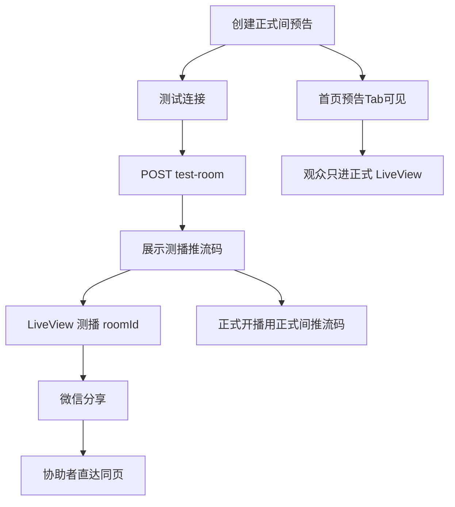

# 18 私密测播不公开通道增量设计文档

**版本**: V1.1.1  
**日期**: 2026-08-08  
**状态**: ✅ 后端已落地；小程序「测试连接」待接（见前端设计文档）  
**基于**: 《直播核心功能设计文档_v6_增加权限设计版》；《17-管理端管播MVP-后端设计文档》V1.1（契约）+ 本文管理端口径；现网 `LiveRoom.is_private`、`Homepage` 房间列表、小程序 `LiveView`  
**前端主战场**: `D:\Programming\Live-Saas-Wechat`（uni-app 微信小程序）  
**前端设计（小程序测播）**: [`Live-Saas-Wechat-18-私密测播不公开通道-前端设计文档-v1.0.md`](./Live-Saas-Wechat-18-私密测播不公开通道-前端设计文档-v1.0.md)  
**前端设计（管理端）**: [`Live-Saas-Wechat-17-管理端直播间内容运营MVP-前端设计文档-v1.1.md`](./Live-Saas-Wechat-17-管理端直播间内容运营MVP-前端设计文档-v1.1.md)  
**后端**: 本仓库 `live_core_service`  
**原则**: **最简单 / 最友好 / 最小化**——正式预告不被破坏；测播不进广场；有链接可看、不输密码。

---

## ⚡ 本文范围（只做这些）

| 本章节 | 内容 |
|--------|------|
| §1 | 产品决策 |
| §2 | 双通道模型 |
| §3 | `is_private` 新语义 |
| §4 | Homepage / 发现层过滤 |
| §5 | `test-room` API |
| §6 | 小程序流程 |
| §7 | 验收清单 |

| 明确不做（MVP） | 说明 |
|-----------------|------|
| 观看密码 / `watch-auth` / 门禁输密页 | 用户已拍板不用密码 |
| 账号白名单、关注审核 | 二期 |
| 独立「测播页」路由 | 复用 `LiveView` |
| 外链 H5 邀请落地 | 微信小程序分享卡片 |
| 把正式预告间拨成 `is_private` 做测播 | 会藏掉已挂预告 |
| 管理端完整运营专篇 | Admin 见《17》前端 v1.1（不公开文案/筛选）；本文不展开 Admin 专页 |

---

## ⚠️ 重要声明

- 本文是对直播房间可见性与主播开播前测连能力的**增量**，不替代 v6 房间/场次主设计。
- 【修改】`is_private` 的 C 端含义：由「仅房主/Admin 可看」改为「不公开（unlisted）」。
- 【新增】正式间派生测播间的 API 与小程序「测试连接」主路径。
- 【修复】Homepage 等发现接口必须排除 `is_private=true`（现网缺口）。

---

## 1. 产品决策（已拍板）

### 1.1 要解决的问题

开播前需要测试设备/场地/推流，**不能让首页「直播 / 预告 / 回放」上的观众看到测试画面**；同时正式预告往往**已经挂在「预告」Tab**，不能为了测播把正式间改成私密。

### 1.2 决策表

| ID | 决策 | 说明 |
|----|------|------|
| D1 | **双通道（两间房）** | 正式间 ≠ 测播间；测完回正式间开播 |
| D2 | **不拨正式间 `is_private`** | 预告已公开时，禁止用「改正式间为私密」代替测播 |
| D3 | **`is_private` = 不公开（unlisted）** | 不进发现列表；**持有 roomId 即可观看** |
| D4 | **MVP 无观看密码** | 不做输密门禁 |
| D5 | **无独立测播页** | 观看页仍为 `pages/live/LiveView` |
| D6 | **分享复用现网** | LiveView 已有 `onShareAppMessage` |
| D7 | **发现层静默隐藏** | 三个 Tab 永不出现测播间；不是「点链接后出现在直播 Tab」 |
| D8 | **P0 修 Homepage** | `GET /homepage/rooms` 现网未滤 `is_private`，必须补上 |

### 1.3 产品语言（对主播）

| 对内实现 | 对主播文案 |
|----------|------------|
| 公开正式房间 | 正式直播间（预告 / 正式开播） |
| `is_private` 测播房间 | **测试连接**（开播前自检，广场看不到） |
| 微信分享测播 `roomId` | **邀请协助**（可选） |

禁止在主路径强调「请再创建一个私密房间」「is_private」等实现词。

---

## 2. 双通道模型

### 2.1 结构

```text
正式间 (is_private=false)     测播间 (is_private=true)
├─ 挂预告 / 正式 LIVE         ├─ 仅测试连接推流
├─ 出现在首页三 Tab            ├─ 永不进首页三 Tab
├─ 正式分享 path              └─ 测试邀请分享 path
└─ 观众主入口                      （持链直达 LiveView）
```

- 链接、`stream_key`、场次均分离。  
- 同一主播、同一场活动：观众始终只认**正式间**链接。  
- 测播间建议标题：`{正式标题}·连接测试`（或等价），便于主播在「我的直播」辨认。

### 2.2 关联（建议）

| 字段/约定 | 说明 |
|-----------|------|
| `source_room_id`（可选，挂在测播间） | 指向正式间，便于幂等复用「一正式间一测播间」 |
| 或服务端按 owner + source 查询 | MVP 也可用「标题约定 + 本地缓存 testRoomId」过渡；**推荐**落库关联以免换端丢失 |

> 若首期不加列：可用「该用户下已存在且标题匹配/标记的测播间」启发式；正式方案仍建议 `source_room_id`（可空，仅测播间使用）。

### 2.3 为什么不用同房密码

同房挂密码时，普通观众从「预告」点进正式间也会看到输密/锁房态，与「预告已公开」冲突。  
双通道 + 不公开：Tab 上只有正式间；测播只有私发链接能到。

---

## 3. `is_private` 新语义

### 3.1 对比现网

| 维度 | 现网（v6 权限设计） | 本增量 |
|------|---------------------|--------|
| 发现（homepage / 公开列表 / 搜索等） | 多数过滤；**Homepage SQL 未过滤** | **一律排除** `is_private=true` |
| 详情 / 拉流 / 留言等「持 roomId 访问」 | 非房主/Admin → **404** | **允许访问**（不公开 = 有链可看） |
| 写操作（改元数据、删房、推流管控等） | 房主 / Admin | **不变** |
| Admin 全站列表（`GET /admin/rooms`） | 含私密，可筛 | **不变**（运营仍可见） |

### 3.2 语义一句话

> **`is_private=true`：不进入任何 C 端发现面；知道 `room_id` 的人可以观看。**  
> 安全依赖：链接不公开传播 + UUID 难猜（类 YouTube「不公开」）。

### 3.3 实现要点（后端）

1. **【修改】** `RoomService._check_room_visibility`（及 Session / 留言 / Tab 等继承链）：对读路径，**不再**因 `is_private` 对非房主返回 404。  
2. **【保持】** 写路径 `_check_write_permission` 不变。  
3. **【修改/修复】** 所有 C 端**列表/发现**查询强制 `is_private = false`（见 §4）。  
4. 响应中可继续返回 `is_private`，供小程序展示「连接测试」弱提示。

### 3.4 兼容影响

| 旧行为 | 新行为 | 说明 |
|--------|--------|------|
| 主播把整间设为私密，外人详情 404 | 外人若持链接可看 | 符合「不公开」；若需「绝对仅自己」需二期更强 ACL |
| 误以为 404 = 房间不存在 | 发现层根本没有；直达可看 | 产品不再用 404 表示「不让看」 |

---

## 4. Homepage / 发现层过滤

### 4.1 硬规则

| 规则 | 要求 |
|------|------|
| R1 | `is_private=true` **不得**出现在 `GET /api/v1/homepage/rooms` |
| R2 | 搜索、公开房间列表等 C 端发现接口同等排除 |
| R3 | 点测试邀请**不会**把测播写入「直播」Tab，仅直达 `LiveView` |
| R4 | 正式预告间保持 `is_private=false`，测播不占用正式间 `live_status` |

小程序首页 [`Home.vue`](D:/Programming/Live-Saas-Wechat/src/pages/home/Home.vue) 三 Tab（`live` / `scheduled` / `replay`）只做状态分流，**不负责**隐藏私密间——以后端过滤为准。

### 4.2 现网缺口（必须修）

[`crud/homepage_search.py`](../backend/live_core_service/app/crud/homepage_search.py) 中 `get_homepage_rooms_with_details`：

- 当前 SQL **无** `lr.is_private = false`  
- 若不修：测播间一旦存在 `live` 场次，会进入首页「直播」Tab —— **事故级**

**【修改】** 列表与 COUNT 均增加：

```sql
WHERE lr.is_private = false
-- 若已有 category 条件，则 AND lr.is_private = false
```

同步审计：公开 `GET /rooms`、搜索相关 CRUD，凡面向匿名/普通用户的发现接口，缺过滤则补齐。

### 4.3 Admin 例外

`GET /api/v1/admin/rooms` **继续包含**不公开房间（可按 `is_private` 筛选）。与《17》一致，本文不改管理端列表权限。

---

## 5. `test-room` API

### 5.1 接口定义

**新增** `POST /api/v1/rooms/{room_id}/test-room`

| 项 | 说明 |
|----|------|
| 认证 | JWT 必填 |
| 权限 | 正式间 **owner** 或 Admin/SUPERADMIN |
| 幂等 | 同一正式间重复调用 → 返回已有测播间，不重复创建 |
| 作用 | 为正式间确保一间关联测播间 |

**路径参数**: `room_id` = **正式间** ID  

**请求体**: 可空 `{}`；可选扩展：

```json
{
  "title_suffix": "连接测试"
}
```

**成功响应** `200`（示意）:

```json
{
  "code": 200,
  "message": "success",
  "data": {
    "source_room_id": "uuid-正式间",
    "test_room": {
      "id": "uuid-测播间",
      "title": "某预告标题·连接测试",
      "is_private": true,
      "stream_key": "...",
      "cover_url": "...",
      "created_at": "..."
    },
    "created": false
  }
}
```

`created`: 本次是否新建；`false` 表示复用。

### 5.2 创建规则

1. 校验正式间存在且调用方有写权限。  
2. 正式间不得要求「必须已是 private」——正式间保持公开。  
3. 创建测播间时：  
   - `is_private = true`  
   - `user_id` = 正式间房主  
   - `title` = 正式标题 + 后缀（默认 `·连接测试`）  
   - `cover_url` / `category_id` 可从正式间复制（可选，便于辨认）  
   - 生成独立 `stream_key`  
   - 写入 `source_room_id`（若已加列）或等价关联  
4. 不自动创建测播场次也可；主播推流/开播仍走现网场次接口（与正式间相同能力，只是 room 不同）。

### 5.3 错误（示意）

| 场景 | HTTP / 业务码 |
|------|----------------|
| 未登录 | 401 |
| 非 owner 且非 Admin | 403 |
| 正式间不存在 | 404 |
| `room_id` 本身已是测播间（可选校验） | 400：请对正式间调用 |

### 5.4 推流与观看

- 测播推流：使用测播间 `stream_key`（现网推流地址规则不变）。  
- 观看：`GET` 房间/场次/播放地址等对测播间按 §3 **持链可读**。  
- **禁止**把测播间 `stream_key` 当作观众凭证对外分享。

---

## 6. 小程序流程

**仓库**: `D:\Programming\Live-Saas-Wechat`  
**关键页**: `pages/live/LiveView.vue`、`pages/live/CreateLive.vue`、`pages/my-live/MyLive.vue`、`pages/home/Home.vue`

### 6.1 主播：测试连接

```text
正式间（我的直播 / 编辑或推流入口）
  → 点「测试连接」
  → POST /rooms/{正式间id}/test-room
  → 展示测播间推流地址 / 密钥（可复制）
  → 「打开预览」→ navigateTo LiveView?roomId=测播间
  → （可选）在测播 LiveView「分享」邀请协助
  → 「测试完成，正式开播」→ 回到正式间推流信息 / 正式开播流程
```

文案约束：主路径不出现「创建第二个私密房间」。

### 6.2 普通观众

| 步骤 | 行为 |
|------|------|
| 打开首页 | 三 Tab 仅公开正式内容（后端已滤私密） |
| 点预告/直播卡片 | `LiveView?roomId=正式间` |
| 测播期间 | 看不到测播间；正式预告仍在「预告」 |

### 6.3 协助者

| 步骤 | 行为 |
|------|------|
| 收主播微信分享 | 小程序卡片 |
| 打开 | `LiveView?roomId=测播间`（现网 `sharePath` 已是该形态） |
| 观看 | **直接播放，不输密码** |

分享实现：复用 LiveView `onShareAppMessage`（`path = /pages/live/LiveView?roomId=...`）。  
主播需先进入测播 LiveView 再转发；可选在测试连接面板增加「邀请协助」（`open-type="share"` 或先跳转再分享）。

### 6.4 页面示意



### 6.5 LiveView 可选体验

- 若 `is_private===true`：顶栏弱提示「连接测试」（非报错页）。  
- 不新增独立测播路由；`RoomDetail` 继续 redirect 到 LiveView。

---

## 7. 验收清单

### 7.1 发现与列表

- [x] `GET /homepage/rooms` 不含任何 `is_private=true` 房间（含测播正在 live） — **后端已验**  
- [x] 公开搜索/公开房间列表同等排除 — **后端已验**  
- [ ] 未持邀请账号刷小程序「直播 / 预告 / 回放」，看不到测播间 — **前端联调**  
- [ ] 正式预告间仍出现在「预告」Tab — **前端联调**  

### 7.2 双通道与 API

- [x] `POST .../test-room`：owner 首次创建测播间，`is_private=true`，独立 `stream_key` — **后端已验**  
- [x] 再次调用幂等返回同一测播间 — **后端已验**  
- [x] 非 owner 普通用户调用返回 403 — **后端已验**  
- [ ] 测播推流不影响正式间画面 — **依赖开播链路**  

### 7.3 可见性语义

- [ ] 协助者仅凭分享打开测播 `LiveView` 可看，**无需密码** — **前端联调**  
- [x] 非房主持测播 `roomId` 请求详情/观看：**不再 404** — **后端已验**  
- [x] 非房主仍不能 PATCH/DELETE 测播间（写权限不变） — **后端已验**  

### 7.4 小程序主路径

- [ ] 主播在正式间可完成：测试连接 → 预览 →（可选）分享 → 回正式开播  
- [ ] 分享 path 为测播 `roomId` 时，协助者进入测播而非正式间  
- [ ] 正式分享 path 仍为正式 `roomId`  

### 7.5 回归

- [x] Admin `GET /admin/rooms` 仍能看到不公开房间 — **后端已验**  
- [ ] 公开正式直播/预告/回放主路径无回归损坏 — **前端联调**  

---

## 7.6 前端落地对照（小程序）

| 能力 | 建议文件 | 状态 |
|------|----------|------|
| `POST .../test-room` | `api.ts` → `ROOM.TEST_ROOM`；我的直播入口 | ✅ 常量已加；⏳ UI 流程待接 |
| 展示测播推流码 / 打开预览 | `MyLive.vue` 或推流面板 | ⏳ 待接 |
| LiveView 弱提示「连接测试」 | `pages/live/LiveView.vue` | ⏳ 待接 |
| 分享 path 复用 | `LiveView` `onShareAppMessage` | ✅ 现网已有形态 |
| Home 三 Tab 过滤 | `pages/home/Home.vue` | ✅ **勿前端再滤**；以后端为准 |
| Admin「不公开」文案 | `AdminRoomList.vue` / `AdminRoomEditDialog.vue` | ✅ 已改 |

详表见 [《18》前端设计 v1.0](./Live-Saas-Wechat-18-私密测播不公开通道-前端设计文档-v1.0.md)；管理端口径见 [《17》前端设计 v1.1](./Live-Saas-Wechat-17-管理端直播间内容运营MVP-前端设计文档-v1.1.md)。

---

## 8. 修订记录

| 版本 | 日期 | 说明 |
|------|------|------|
| V1.0 | 2026-08-08 | 初版：双通道不公开测播；`is_private` unlisted；homepage 必滤；test-room；小程序流程；验收清单。无密码。管理端口径与《17》前端对齐。 |
| V1.1 | 2026-08-08 | 后端落地勾选验收；增 §7.6 前端对照；状态改为「小程序待接」。 |
| V1.1.1 | 2026-08-08 | 文首/§7.6 互链改为真实存在的《18》《17》前端设计文档；去掉尚未创建的对接专篇引用；基于行与《17》后端版本号对齐为 V1.1。 |
