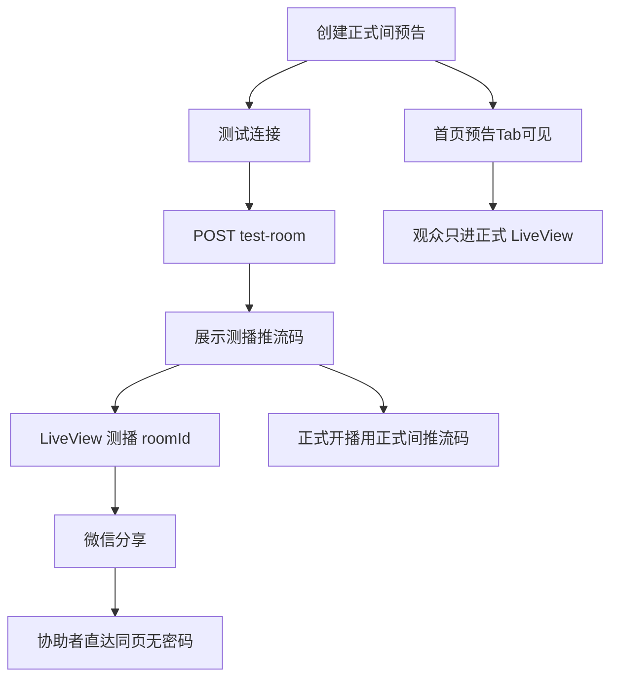

# 私密测播不公开通道 —— 前端可落地实现文档

**项目**: Live-Saas-Wechat  
**模块编号**: 18  
**版本**: V1.0  
**创建日期**: 2026-08-08  
**状态**: 📋 设计定稿；后端已落地，小程序「测试连接」待接  
**技术栈**: uni-app + Vue 3 + TypeScript + Pinia  
**平台**: 微信小程序

> **后端设计文档**：《18-私密测播不公开通道-增量设计文档.md》V1.1  
> **管理端姊妹文档**：[《17-管理端直播间内容运营MVP-前端设计文档-v1.1》](./Live-Saas-Wechat-17-管理端直播间内容运营MVP-前端设计文档-v1.1.md)（Admin 找房改内容；本文只管主播/观众侧）  
> **关联**：《17》后端 V1.1（Admin 列表仍含不公开房）；现网 `MyLive` / `LiveView` / `Home` / `api.ts` `ROOM.TEST_ROOM`  
> **原则**：最简单 / 最友好 / 最小化——正式预告不被破坏；测播不进广场；有链接可看、**不输密码**。

> **一句话闭环**：正式间点「测试连接」→ 拿测播推流码 → 预览（可选分享协助）→ 回正式间开播。  
> **完成定义**：主播不新建「第二个私密房」话术，即可完成自检；观众首页永远看不到测播间。

---

## ⚠️ 重要声明

- 本文是对小程序开播前测连与 `is_private` 展示语义的**前端增量**，不替代房间/场次主设计与《17》Admin 专篇。
- 【修改】产品文案：`is_private=true` → UI「不公开 / 连接测试」；禁止主路径强调「再创建一个私密房间」。
- 【新增】主路径调用 `POST /rooms/{正式间id}/test-room`（常量已有：`API_PATHS.ROOM.TEST_ROOM`）。
- 【维持】观看页仍为 `pages/live/LiveView`；分享复用现网 `onShareAppMessage`。
- 【禁止】首页三 Tab **前端再滤** `is_private`（以后端 Homepage 过滤为准）。

---

## 📌 变更范围

| 变更类型 | 说明 |
|----------|------|
| 【新增·主路径】 | 正式间入口「测试连接」→ `POST test-room` → 展示测播推流信息 → 打开预览 |
| 【修改·弱提示】 | `LiveView` 当 `is_private===true` 顶栏弱提示「连接测试」 |
| 【维持·分享】 | `sharePath = /pages/live/LiveView?roomId=当前房`；测播间即测播 roomId |
| 【维持·Home】 | 只做 live/scheduled/replay 状态分流；**不**前端隐藏私密 |
| 【不做】 | 观看密码 / 输密页 / 独立测播路由 / 外链 H5 邀请落地 / Admin 测播专页 |

---

## 一、产品语言与双通道（前端必守）

| 对内实现 | 对主播/协助者文案 |
|----------|-------------------|
| 公开正式房间 | **正式直播间**（预告 / 正式开播） |
| `is_private` 测播房间 | **测试连接**（开播前自检，广场看不到） |
| 微信分享测播 `roomId` | **邀请协助**（可选） |
| 字段 `is_private` | 弱展示可用「不公开 / 连接测试」；勿主推「私密」 |

```text
正式间 (is_private=false)     测播间 (is_private=true)
├─ 挂预告 / 正式 LIVE         ├─ 仅测试连接推流
├─ 出现在首页三 Tab            ├─ 永不进首页三 Tab
└─ 观众主入口                  └─ 持链直达 LiveView
```

- 禁止把正式预告间拨成 `is_private` 当测播用。  
- 禁止把测播 `stream_key` 当观众凭证外发（分享只传 roomId path）。

---

## 二、涉及文件

```
src/config/api.ts                    # ✅ ROOM.TEST_ROOM 已加
src/api/room.ts                      # 【追加】ensureTestRoom / postTestRoom
src/types/room.ts（或邻近类型文件） # 【追加】TestRoomResponse 等
src/pages/my-live/MyLive.vue         # 【修改】正式间「测试连接」入口（推荐）
src/pages/live/CreateLive.vue        # 【可选】编辑/推流面板同入口（若推流码在此展示则优先）
src/pages/live/LiveView.vue          # 【修改】is_private 弱提示；分享已有
src/pages/home/Home.vue              # ✅ 勿前端再滤 is_private
```

**现网缺口速查**：

| 落点 | 现状 | P0 |
|------|------|-----|
| `API_PATHS.ROOM.TEST_ROOM` | 已有 | 接 UI |
| `room.ts` API 函数 | 无 `test-room` 封装 | 新增 |
| `MyLive` | 可进 LiveView / CreateLive；无测试连接 | 加入口 + 面板 |
| `LiveView` | 有 `onShareAppMessage` / `sharePath` | 加弱提示 |
| `Home` | 状态分流 | **禁止**加 `is_private` 前端过滤 |

---

## 三、API 与类型

### 3.1 路径

| 项 | 值 |
|----|-----|
| 服务内 | `POST /api/v1/rooms/{room_id}/test-room` |
| 网关 | `POST /api/core/rooms/{room_id}/test-room` |
| 常量 | `API_PATHS.ROOM.TEST_ROOM(roomId)` → `` `/rooms/${roomId}/test-room` `` |
| 认证 | JWT；正式间 owner 或 Admin |
| 幂等 | 同一正式间重复调用返回已有测播间 |

**请求体**（可空）:

```json
{ "title_suffix": "连接测试" }
```

**成功 `data` 示意**（对齐后端 §5）:

```typescript
// 建议类型名；字段名与后端 snake_case 一致
export interface TestRoomPayload {
  source_room_id: string
  test_room: {
    id: string
    title: string
    is_private: boolean
    stream_key: string
    cover_url?: string | null
    created_at?: string
  }
  created: boolean
}
```

### 3.2 封装示例

```typescript
// src/api/room.ts —— 追加
export const ensureTestRoom = (
  formalRoomId: string,
  body?: { title_suffix?: string }
): Promise<ApiResponse<TestRoomPayload>> => {
  return request.post(API_PATHS.ROOM.TEST_ROOM(formalRoomId), body || {}, {
    showError: false
  })
}
```

### 3.3 错误处理

| 场景 | 码 | 前端 |
|------|----|------|
| 未登录 | 401 / 3001 | 跳登录 |
| 非 owner 且非 Admin | 403 | Toast「无权限」 |
| 正式间不存在 | 404 / 2001 | Toast「直播间不存在」 |
| 对测播间误调（可选） | 400 | Toast 后端 message（请对正式间操作） |

---

## 四、页面交互

### 4.1 主播：测试连接（主路径）

**推荐入口**：`MyLive` 正式间卡片操作，或 CreateLive / 推流信息面板（有推流码展示处优先同面板扩展）。

```text
正式间（我的直播 / 推流面板）
  → 点「测试连接」
  → POST /rooms/{正式间id}/test-room
  → 面板展示：测播间标题、推流地址规则（现网）、stream_key（可复制）
  → 「打开预览」→ navigateTo /pages/live/LiveView?roomId=测播间id
  → （可选）「邀请协助」→ 先进入测播 LiveView 再系统分享，或 open-type="share"
  → 「测试完成，正式开播」→ 关闭测播面板 / 回到正式间推流信息
```

**文案约束**:
- 按钮：**测试连接**（非「创建私密房」）
- 面板标题可用：连接测试 / 测试推流
- 成功 Toast：新建「已准备测试连接」；复用「已打开上次测试连接」

**本地缓存（可选）**：`testRoomId` 按正式间缓存，减少重复点按等待；仍以 API 幂等为准。

### 4.2 LiveView 弱提示

当房间详情 `is_private === true`：

- 顶栏或标题旁**弱**文案：「连接测试」（非全屏报错、非门禁）
- **不**新增独立测播路由；`RoomDetail` 继续 redirect 到 LiveView

### 4.3 分享（协助者）

- 复用现网：

```typescript
// 现网形态（勿改 path 结构）
sharePath = `/pages/live/LiveView?roomId=${encodeURIComponent(roomId)}`
```

- 主播在**测播** LiveView 分享 → 协助者进测播间；**直接播放，无密码**。  
- 正式间分享仍为正式 `roomId`。  
- 可选：测试连接面板「邀请协助」先 `navigateTo` 测播 LiveView 再引导分享。

### 4.4 普通观众 / Home

| 步骤 | 行为 |
|------|------|
| 打开首页 | 三 Tab 仅公开正式内容（**后端已滤**） |
| 点预告/直播 | `LiveView?roomId=正式间` |
| 测播期间 | 看不到测播；正式预告仍在「预告」 |

**禁止**：在 `Home.vue`（或列表组件）用 `is_private` 再滤一遍当「产品修复」——发现层缺口只认后端。

### 4.5 流程图



---

## 五、与《17》前端分工（短索引）

| 主题 | 文档 |
|------|------|
| Admin 找房 → 改内容；筛不公开；不泄露 stream_key；无播控 | 《17》前端 v1.1 |
| 主播测试连接；LiveView 弱提示；分享；Home 勿滤；无密码 | **本文** |
| `is_private` 后端语义 / test-room 契约 | 《18》后端增量 |
| Admin 列表 API 契约 | 《17》后端 |

不另建「17-18 对接专篇」；联调按上表打开对应篇即可。

---

## 六、对接清单

| # | 任务 | 文件 | 说明 |
|---|------|------|------|
| 1 | 类型 | `src/types/*` | `TestRoomPayload` |
| 2 | API | `src/api/room.ts` | `ensureTestRoom` |
| 3 | 常量 | `src/config/api.ts` | ✅ `ROOM.TEST_ROOM` 已有 |
| 4 | 入口+面板 | `MyLive` 和/或推流面板 | 主路径 |
| 5 | 弱提示 | `LiveView.vue` | `is_private` |
| 6 | 分享 | `LiveView` | ✅ 复用；验测播 roomId |
| 7 | Home | `Home.vue` | ✅ 确认无前端滤私密 |

---

## 七、联调与自测

| # | 场景 | 预期 |
|---|------|------|
| T1 | 正式间点测试连接（首次） | 200，`created=true`，得测播 `stream_key` |
| T2 | 再次点测试连接 | 幂等同一测播间，`created=false` |
| T3 | 非 owner 调用 | 403 |
| T4 | 打开预览 | 进测播 LiveView；弱提示「连接测试」 |
| T5 | 测播页分享给协助者 | 直达可看，**无密码** |
| T6 | 未持邀请刷首页三 Tab | 无测播间 |
| T7 | 正式预告仍在「预告」 | 正式间 `is_private=false` 未被动拨私密 |
| T8 | 正式分享 path | 仍为正式 roomId |
| T9 | Home 源码 | 无 `is_private` 前端过滤逻辑 |
| T10 | 测播推流 | 不影响正式间画面（依赖开播链路） |

---

## 八、明确不做（非目标封印）

| 项 | 说明 |
|----|------|
| 观看密码 / watch-auth / 门禁输密页 | 产品已拍板不用 |
| 账号白名单、关注审核 | 二期 |
| 独立「测播页」路由 | 复用 LiveView |
| 外链 H5 邀请落地 | 用微信小程序分享卡片 |
| 把正式预告间改成不公开当测播 | 会藏掉已挂预告 |
| Home 前端滤私密当修复 | 只认后端发现层 |
| Admin 完整测播运营专页 | 见《17》；运营只需可见可筛不公开房 |
| 播控（强制结束等） | 《17》附录 A，非本文 |

---

## 📝 文档修订历史

| 版本 | 日期 | 修订内容 | 作者 |
|------|------|----------|------|
| V1.0 | 2026-08-08 | 初版：对齐《18》后端 V1.1；测试连接主路径、LiveView 弱提示、分享复用、Home 勿滤、无密码、双通道文案；与《17》前端 v1.1 短互链 | — |

---

**文档结束** ✅
